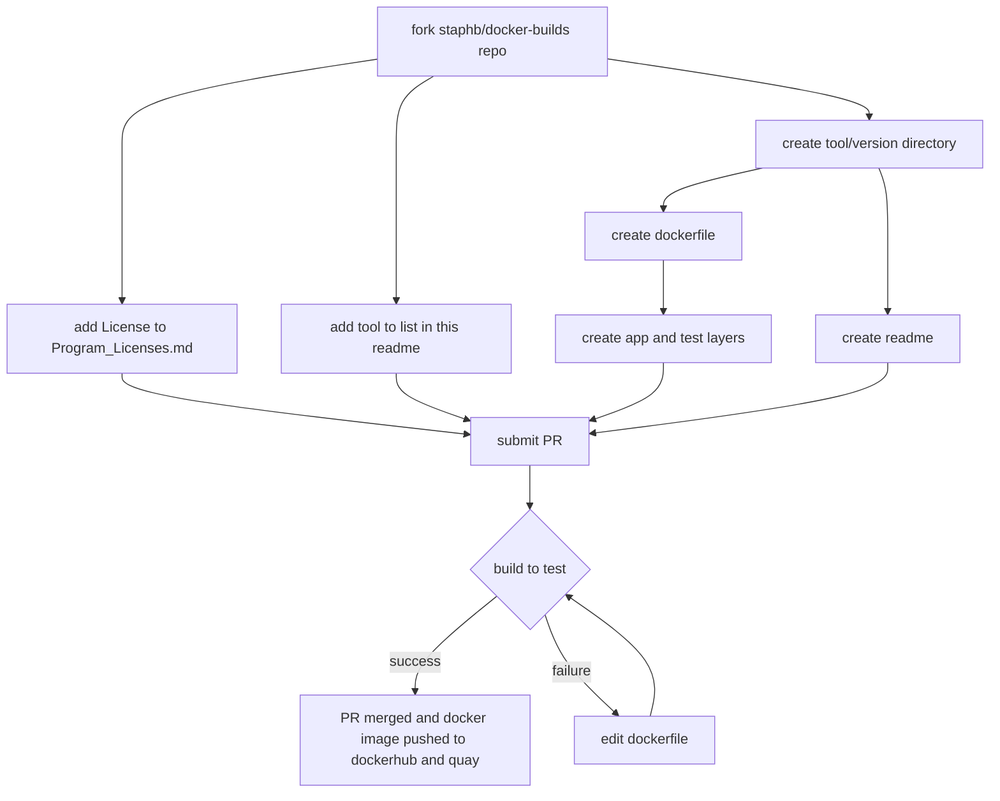

[](https://gitpod.io/#https://github.com/StaPH-B/docker-builds)

# [docker-builds](#)
This repository contains the Dockerfiles and other assorted files necessary for building Docker images for a variety of programs used by members of the StaPH-B (State Public Health Lab Bioinformatics) consortium. The purpose of this repository is to provide a centralized location for Docker images that is easily accessible for users, with clear documentation on how the containers were built and how to use them.

This is a community resource, built and maintained by users from varied backgrounds and expertise levels. As such, we have provided some [templates for contributing to this repository](./dockerfile-template). If **you** would like to add a Docker image or improve upon the existing images, please fork the repository, make your changes/additions, and submit a pull request. If you are having an issue with an existing image, please submit an issue. We welcome any and all feedback!

[See more details on how to contribute here](https://staph-b.github.io/docker-builds/contribute/)

## Docker image repositories & hosting

We host all of our docker images on two different repositories:

  1. [Dockerhub - https://hub.docker.com/r/staphb/](https://hub.docker.com/r/staphb/)
  2. [Quay.io - https://quay.io/organization/staphb/](https://quay.io/organization/staphb/)

The development process of creating a new image is summarized as follows:



## User Guide

The [StaPH-B Docker User Guide](https://staphb.org/docker-builds/) was created to outline methods and best practices for using and developing docker containers. There are chapters for:

- [Contributing](https://staphb.org/docker-builds/contribute/)
- [Downloading Docker images](https://staphb.org/docker-builds/get_containers/)
- [Running Docker containers](https://staphb.org/docker-builds/run_containers/)
- [Developing Docker images](https://staphb.org/docker-builds/make_containers/)
- [Useful links](https://staphb.org/docker-builds/useful_links/)

### Summarized usage guide for docker

```bash
# Build a docker image to the 'test' layer
docker build --tag tool:test --target test <directory to Dockerfile>
docker build --tag samtools:test --target test samtools/1.15

# Download a docker image from dockerhub (most tools have a 'latest' version tag)
docker pull staphb/tool:version
docker pull staphb/shigatyper:2.0.2

# Run the container (don't forget to mount your volumes!)
docker run --rm -u $(id -u):$(id -g) -v <local directory>:/data tool:version <command>
docker run --rm -u $(id -u):$(id -g) -v $(pwd)/amrfinder_test_files:/data amrfinder:3.10 amrfinder --nucleotide 2021CK-01854_contigs.fa --threads 20 --name 2021CK-01854 --output /data/2021CK-01854.txt --organism Klebsiella
```

Further documentation can be found at [docs.docker.com](https://docs.docker.com/engine/reference/run/)

### Templates

Several template files are provided. These are intended to be copied and edited by contributors.

1. [dockerfile-template/Dockerfile](./dockerfile-template/Dockerfile) is the basic template useful for most images
2. [dockerfile-template/Dockerfile_mamba](./dockerfile-template/Dockerfile_mamba) is a basic template for using the micromamba base image
3. [dockerfile-template/README.md](./dockerfile-template/README.md) is a basic readme file template to assist others in using the image

### What about Singularity?

For many people, Docker is not an option, but Singularity is. Most Docker containers are compatible with Singularity and can easily be converted to Singularity format. Please see the [User Guide](https://staphb.org/docker-builds/) for instructions on how to download docker images from dockerhub and how to run them using Singularity. We've worked hard to ensure that our containers are compatibile with Singularity, but if you find one that isn't, please leave an issue and let us know!

### Summarized usage guide for singularity

```bash
# Pulling a container from dockerhub (creates a file)
singularity pull --name <name of singularity file> docker://staphb/bbtools:38.96
singularity pull --name staphb-bbtools-38.96.simg docker://staphb/bbtools:38.96

# Running the container (don't forget to mount your volumes!)
singularity exec --bind <local directory>:/data <name of singularity file> <command>
singularity exec --bind $(pwd)/fastq:/data staphb-bbtools-38.96.simg bbduk.sh in1=sample1_R1.fastq.gz in2=sample1_R2.fastq.gz out1=bbduk/sample1_rmphix_R1.fastq.gz out2=bbduk/sample1_rmphix_R2.fastq.gz outm=bbduk/sample1.matched_phix.fq ref=/opt/bbmap/resources/phix174_ill.ref.fa.gz stats=bbduk/sample1.phix.stats.txt threads=4
```

Further documentation can be found at [docs.sylabs.io](https://docs.sylabs.io/guides/3.1/user-guide/cli.html)

## Training

- Training materials (slides & exercises) from the North East Bioinformatics Regional Resource 2023 workshop **Docker for Public Health Bioinformatics** can be located here, within [`training/NE-BRR-docker-for-PH-bioinformatics-May2023/`](training/NE-BRR-docker-for-PH-bioinformatics-May2023/)
- Video training from APHL 2024 workshop **Intermediate Docker Bioinformatics Workshop** can be located in [APHL's e-learning resources](https://learn.aphl.org/learn/course/external/view/elearning/355/intermediate-docker-bioinformatics-workshop)

## Logs
In December 2024, StaPH-B/docker-builds underwent a structural change where all Dockerfiles were placed in the subdirectory `build-files`.

In November 2020, Docker began to implement pull rate limits for images hosted on dockerhub. This limits the number of `docker pull`'s per time period (e.g. anonymous users allowed 100 pulls per six hours). We applied and were approved for Docker's "Open Source Program," which should have removed the pull rate limits for all `staphb` docker images! 🎉 🥳 If you encounter an error such as `ERROR: toomanyrequests: Too Many Requests.` or `You have reached your pull rate limit. You may increase the limit by authenticating and upgrading: https://www.docker.com/increase-rate-limits.` , please let us know by [submitting an issue.](https://github.com/StaPH-B/docker-builds/issues)

**A huge thank you goes to the folks at Docker for supporting our efforts to distribute & share critical tools for public health bioinformatics. This has been especially important during the COVID-19 global pandemic, as many of these tools are used to conduct genomic surveillance on the SARS-CoV-2 virus as well as other important pathogens of public health concern.**

To learn more about the docker pull rate limits and the open source software program, please see these blog posts ([1](https://www.docker.com/blog/docker-hub-image-retention-policy-delayed-and-subscription-updates/), [2](https://www.docker.com/blog/scaling-docker-to-serve-millions-more-developers-network-egress/), and [3](https://www.docker.com/blog/expanded-support-for-open-source-software-projects/)) and Docker documentation ([1](https://docs.docker.com/docker-hub/download-rate-limit/)).

*NOTE: In the table below, we do not provide individual links to the various tools on quay.io, please visit the above quay.io link to find all of our docker images.*

## [Available Docker images](https://hub.docker.com/r/staphb/)

| Software | Version | Link |
| :--------: | ------- | -------- |
| [ABRicate](https://hub.docker.com/r/staphb/abricate/) <br/> [](https://hub.docker.com/r/staphb/abricate) | <details><summary>Click to see all versions</summary> <ul><li>[0.8.7](./build-files/abricate/0.8.7/)</li><li>[0.8.13](./build-files/abricate/0.8.13/)</li><li>[0.8.13s (+serotypefinder db)](./build-files/abricate/0.8.13s/)</li><li>[0.9.8](./build-files/abricate/0.9.8/)</li><li>[1.0.0](./build-files/abricate/1.0.0/)</li><li>[1.0.1 (+ A. baumannii plasmid typing db)](./build-files/abricate/1.0.1-Abaum-plasmid)</li><li>[1.0.1 (+ InsaFlu db)](./build-files/abricate/1.0.1-insaflu-220727)</li><li>[1.0.1 (+ *Vibrio cholerae* db)](./build-files/abricate/1.0.1-vibrio-cholera/)</li><li>[1.2.0](./build-files/abricate/1.2.0/)</li></ul> </details> | https://github.com/tseemann/abricate |
| [ACI](https://hub.docker.com/r/staphb/aci/) <br/> [](https://hub.docker.com/r/staphb/aci) | <details><summary>Click to see all versions</summary> <ul><li>[1.4.20240116](./build-files/aci/1.4.20240116/)</li><li>[1.15.250702](./build-files/aci/1.15.250702/)</li><li>[1.45.251125](./build-files/aci/1.45.251125/)</li></ul> </details> | https://github.com/erinyoung/ACI |
| [ANIclustermap](https://hub.docker.com/r/staphb/aniclustermap/) <br/> [](https://hub.docker.com/r/staphb/aniclustermap) | <details><summary>Click to see all versions</summary> <ul><li>[1.3.0](./build-files/aniclustermap/1.3.0/)</li><li>[1.4.0](./build-files/aniclustermap/1.4.0/)</li><li>[2.0.1](./build-files/aniclustermap/2.0.1/)</li></ul> </details> | https://github.com/moshi4/ANIclustermap |
| [any2fasta](https://hub.docker.com/r/staphb/any2fasta/) <br/> [](https://hub.docker.com/r/staphb/any2fasta) | <details><summary>Click to see all versions</summary> <ul><li>[0.4.2](./build-files/any2fasta/0.4.2/)</li><li>[0.8.1](./build-files/any2fasta/0.8.1/)</li></ul> </details> | https://github.com/tseemann/any2fasta |
| [ArborView](https://hub.docker.com/r/staphb/arborview/) <br/> [](https://hub.docker.com/r/staphb/arborview) | <details><summary>Click to see all versions</summary> <ul><li>[0.1.2](./build-files/arborview/0.1.2/)</li></ul> </details> | https://github.com/phac-nml/ArborView |
| [ARIBA](https://hub.docker.com/r/staphb/ariba/) <br/> [](https://hub.docker.com/r/staphb/ariba) | <details><summary>Click to see all versions</summary> <ul><li>[2.14.4](./build-files/ariba/2.14.4/)</li><li>[2.14.6](./build-files/ariba/2.14.6/)</li><li>[2.14.7](./build-files/ariba/2.14.7/)</li></ul> </details> | https://github.com/sanger-pathogens/ariba |
| [artic](https://hub.docker.com/r/staphb/artic) <br/> [](https://hub.docker.com/r/staphb/artic) | <details><summary>Click to see all versions</summary> <ul><li>[1.2.4-1.11.1 (artic-medaka)](./build-files/artic/1.2.4-1.11.1/)</li><li>[1.2.4-1.12.0 (artic-medaka)](./build-files/artic/1.2.4-1.12.0/)</li><li>[1.6.2 (Clair3)](./build-files/artic/1.6.2/)</li><li>[1.7.5](./build-files/artic/1.7.5/)</li><li>[1.8.0](./build-files/artic/1.8.0/)</li><li>[1.8.4](./build-files/artic/1.8.4/)</li><li>[1.8.5](./build-files/artic/1.8.5/)</li></ul> </details> | https://github.com/artic-network/fieldbioinformatics |
| [artic-ncov2019](https://hub.docker.com/r/staphb/artic-ncov2019) <br/> [](https://hub.docker.com/r/staphb/artic-ncov2019) |  <details><summary>Click to see all versions</summary> <ul><li>[1.3.0](./build-files/artic-ncov2019/1.3.0/)</ul> </details> | https://github.com/artic-network/fieldbioinformatics |
| [artic-ncov2019-epi2me](https://hub.docker.com/r/staphb/artic-ncov2019-epi2me) <br/> [](https://hub.docker.com/r/staphb/artic-ncov2019-epi2me) |  <details><summary>Click to see all versions</summary> <ul><li>[0.3.10](./build-files/artic-ncov2019-epi2me/0.3.10/)</ul> </details> | https://github.com/epi2me-labs/wf-artic |
| [artic-ncov2019-medaka](https://hub.docker.com/r/staphb/artic-ncov2019-medaka) <br/> [](https://hub.docker.com/r/staphb/artic-ncov2019-medaka) |  <details><summary>Click to see all versions</summary> <ul><li>[1.1.0](./build-files/artic-ncov2019-medaka/1.1.0/)</ul> </details> | https://github.com/artic-network/artic-ncov2019 |
| [artic-ncov2019-nanopolish](https://hub.docker.com/r/staphb/artic-ncov2019-nanopolish) <br/> [](https://hub.docker.com/r/staphb/artic-ncov2019-nanopolish) |  <details><summary>Click to see all versions</summary> <ul><li>[1.1.0](./build-files/artic-ncov2019-nanopolish/1.1.0/)</ul> </details> | https://github.com/artic-network/artic-ncov2019 |
| [assembly_snptyper](https://hub.docker.com/r/staphb/assembly_snptyperh) <br/> [](https://hub.docker.com/r/staphb/assembly_snptyper) | <details><summary>Click to see all versions</summary> <ul><li>[0.1.1](./build-files/assembly_snptyper/0.1.1/)</li></ul> </details> | https://github.com/boasvdp/assembly_snptyper |
| [Augur](https://hub.docker.com/r/staphb/augur) <br/> [](https://hub.docker.com/r/staphb/augur) | <details><summary>Click to see all versions</summary> <ul><li>[6.3.0](./build-files/augur/6.3.0/)</li><li>[7.0.2](./build-files/augur/7.0.2/)</li><li>[8.0.0](./build-files/augur/8.0.0/)</li><li>[9.0.0](./build-files/augur/9.0.0/)</li><li>[16.0.3](./build-files/augur/16.0.3/)</li><li>[24.2.2](./build-files/augur/24.2.2/)</li><li>[24.2.3](./build-files/augur/24.2.3/)</li><li>[24.3.0](./build-files/augur/24.3.0/)</li><li>[24.4.0](./build-files/augur/24.4.0/)</li><li>[26.0.0](./build-files/augur/26.0.0/)</li><li>[27.0.0](./build-files/augur/27.0.0/)</li><li>[28.0.1](./build-files/augur/28.0.1/)</li><li>[29.0.0](./build-files/augur/29.0.0/)</li><li>[30.0.0](./build-files/augur/30.0.0/)</li><li>[31.1.0](./build-files/augur/31.1.0/)</li><li>[31.3.0](./build-files/augur/31.3.0/)</li><li>[31.4.0](./build-files/augur/31.4.0/)</li><li>[31.5.0](./build-files/augur/31.5.0/)</li><li>[32.0.0](./build-files/augur/32.0.0/)</li><li>[32.1.0](./build-files/augur/32.1.0/)</li></ul> </details> | https://github.com/nextstrain/augur |
| [Auspice](https://hub.docker.com/r/staphb/auspice) <br/> [](https://hub.docker.com/r/staphb/auspice) | <details><summary>Click to see all versions</summary> <ul><li>[2.12.0](./build-files/auspice/2.12.0/)</li></ul> </details> | https://github.com/nextstrain/auspice |
| [Autocycler](https://hub.docker.com/r/staphb/autocycler) <br/> [](https://hub.docker.com/r/staphb/autocycler) | <details><summary>Click to see all versions</summary> <ul><li>[0.2.1](./build-files/autocycler/0.2.1/)</li><li>[0.2.1-tutorial](./build-files/autocycler/0.2.1-tutorial/)</li><li>[0.4.0](./build-files/autocycler/0.4.0/)</li><li>[0.4.0-tutorial](./build-files/autocycler/0.4.0-tutorial/)</li></ul> </details> | https://github.com/rrwick/Autocycler/ |
| [bakta](https://hub.docker.com/r/staphb/bakta) <br/> [](https://hub.docker.com/r/staphb/bakta) | <details><summary>Click to see all versions</summary> <ul><li>[1.9.2](./build-files/bakta/1.9.2/)</li><li>[1.9.2-light](./build-files/bakta/1.9.2-5.1-light/)</li><li>[1.9.3](./build-files/bakta/1.9.3/)</li><li>[1.9.3-light](./build-files/bakta/1.9.3-5.1-light/)</li><li>[1.9.4](./build-files/bakta/1.9.4/)</li><li>[1.9.4-5.1-light](./build-files/bakta/1.9.4-5.1-light/)</li><li>[1.10.3](./build-files/bakta/1.10.3/)</li><li>[1.10.3-light](./build-files/bakta/1.10.3-5.1-light/)</li><li>[1.10.4](./build-files/bakta/1.10.4/)</li><li>[1.10.4-5.1-light](./build-files/bakta/1.10.4-5.1-light/)</li><li>[1.11.0](./build-files/bakta/1.11.0/)</li><li>[1.11.0-6.0-light](./build-files/bakta/1.11.0-6.0-light/)</li><li>[1.11.3](./build-files/bakta/1.11.3/)</li><li>[1.11.3-6.0-light](./build-files/bakta/1.11.3-6.0-light/)</li><li>[1.11.4](./build-files/bakta/1.11.4/)</li><li>[1.11.4-6.0-light](./build-files/bakta/1.11.4-6.0-light/)</li></ul> </details> | https://github.com/oschwengers/bakta |
| [bandage](https://hub.docker.com/r/staphb/bandage) <br/> [](https://hub.docker.com/r/staphb/bandage) | <details><summary>Click to see all versions</summary> <ul><li>[0.8.1](./build-files/bandage/0.8.1/)</li></ul> </details> | https://rrwick.github.io/Bandage/ |
| [BBTools](https://hub.docker.com/r/staphb/bbtools/) <br/> [](https://hub.docker.com/r/staphb/bbtools) | <details><summary>Click to see all versions</summary> <ul><li>[38.76](./build-files/bbtools/38.76/)</li><li>[38.86](./build-files/bbtools/38.86/)</li><li>[38.95](./build-files/bbtools/38.95/)</li><li>[38.96](./build-files/bbtools/38.96/)</li><li>[38.97](./build-files/bbtools/38.97/)</li><li>[38.98](./build-files/bbtools/38.98/)</li><li>[38.99](./build-files/bbtools/38.99/)</li><li>[39.00](./build-files/bbtools/39.00/)</li><li>[39.01](./build-files/bbtools/39.01/)</li><li>[39.06](./build-files/bbtools/39.06/)</li><li>[39.10](./build-files/bbtools/39.10/)</li><li>[39.13](./build-files/bbtools/39.13/)</li><li>[39.16](./build-files/bbtools/39.16/)</li><li>[39.23](./build-files/bbtools/39.23/)</li><li>[39.25](./build-files/bbtools/39.25/)</li><li>[39.33](./build-files/bbtools/39.33/)</li><li>[39.34](./build-files/bbtools/39.34/)</li><li>[39.38](./build-files/bbtools/39.38/)</li><li>[39.49](./build-files/bbtools/39.49/)</li><li>[39.60](./build-files/bbtools/39.60/)</li></ul></details> | https://bbmap.org/ |
| [bcftools](https://hub.docker.com/r/staphb/bcftools/) <br/> [](https://hub.docker.com/r/staphb/bcftools) | <details><summary>Click to see all versions</summary> <ul><li>[1.10.2](./build-files/bcftools/1.10.2/)</li><li>[1.11](./build-files/bcftools/1.11/)</li><li>[1.12](./build-files/bcftools/1.12/)</li><li>[1.13](./build-files/bcftools/1.13/)</li><li>[1.14](./build-files/bcftools/1.14/)</li><li>[1.15](./build-files/bcftools/1.15/)</li><li>[1.16](./build-files/bcftools/1.16/)</li><li>[1.17](./build-files/bcftools/1.17/)</li><li>[1.18](./build-files/bcftools/1.18/)</li><li>[1.19](./build-files/bcftools/1.19/)</li><li>[1.20](./build-files/bcftools/1.20/)</li><li>[1.20.c](./build-files/bcftools/1.20.c/)</li><li>[1.21](./build-files/bcftools/1.21/)</li><li>[1.22](./build-files/bcftools/1.22/)</li><li>[1.23](./build-files/bcftools/1.23/)</li></ul> </details> | https://github.com/samtools/bcftools |
| [bedtools](https://hub.docker.com/r/staphb/bedtools/) <br/> [](https://hub.docker.com/r/staphb/bedtools) | <details><summary>Click to see all versions</summary> <ul><li>[2.29.2](./build-files/bedtools/2.29.2/)</li><li>[2.30.0](./build-files/bedtools/2.30.0/)</li><li>[2.31.0](./build-files/bedtools/2.31.0/)</li><li>[2.31.1](./build-files/bedtools/2.31.1/)</li></ul> </details> | https://bedtools.readthedocs.io/en/latest/ <br/>https://github.com/arq5x/bedtools2 |
| [berrywood-report-env](https://hub.docker.com/r/staphb/berrywood-report-env/) <br/> [](https://hub.docker.com/r/staphb/berrywood-report-env) | <details><summary>Click to see all versions</summary> <ul><li>[1.0](./build-files/berrywood-report-env/1.0/)</li></ul> </details> | none |
| [bindashtree](https://hub.docker.com/r/staphb/bindashtree/) <br/> [](https://hub.docker.com/r/staphb/bindashtree) | <details><summary>Click to see all versions</summary> <ul><li>[0.1.0](./build-files/bindashtree/0.1.0/)</li><li>[0.1.1](./build-files/bindashtree/0.1.1/)</li></ul> </details> | https://github.com/jianshu93/bindashtree |
| [blast+](https://hub.docker.com/r/staphb/blast/) <br/> [](https://hub.docker.com/r/staphb/blast) | <details><summary>Click to see all versions</summary> <ul><li>[2.13.0](./build-files/blast/2.13.0/)</li><li>[2.14.0](./build-files/blast/2.14.0/)</li><li>[2.14.1](./build-files/blast/2.14.1/)</li><li>[2.15.0](./build-files/blast/2.15.0/)</li><li>[2.16.0](./build-files/blast/2.16.0/)</li><li>[2.17.0](./build-files/blast/2.17.0/)</li></ul> </details> | https://www.ncbi.nlm.nih.gov/books/NBK279690/ |
| [bowtie2](https://hub.docker.com/r/staphb/bowtie2/) <br/> [](https://hub.docker.com/r/staphb/bowtie2) | <details><summary>Click to see all versions</summary> <ul><li>[2.4.4](./build-files/bowtie2/2.4.4/)</li><li>[2.4.5](./build-files/bowtie2/2.4.5/)</li><li>[2.5.1](./build-files/bowtie2/2.5.1/)</li><li>[2.5.3](./build-files/bowtie2/2.5.3/)</li><li>[2.5.4](./build-files/bowtie2/2.5.4/)</li></ul> </details> | http://bowtie-bio.sourceforge.net/bowtie2/manual.shtml <br/>https://github.com/BenLangmead/bowtie2 |
| [Bracken](https://hub.docker.com/r/staphb/bracken/) <br/> [](https://hub.docker.com/r/staphb/bracken) | <details><summary>Click to see all versions</summary> <ul><li>[2.9](./build-files/bracken/2.9)</li><li>[3.1](./build-files/bracken/3.1)</li></ul> </details> | https://ccb.jhu.edu/software/bracken/index.shtml?t=manual <br/>https://github.com/jenniferlu717/Bracken |
| [BUSCO](https://hub.docker.com/r/staphb/busco/) <br/> [](https://hub.docker.com/r/staphb/busco) | <details><summary>Click to see all versions</summary> <ul><li>[5.4.7](./build-files/busco/5.4.7/)</li><li>[5.6.1](./build-files/busco/5.6.1/)</li><li>[5.6.1-prok-bacteria_odb10_2024-01-08](./build-files/busco/5.6.1-prok-bacteria_odb10_2024-01-08/)</li><li>[5.7.1](./build-files/busco/5.7.1/)</li><li>[5.7.1-prok-bacteria_odb10_2024-01-08](./build-files/busco/5.7.1-prok-bacteria_odb10_2024-01-08/)</li><li>[5.8.0](./build-files/busco/5.8.0/)</li><li>[5.8.0-prok-bacteria_odb10_2024-01-08](./build-files/busco/5.8.0-prok-bacteria_odb10_2024-01-08/)</li><li>[6.0.0](./build-files/busco/6.0.0/)</li><li>[5.8.2-prok-bacteria_odb10_2024-11-14](./build-files/busco/5.8.2-prok-bacteria_odb10_2024-11-14/)</li><li>[5.8.2](./build-files/busco/5.8.2/)</li><li>[6.0.0-prok-bacteria_odb12_2024-11-14](./build-files/busco/6.0.0-prok-bacteria_odb12_2024-11-14/)</li</ul> </details> | https://busco.ezlab.org/busco_userguide.html <br/>https://gitlab.com/ezlab/busco |
| [BWA](https://hub.docker.com/r/staphb/bwa) <br/> [](https://hub.docker.com/r/staphb/bwa) | <details><summary>Click to see all versions</summary> <ul><li>[0.7.17](/build-files/bwa/0.7.17/)</li><li>[0.7.18](./build-files/bwa/0.7.18/)</li><li>[0.7.19](./build-files/bwa/0.7.19/)</li></ul> </details> | https://github.com/lh3/bwa |
| [Canu](https://hub.docker.com/r/staphb/canu) <br/> [](https://hub.docker.com/r/staphb/canu)| <details><summary>Click to see all versions</summary> <ul><li>[2.0](./build-files/canu/2.0/)</li><li>[2.1.1](./build-files/canu/2.1.1/)</li><li>[2.2](./build-files/canu/2.2/)</li><li>[2.3](./build-files/canu/2.3/)</li></ul> </details> | https://canu.readthedocs.io/en/latest/ <BR/> https://github.com/marbl/canu |
| [Canu-Racon](https://hub.docker.com/r/staphb/canu-racon/) <br/> [](https://hub.docker.com/r/staphb/canu-racon) | <details><summary>Click to see all versions</summary> <ul><li>[1.7.1 (Canu), 1.3.1 (Racon), 2.13 (minimap2)](./build-files/canu-racon/1.7.1/)</li><li>[1.9 (Canu), 1.4.3 (Racon), 2.17 (minimap2)](./build-files/canu-racon/1.9/)</li><li>[1.9i (Canu), 1.4.3 (Racon), 2.17 (minimap2), (+racon_preprocess.py)](./build-files/canu-racon/1.9i/)</li><li>[2.0 (Canu), 1.4.3 (Racon), 2.17 (minimap2)](./build-files/canu-racon/2.0/)</li></ul> </details> | https://canu.readthedocs.io/en/latest/ <br/> https://github.com/lbcb-sci/racon <br/> https://github.com/isovic/racon (ARCHIVED) <br/> https://lh3.github.io/minimap2/ |
| [CAT](https://hub.docker.com/r/staphb/CAT) <br/> [](https://hub.docker.com/r/staphb/cat) | <details><summary>Click to see all versions</summary> <ul><li>[5.3](./build-files/cat/5.3)</li><li>[6.0.1](./build-files/cat/6.0.1/)</li></ul> </details> | https://github.com/MGXlab/CAT_pack |
| [cbird-util](https://github.com/Kincekara/C-BIRD/tree/main/cbird-util) <br/> [](https://hub.docker.com/r/staphb/cbird-util) | <details><summary>Click to see all versions</summary> <ul><li>[2.0](./build-files/cbird-util/2.0/)</li><li>[2.1](./build-files/cbird-util/2.1/)</li><li>[2.2](./build-files/cbird-util/2.2/)</li></ul> </details> | https://github.com/Kincekara/C-BIRD |
| [centroid](https://hub.docker.com/r/staphb/centroid/) <br/> [](https://hub.docker.com/r/staphb/centroid) | <details><summary>Click to see all versions</summary> <ul><li>[1.0.0](./build-files/centroid/1.0.0/)</li></ul> </details> | https://github.com/stjacqrm/centroid |
| [CDC-SPN](https://hub.docker.com/r/staphb/cdc-spn/) <br/> [](https://hub.docker.com/r/staphb/cdc-spn) | <details><summary>Click to see all versions</summary> <ul><li>[0.1 (no version)](./build-files/cdc-spn/0.1/)</li></ul> </details> | https://github.com/BenJamesMetcalf/Spn_Scripts_Reference |
| [cfsan-snp-pipeline](https://hub.docker.com/r/staphb/cfsan-snp-pipeline) <br/> [](https://hub.docker.com/r/staphb/cfsan-snp-pipeline) | <details><summary>Click to see all versions</summary> <ul><li>[2.0.2](./build-files/cfsan-snp-pipeline/2.0.2/)</li><li>[2.2.1](./build-files/cfsan-snp-pipeline/2.2.1/)</li></ul> | https://github.com/CFSAN-Biostatistics/snp-pipeline |
| [CheckM](https://hub.docker.com/r/staphb/checkm) <br/> [](https://hub.docker.com/r/staphb/checkm) | <details><summary>Click to see all versions</summary> <ul><li>[1.2.2](./build-files/checkm/1.2.2/)</li><li>[1.2.3](./build-files/checkm/1.2.3/)</li><li>[1.2.4](./build-files/checkm/1.2.4/)</li></ul> </details> | https://github.com/Ecogenomics/CheckM |
| [CheckM2](https://hub.docker.com/r/staphb/checkm2) <br/> [](https://hub.docker.com/r/staphb/checkm2) | <details><summary>Click to see all versions</summary> <ul><li>[1.0.2](./build-files/checkm2/1.0.2)</li><li>[1.1.0](./build-files/checkm2/1.1.0)</li></ul> </details> | https://github.com/chklovski/CheckM2 |
| [CheckV](https://hub.docker.com/r/staphb/checkv) <br/> [](https://hub.docker.com/r/staphb/checkv) | <details><summary>Click to see all versions</summary> <ul><li>[1.0.3](./build-files/checkv/1.0.3/)</li></ul> </details> | https://bitbucket.org/berkeleylab/checkv/ |
| [Circlator](https://hub.docker.com/r/staphb/circlator) <br/> [](https://hub.docker.com/r/staphb/circlator) | <details><summary>Click to see all versions</summary> <ul><li>[1.5.6](./build-files/circlator/1.5.6/)</li><li>[1.5.5](./build-files/circlator/1.5.5/)</li></ul> </details> | https://github.com/sanger-pathogens/circlator |
| [Circos](https://hub.docker.com/r/staphb/circos) <br/> [](https://hub.docker.com/r/staphb/circos) | <details><summary>Click to see all versions</summary> <ul><li>[0.69-9](./build-files/circos/0.69.9/)</li></ul> </details> | https://circos.ca/ |
| [CirculoCov](https://hub.docker.com/r/staphb/circulocov) <br/> [](https://hub.docker.com/r/staphb/circulocov) | <details><summary>Click to see all versions</summary> <ul><li>[0.1.20240104](./build-files/circulocov/0.1.20240104/)</li></ul> </details> | https://github.com/erinyoung/CirculoCov |
| [Clair3](https://hub.docker.com/r/staphb/clair3) <br/> [](https://hub.docker.com/r/staphb/clair3) | <details><summary>Click to see all versions</summary><ul><li>[1.0.9](./build-files/clair3/1.0.9/)</li><li>[1.0.10](./build-files/clair3/1.0.10/)</li><li>[1.1.0](./build-files/clair3/1.1.0/)</li><li>[1.2.0](./build-files/clair3/1.2.0/)</li></ul></details> | https://github.com/HKU-BAL/Clair3 |
| [Clustalo](https://hub.docker.com/r/staphb/clustalo) <br/> [](https://hub.docker.com/r/staphb/clustalo) | <details><summary>Click to see all versions</summary> <ul><li>[1.2.4](./build-files/clustalo/1.2.4/)</li><li>[1.2.4-2025](./build-files/clustalo/1.2.4-2025/)</li></ul> </details> | http://www.clustal.org/omega/ |
| [colorid](https://hub.docker.com/r/staphb/colorid) <br/> [](https://hub.docker.com/r/staphb/colorid) | <details><summary>Click to see all versions</summary> <ul><li>[0.1.4.3](./build-files/colorid/0.1.4.3/)</li><li>[0.1.4.3](./build-files/colorid/0.1.4.3-jammy/)</li></ul> </details> | https://github.com/hcdenbakker/colorid |
| [Core-SNP-filter](https://hub.docker.com/r/staphb/core-snp-filter) <br/> [](https://hub.docker.com/r/staphb/core-snp-filter) | <details><summary>Click to see all versions</summary> <ul><li>[0.2.0](./build-files/core-snp-filter/0.2.0/)</li></ul> </details> | https://github.com/rrwick/Core-SNP-filter |
| [cutshaw-report-env](https://hub.docker.com/r/staphb/cutshaw-report-env) <br/> [](https://hub.docker.com/r/staphb/cutshaw-report-env) | <details><summary>Click to see all versions</summary> <ul><li>[1.0.0](./build-files/cutshaw-report-env/1.0/)</li></ul> </details> | https://github.com/VADGS/CutShaw |
| [datasets-sars-cov-2](https://github.com/CDCgov/datasets-sars-cov-2) <br/> [](https://hub.docker.com/r/staphb/datasets-sars-cov-2) | <details><summary>Click to see all versions</summary> <ul><li>[0.6.2](./build-files/datasets-sars-cov-2/0.6.2/)</li><li>[0.6.3](./build-files/datasets-sars-cov-2/0.6.3/)</li><li>[0.7.2](./build-files/datasets-sars-cov-2/)</li></ul> </details> | https://github.com/CDCgov/datasets-sars-cov-2 |
| [dnaapler](https://hub.docker.com/r/staphb/dnaapler) <br/> [](https://hub.docker.com/r/staphb/dnaapler) | <details><summary>Click to see all versions</summary> <ul><li>[0.1.0](./build-files/dnaapler/0.1.0/)</li></ul> <ul><li>[0.4.0](./build-files/dnaapler/0.4.0/)</li><li>[0.5.0](./build-files/dnaapler/0.5.0/)</li><li>[0.5.1](./build-files/dnaapler/0.5.1/)</li><li>[0.7.0](./build-files/dnaapler/0.7.0/)</li><li>[0.8.0](./build-files/dnaapler/0.8.0/)</li><li>[1.0.1](./build-files/dnaapler/1.0.1/)</li><li>[1.1.0](./build-files/dnaapler/1.1.0/)</li><li>[1.2.0](./build-files/dnaapler/1.2.0/)</li><li>[1.3.0](./build-files/dnaapler/1.3.0/)</li></ul> </details> | https://github.com/gbouras13/dnaapler |
| [diamond](https://github.com/bbuchfink/diamond) <br/> [](https://hub.docker.com/r/staphb/diamond) | <details><summary>Click to see all versions</summary> <ul><li>[2.1.9](./build-files/diamond/2.1.9)</li><li>[2.1.10](./build-files/diamond/2.1.10)</li><li>[2.1.11](./build-files/diamond/2.1.11)</li><li>[2.1.12](./build-files/diamond/2.1.12)</li><li>[2.1.13](./build-files/diamond/2.1.13)</li><li>[2.1.16](./build-files/diamond/2.1.16)</li></ul> </details> | https://github.com/bbuchfink/diamond|
| [dorado](https://hub.docker.com/r/staphb/dorado) <br/> [](https://hub.docker.com/r/staphb/dorado) | <details><summary>Click to see all versions</summary> <ul><li>[0.8.0](./build-files/dorado/0.8.0/)</li><li>[0.8.3](./build-files/dorado/0.8.3/)</li><li>[0.9.0](./build-files/dorado/0.9.0-cuda12.2.0/)</li><li>[0.9.0-cuda12.2.0-no_model](./build-files/dorado/0.9.0-cuda12.2.0-no_model/)</li><li>[1.1.0-cuda12.2.0](./build-files/dorado/1.1.0-cuda12.2.0/)</li><li>[1.1.0-cuda12.2.0-no_model](./build-files/dorado/1.1.0-cuda12.2.0-no_model/)</li></ul></ul> </details> | [https://github.com/nanoporetech/dorado](https://github.com/nanoporetech/dorado) |
| [dragonflye](https://hub.docker.com/r/staphb/dragonflye) <br/> [](https://hub.docker.com/r/staphb/dragonflye) | <details><summary>Click to see all versions</summary> <ul><li>[1.0.14](./build-files/dragonflye/1.0.14/)</li><li>[1.1.1](./build-files/dragonflye/1.1.1/)</li><li>[1.1.2](./build-files/dragonflye/1.1.2/)</li><li>[1.2.0](./build-files/dragonflye/1.2.0/)</li><li>[1.2.1](./build-files/dragonflye/1.2.1/)</li></ul> </details> | https://github.com/rpetit3/dragonflye |
| [Dr. PRG ](https://hub.docker.com/r/staphb/drprg) <br/> [](https://hub.docker.com/r/staphb/drprg) | <details><summary>Click to see all versions</summary> <ul><li>[0.1.1](./build-files/drprg/0.1.1/)</li></ul> </details> | https://mbh.sh/drprg/ |
| [DSK](https://hub.docker.com/r/staphb/dsk) <br/> [](https://hub.docker.com/r/staphb/dsk) | <details><summary>Click to see all versions</summary> <ul><li>[0.0.100](./build-files/dsk/0.0.100/)</li><li>[2.3.3](./build-files/dsk/2.3.3/)</li></ul> </details> | https://gatb.inria.fr/software/dsk/ |
| [ectyper](https://hub.docker.com/r/staphb/ectyper) <br/> [](https://hub.docker.com/r/staphb/ectyper) | <details><summary>Click to see all versions</summary> <ul><li>[2.0.0](./build-files/ectyper/2.0.0/)</li></ul> </details> | https://github.com/phac-nml/ecoli_serotyping |
| [el_gato](https://hub.docker.com/r/staphb/elgato) <br/> [](https://hub.docker.com/r/staphb/elgato) | <details><summary>Click to see all versions</summary> <ul><li>[1.15.2](./build-files/elgato/1.15.2)</li><li>[1.18.2](./build-files/elgato/1.18.2)</li><li>[1.19.0](./build-files/elgato/1.19.0)</li><li>[1.20.0](./build-files/elgato/1.20.0)</li><li>[1.20.1](./build-files/elgato/1.20.1)</li><li>[1.20.2](./build-files/elgato/1.20.2)</li><li>[1.21.0](./build-files/elgato/1.21.0)</li><li>[1.21.2](./build-files/elgato/1.21.2)</li><li>[1.22.0](./build-files/elgato/1.22.0)</li></ul></details> | https://github.com/appliedbinf/el_gato https://github.com/CDCgov/el_gato |
| [emboss](https://hub.docker.com/r/staphb/emboss) <br/> [](https://hub.docker.com/r/staphb/emboss) | <details><summary>Click to see all versions</summary> <ul><li>[6.6.0 (no version)](./build-files/emboss/6.4.0/)</li><li>[6.4.0 (no version)](./build-files/emboss/6.6.0/)</li></ul> </details> | http://emboss.sourceforge.net |
| [emmtyper](https://hub.docker.com/r/staphb/emmtyper) <br/> [](https://hub.docker.com/r/staphb/emmtyper) | <details><summary>Click to see all versions</summary> <ul><li>[0.2.0](./build-files/emmtyper/0.2.0/)</li><li>[0.2.0-2412](./build-files/emmtyper/0.2.0-2412/)</li></ul> </details> | https://github.com/MDU-PHL/emmtyper |
| [emm-typing-tool](https://hub.docker.com/r/staphb/emm-typing-tool) <br/> [](https://hub.docker.com/r/staphb/emm-typing-tool) | <details><summary>Click to see all versions</summary> <ul><li>[0.0.1 (no version)](./build-files/emmtypingtool/0.0.1/)</li></ul> </details> | https://github.com/phe-bioinformatics/emm-typing-tool |
| [enaBrowserTools](https://hub.docker.com/r/staphb/enabrowsertools) <br/> [](https://hub.docker.com/r/staphb/enabrowsertools) | <details><summary>Click to see all versions</summary> <ul><li>[1.7.1](./build-files/enabrowsertools/1.7.1/)</li><li>[1.7.2](./build-files/enabrowsertools/1.7.2/)</li></ul> </details> | https://github.com/enasequence/enaBrowserTools |
| [EToKi](https://hub.docker.com/r/staphb/etoki) <br/> [](https://hub.docker.com/r/staphb/etoki) | <details><summary>Click to see all versions</summary> <ul><li>[1.2.1](./build-files/etoki/1.2.1/)</li></ul> </details> | https://github.com/zheminzhou/EToKi |
| [falco](https://hub.docker.com/r/staphb/falco) <br/> [](https://hub.docker.com/r/staphb/falco) | <details><summary>Click to see all versions</summary> <ul><li>[1.2.5](./build-files/falco/1.2.5/)</li></ul> </details> | https://github.com/smithlabcode/falco |
| [FastANI](https://hub.docker.com/r/staphb/fastani) <br/> [](https://hub.docker.com/r/staphb/fastani) | <details><summary>Click to see all versions</summary> <ul><li>[1.1](./build-files/fastani/1.1/)</li><li>[1.32](./build-files/fastani/1.32/)</li><li>[1.33](./build-files/fastani/1.33/)</li><li>[1.33 + RGDv2](./build-files/fastani/1.33-RGDv2/)</li><li>[1.34](./build-files/fastani/1.34)</li><li>[1.34 + RGDv2](./build-files/fastani/1.34-RGDV2/)</li></ul> </details> | https://github.com/ParBLiSS/FastANI |
| [fasten](https://hub.docker.com/r/staphb/fasten) <br/> [](https://hub.docker.com/r/staphb/fasten) | <details><summary>Click to see all versions</summary> <ul><li>[0.7.2](./build-files/fasten/0.7.2)</li><li>[0.8.1](./build-files/fasten/0.8.1/)</li><li>[0.8.5](./build-files/fasten/0.8.5/)</li><li>[0.8.7](./build-files/fasten/0.8.7/)</li><li>[0.9.0](./build-files/fasten/0.9.0/)</li></ul> </details> | https://github.com/lskatz/fasten |
| [Fastp](https://hub.docker.com/r/staphb/fastp) <br/> [](https://hub.docker.com/r/staphb/fastp) | <details><summary>Click to see all versions</summary><ul><li>[0.23.2](./build-files/fastp/0.23.2/)</li><li>[0.23.4](./build-files/fastp/0.23.4/)</li><li>[0.24.0](./build-files/fastp/0.24.0/)</li><li>[0.24.1](./build-files/fastp/0.24.1/)</li><li>[1.0.1](./build-files/fastp/1.0.1/)</li></ul></details>| http://opengene.org/fastp/ <br/> https://github.com/OpenGene/fastp |
| [fastplong](https://hub.docker.com/r/staphb/fastplong) <br/> [](https://hub.docker.com/r/staphb/fastplong) | <details><summary>Click to see all versions</summary> <ul><li>[0.2.2](./build-files/fastplong/0.2.2/)</li><li>[0.4.1](./build-files/fastplong/0.4.1/)</li></ul> </details> | https://github.com/OpenGene/fastplong |
| [FastTree](https://hub.docker.com/r/staphb/fasttree) <br/> [](https://hub.docker.com/r/staphb/fasttree) | <details><summary>Click to see all versions</summary> <ul><li>[2.1.11](./build-files/fasttree/2.1.11/)</li><li>[2.2.0](./build-files/fasttree/2.2.0/)</li></ul> </details> | http://www.microbesonline.org/fasttree/ |
| [FastQC](https://hub.docker.com/r/staphb/fastqc) <br/> [](https://hub.docker.com/r/staphb/fastqc) | <details><summary>Click to see all versions</summary> <ul><li>[0.11.8](./build-files/fastqc/0.11.8/)</li><li>[0.11.9](./build-files/fastqc/0.11.9/)</li><li>[0.12.1](./build-files/fastqc/0.12.1/)</li></ul> </details> | https://www.bioinformatics.babraham.ac.uk/projects/fastqc/ <br/> https://github.com/s-andrews/FastQC |
| [fastq-scan](https://hub.docker.com/r/staphb/fastq-scan) <br/> [](https://hub.docker.com/r/staphb/fastq-scan) | <details><summary>Click to see all versions</summary> <ul><li>[0.4.3](./build-files/fastq-scan/0.4.3/)</li><li>[0.4.4](./build-files/fastq-scan/0.4.4/)</li><li>[1.0.0](./build-files/fastq-scan/1.0.0/)</li><li>[1.0.1](./build-files/fastq-scan/1.0.1/)</li></ul> </details> | https://github.com/rpetit3/fastq-scan |
| [Freebayes](https://hub.docker.com/r/staphb/freebayes) <br/> [](https://hub.docker.com/r/staphb/freebayes) | <details><summary>Click to see all versions</summary> <ul><li>[1.3.6](./build-files/freebayes/1.3.6/)</li><li>[1.3.7](./build-files/freebayes/1.3.7/)</li><li>[1.3.8](./build-files/freebayes/1.3.8/)</li><li>[1.3.9](./build-files/freebayes/1.3.9/)</li><li>[1.3.10](./build-files/freebayes/1.3.10/)</li></ul> </details> | https://github.com/freebayes/freebayes |
| [Filtlong](https://hub.docker.com/r/staphb/filtlong) <br/> [](https://hub.docker.com/r/staphb/filtlong) | <details><summary>Click to see all versions</summary> <ul><li>[0.2.0](./build-files/filtlong/0.2.0/)</li><li>[0.2.1](./build-files/filtlong/0.2.1/)</li><li>[0.3.1](./build-files/filtlong/0.3.1/)</li></ul> </details> | https://github.com/rrwick/filtlong |
| [FLASH](https://hub.docker.com/r/staphb/flash) <br/> [](https://hub.docker.com/r/staphb/flash) | <details><summary>Click to see all versions</summary> <ul><li>[1.2.11](./build-files/flash/1.2.11/)</li></ul> </details> | http://ccb.jhu.edu/software/FLASH |
| [Flye](https://hub.docker.com/r/staphb/flye) <br/> [](https://hub.docker.com/r/staphb/flye) | <details><summary>Click to see all versions</summary> <ul><li>[2.5](./build-files/flye/2.5/)</li><li>[2.7](./build-files/flye/2.7/)</li><li>[2.8](./build-files/flye/2.8/)</li><li>[2.9](./build-files/flye/2.9/)</li><li>[2.9.1](./build-files/flye/2.9.1/)</li><li>[2.9.2](./build-files/flye/2.9.2/)</li><li>[2.9.3](./build-files/flye/2.9.3/)</li><li>[2.9.4](./build-files/flye/2.9.4/)</li><li>[2.9.5](./build-files/flye/2.9.5/)</li><li>[2.9.6](./build-files/flye/2.9.6/)</li></ul> </details> | https://github.com/fenderglass/Flye |
| [Freyja](https://hub.docker.com/r/staphb/freyja) <br/> [](https://hub.docker.com/r/staphb/freyja) | <details><summary>Click to see all versions</summary> <ul><li>[1.2](./build-files/freyja/1.2/)</li><li>[1.2.1](./build-files/freyja/1.2.1/)</li><li>[1.3.1](./build-files/freyja/1.3.1/)</li><li>[1.3.2](./build-files/freyja/1.3.2/)</li><li>[1.3.4](./build-files/freyja/1.3.4/)</li><li>[1.3.7](./build-files/freyja/1.3.7/)</li><li>[1.3.8](./build-files/freyja/1.3.8/)</li><li>[1.3.9](./build-files/freyja/1.3.9/)</li><li>[1.3.10](./build-files/freyja/1.3.10/)</li><li>[1.3.11](./build-files/freyja/1.3.11/)</li><li>[1.3.12](./build-files/freyja/1.3.12/)</li><li>[1.4.2](./build-files/freyja/1.4.2/)</li><li>[1.4.3](./build-files/freyja/1.4.3/)</li><li>[1.4.4](./build-files/freyja/1.4.4/)</li><li>[1.4.5](./build-files/freyja/1.4.5/)</li><li>[1.4.7](./build-files/freyja/1.4.7/)</li><li>[1.4.8](./build-files/freyja/1.4.8/)</li><li>[1.4.9](./build-files/freyja/1.4.9/)</li><li>[1.5.0](./build-files/freyja/1.5.0/)</li><li>[1.5.1](./build-files/freyja/1.5.1/)</li><li>[1.5.2](./build-files/freyja/1.5.2/)</li><li>[1.5.3](./build-files/freyja/1.5.3/)</li><li>[2.0.0](./build-files/freyja/2.0.0/)</li><li>[2.0.1](./build-files/freyja/2.0.1/)</li><li>[2.0.2](./build-files/freyja/2.0.2/)</li></ul> </details> | https://github.com/andersen-lab/Freyja |
| [GAMBIT](https://hub.docker.com/r/staphb/gambit) <br/> [](https://hub.docker.com/r/staphb/gambit) | <details><summary>Click to see all versions</summary> <ul><li>[0.3.0](./build-files/gambit/0.3.0/)</li><li>[0.4.0](./build-files/gambit/0.4.0/)</li><li>[0.5.0](./build-files/gambit/0.5.0/)</li><li>[1.0.0](./build-files/gambit/1.0.0/)</li></ul> </details> | https://github.com/jlumpe/gambit |
| [GAMMA](https://hub.docker.com/r/staphb/gamma) <br/> [](https://hub.docker.com/r/staphb/gamma) | <details><summary>Click to see all versions</summary> <ul><li>[1.4](./build-files/gamma/1.4/)</li><li>[2.1](./build-files/gamma/2.1/)</li><li>[2.2](./build-files/gamma/2.2/)</li></ul> </details> | https://github.com/rastanton/GAMMA/ |
| [GenoFLU](https://hub.docker.com/r/staphb/genoflu) <br/> []() | <details><summary>Click to see all versions</summary> <ul><li>[1.03](./build-files/genoflu/1.03/)</li><li>[1.05](./build-files/genoflu/1.05/)</li><li>[1.06](./build-files/genoflu/1.06/)</li></ul> </details> | https://github.com/USDA-VS/GenoFLU |
| [geNomad](https://hub.docker.com/r/staphb/genomad) <br/> [](https://hub.docker.com/r/staphb/genomad) | <details><summary>Click to see all versions</summary> <ul><li>[1.7.4](./build-files/genomad/1.7.4/)</li><li>[1.8.0](./build-files/genomad/1.8.0/)</li><li>[1.8.1](./build-files/genomad/1.8.1/)</li><li>[1.11.0](./build-files/genomad/1.11.0/)</li><li>[1.11.1](./build-files/genomad/1.11.1/)</li></ul> </details> | https://github.com/apcamargo/genomad |
| [GenoVi](https://hub.docker.com/r/staphb/genovi) <br/> [](https://hub.docker.com/r/staphb/genovi) | <details><summary>Click to see all versions</summary> <ul><li>[0.2.16](./build-files/genovi/0.2.16/)</li></ul> </details> | https://github.com/robotoD/GenoVi |
| [gfastats](https://hub.docker.com/r/staphb/gfastats) <br/> [](https://hub.docker.com/r/staphb/gfastats) | <details><summary>Click to see all versions</summary> <ul><li>[1.3.6](./build-files/gfastats/1.3.6/)</li><li>[1.3.7](./build-files/gfastats/1.3.7/)</li><li>[1.3.10](./build-files/gfastats/1.3.10/)</li><li>[1.3.11](./build-files/gfastats/1.3.11/)</li></ul> </details> | https://github.com/vgl-hub/gfastats |
| [grandeur_ref](https://hub.docker.com/r/staphb/grandeur_ref) <br/> [](https://hub.docker.com/r/staphb/grandeur_ref) | <details><summary>Click to see all versions</summary> <ul><li>[4.5](./build-files/grandeur_ref/4.5/)</li></ul> </details> | Part of https://github.com/UPHL-BioNGS/Grandeur |
| [Gubbins](https://hub.docker.com/r/staphb/gubbins) <br/> [](https://hub.docker.com/r/staphb/gubbins) | <details><summary>Click to see all versions</summary> <ul><li>[3.3.3](./build-files/gubbins/3.3.3/)</li><li>[3.3.4](./build-files/gubbins/3.3.4/)</li><li>[3.3.5](./build-files/gubbins/3.3.5/)</li><li>[3.4.1](./build-files/gubbins/3.4.1/)</li></ul> </details> | https://github.com/nickjcroucher/gubbins |
| [heatcluster](https://hub.docker.com/r/staphb/heatcluster) <br/> [](https://hub.docker.com/r/staphb/heatcluster) | <details><summary>Click to see all versions</summary> <ul><li>[1.0.2c](./build-files/heatcluster/1.0.2c/)</li></ul> </details> | https://github.com/DrB-S/heatcluster/tree/main |
| [hmmer](https://hub.docker.com/r/staphb/hmmer) <br/> [](https://hub.docker.com/r/staphb/hmmer) | <details><summary>Click to see all versions</summary> <ul><li>[3.3](./build-files/hmmer/3.3/)</li><li>[3.3.2](./build-files/hmmer/3.3.2/)</li><li>[3.4](./build-files/hmmer/3.4/)</li></ul> </details> | http://hmmer.org/ |
| [hocort](https://hub.docker.com/r/staphb/hocort) <br/> [](https://hub.docker.com/r/staphb/hocort) | <details><summary>Click to see all versions</summary> <ul><li>[1.2.2](./build-files/hocort/1.2.2/)</li></ul> </details> | https://github.com/ignasrum/hocort |
| [homopolish](https://hub.docker.com/r/staphb/homopolish) <br/> [](https://hub.docker.com/r/staphb/homopolish) | <details><summary>Click to see all versions</summary> <ul><li>[0.4.1](./build-files/homopolish/0.4.1/)</li></ul> </details> | https://github.com/ythuang0522/homopolish/ |
| [hostile](https://github.com/bede/hostile) <br/> [](https://hub.docker.com/r/staphb/hostile) | <details><summary>Click to see all versions</summary> <ul><li>[1.1.0](./build-files/hostile/1.1.0/)</li><li>[2.0.0](./build-files/hostile/2.0.0/)</li><li>[2.0.1](./build-files/hostile/2.0.1/)</li><li>[2.0.2](./build-files/hostile/2.0.2/)</li></ul> </details> | https://github.com/bede/hostile |
| [htslib](https://hub.docker.com/r/staphb/htslib) <br/> [](https://hub.docker.com/r/staphb/htslib) | <details><summary>Click to see all versions</summary> <ul><li>[1.14](./build-files/htslib/1.14)</li><li>[1.15](./build-files/htslib/1.15)</li><li>[1.16](./build-files/htslib/1.16)</li><li>[1.17](./build-files/htslib/1.17)</li><li>[1.18](./build-files/htslib/1.18/)</li><li>[1.19](./build-files/htslib/1.19/)</li><li>[1.20](./build-files/htslib/1.20/)</li><li>[1.20.c](./build-files/htslib/1.20.c/)</li><li>[1.21](./build-files/htslib/1.21/)</li><li>[1.22.1](./build-files/htslib/1.22.1/)</li><li>[1.23](./build-files/htslib/1.23/)</li></ul> </details> | https://www.htslib.org/ |
| [igv-reports](https://hub.docker.com/r/staphb/igv-reports) <br/> [](https://hub.docker.com/r/staphb/igv-reports) | <details><summary>Click to see all versions</summary> <ul><li>[1.12.0](./build-files/igv-reports/1.12.0/)</li><li>[1.15.1](./build-files/igv-reports/1.15.1/)</li><li>[1.16.0](./build-files/igv-reports/1.16.0/)</li></ul> </details> | https://github.com/igvteam/igv-reports |
| [Integron Finder](https://hub.docker.com/r/staphb/integron_finder/) <br/> [](https://hub.docker.com/r/staphb/integron_finder) | <details><summary>Click to see all versions</summary> <ul><li>[2.0.5](./build-files/integron_finder/2.0.5/)</li></ul> </details> | https://github.com/gem-pasteur/Integron_Finder |
| [iqtree](https://hub.docker.com/r/staphb/iqtree/) <br/> [](https://hub.docker.com/r/staphb/iqtree) | <details><summary>Click to see all versions</summary> <ul><li>[1.6.7](./build-files/iqtree/1.6.7/)</li></ul> </details> | http://www.iqtree.org/ |
| [iqtree2](https://hub.docker.com/r/staphb/iqtree2/) <br/> [](https://hub.docker.com/r/staphb/iqtree2) | <details><summary>Click to see all versions</summary> <ul><li>[2.1.2](./build-files/iqtree2/2.1.2/)</li><li>[2.2.2.2](./build-files/iqtree2/2.2.2.2/)</li><li>[2.2.2.6](./build-files/iqtree2/2.2.2.6/)</li><li>[2.2.2.7](./build-files/iqtree2/2.2.2.7/)</li><li>[2.3.1](./build-files/iqtree2/2.3.1/)</li><li>[2.3.4](./build-files/iqtree2/2.3.4/)</li><li>[2.3.6](./build-files/iqtree2/2.3.6/)</li><li>[2.4.0](./build-files/iqtree2/2.4.0/)</li></ul> </details> | http://www.iqtree.org/ |
| [iqtree3](https://hub.docker.com/r/staphb/iqtree3/) <br/> [](https://hub.docker.com/r/staphb/iqtree3) | <details><summary>Click to see all versions</summary> <ul><li>[3.0.1](./build-files/iqtree3/3.0.1/)</li></ul> </details> | http://www.iqtree.org/ |
| [IPA](https://hub.docker.com/r/staphb/pbipa) <br/> [](https://hub.docker.com/r/staphb/pbipa) | <details><summary>Click to see all versions</summary> <ul><li>[1.8.0](./build-files/pbipa/1.8.0/)</li></ul> </details> | https://github.com/PacificBiosciences/pbipa |
| [IRMA](https://hub.docker.com/r/staphb/irma/) <br/> [](https://hub.docker.com/r/staphb/irma) | <details><summary>Click to see all versions</summary> <ul><li>[1.0.2](./build-files/irma/1.0.2/)</li><li>[1.0.3](./build-files/irma/1.0.3/)</li><li>[1.1.2](./build-files/irma/1.1.2/)</li><li>[1.1.3](./build-files/irma/1.1.3/)</li><li>[1.1.4](./build-files/irma/1.1.4/)</li><li>[1.2.0](./build-files/irma/1.2.0/)</li><li>[1.3.0](./build-files/irma/1.3.0/)</li><li>[1.3.1](./build-files/irma/1.3.1/)</li></ul> </details> | <li>https://wonder.cdc.gov/amd/flu/irma/</li><li>https://github.com/CDCgov/irma</li>|
| [isPcr](https://users.soe.ucsc.edu/~kent/) <br/> [](https://hub.docker.com/r/staphb/ispcr) | <details><summary>Click to see all versions</summary> <ul><li>[33](./build-files/ispcr/33/)</li></ul> </details> | https://users.soe.ucsc.edu/~kent/ |
| [iVar](https://hub.docker.com/r/staphb/ivar/) <br/> [](https://hub.docker.com/r/staphb/ivar) | <details><summary>Click to see all versions</summary> <ul><li>[1.1](./build-files/ivar/1.1/)</li><li>[1.1 (+SARS-CoV2 reference)](./build-files/ivar/1.1-SC2/)</li><li>[1.2.1](./build-files/ivar/1.2.1/)</li><li>[1.2.1 (+SC2 ref)](./build-files/ivar/1.2.1-SC2/)</li><li>[1.2.2 (+SC2 ref and artic bedfiles)](./build-files/ivar/1.2.2_artic20200528/)</li><li>[1.3](./build-files/ivar/1.3/)</li><li>[1.3.1](./build-files/ivar/1.3.1/)</li><li>[1.3.2](./build-files/ivar/1.3.2/)</li><li>[1.4.1](./build-files/ivar/1.4.1/)</li><li>[1.4.2](./build-files/ivar/1.4.2/)</li><li>[1.4.3](./build-files/ivar/1.4.3/)</li><li>[1.4.4](./build-files/ivar/1.4.4/)</li><li>[1.4.4-aligners (+bwa and minimap2)](./build-files/ivar/1.4.4-aligners/)</li></ul> </details> | https://github.com/andersen-lab/ivar |
| [Jasmine](https://hub.docker.com/r/staphb/pbjasmine/) <br/> [](https://hub.docker.com/r/staphb/pbjasmine) | <details><summary>Click to see all versions</summary> <ul><li>[2.0.0](./build-files/pbjasmine/2.0.0/)</li><li>[2.4.0](./build-files/pbjasmine/2.4.0/)</li></ul> </details> | https://github.com/PacificBiosciences/jasmine |
| [Kaptive](https://hub.docker.com/r/staphb/kaptive/) <br/> [](https://hub.docker.com/r/staphb/kaptive) | <details><summary>Click to see all versions</summary> <ul><li>[2.0.0](./build-files/kaptive/2.0.0/)</li><li>[2.0.3](./build-files/kaptive/2.0.3/)</li><li>[2.0.5](./build-files/kaptive/2.0.5/)</li><li>[2.0.8](./build-files/kaptive/2.0.8/)</li><li>[3.0.0b6](./build-files/kaptive/3.0.0b6/)</li><li>[3.1.0](./build-files/kaptive/3.1.0/)</li></ul> </details> | https://github.com/klebgenomics/Kaptive |
| [Kleborate](https://hub.docker.com/r/staphb/kleborate/) <br/> [](https://hub.docker.com/r/staphb/kleborate) | <details><summary>Click to see all versions</summary> <ul><li>[2.0.4](./build-files/kleborate/2.0.4/)</li><li>[2.1.0](./build-files/kleborate/2.1.0/)</li><li>[2.2.0](./build-files/kleborate/2.2.0/)</li><li>[2.3.2](./build-files/kleborate/2.3.2)</li><li>[2.3.2-2023-05](./build-files/kleborate/2.3.2-2023-05/)</li><li>[2.4.1](./build-files/kleborate/2.4.1/)</li><li>[3.1.2](./build-files/kleborate/3.1.2/)</li><li>[3.1.3](./build-files/kleborate/3.1.3/)</li><li>[3.2.4](./build-files/kleborate/3.2.4/)</li><li>[3.2.4-micromamba](./build-files/kleborate/3.2.4-micromamba/)</li></ul> </details> | https://github.com/klebgenomics/Kleborate <br/> https://github.com/klebgenomics/Kaptive |
| [kma](https://hub.docker.com/r/staphb/kma/) <br/> [](https://hub.docker.com/r/staphb/kma) | <details><summary>Click to see all versions</summary> <ul><li>[1.2.21](./build-files/kma/1.2.21/)</li><li>[1.4.10 (no database)](./build-files/kma/1.4.10/)</li><li>[1.4.14](./build-files/kma/1.4.14/) (no database)</li><li>[1.4.17](./build-files/kma/1.4.17/) (no database)</li><li>[1.5.2](./build-files/kma/1.5.2/) (no database)</li><li>[1.6.4](./build-files/kma/1.6.4/)</li><</ul> </details> | https://bitbucket.org/genomicepidemiology/kma/ |
| [Kraken](https://hub.docker.com/r/staphb/kraken/) <br/> [](https://hub.docker.com/r/staphb/kraken) | <details><summary>Click to see all versions</summary> <ul><li>[1.0](./build-files/kraken/1.0/)</li><li>[1.1.1](./build-files/kraken/1.1.1/)</li><li>[1.1.1 (no database)](./build-files/kraken/1.1.1-no-db/)</li></ul> </details> | https://github.com/DerrickWood/kraken |
| [Kraken2](https://hub.docker.com/r/staphb/kraken2/) <br/> [](https://hub.docker.com/r/staphb/kraken2) | <details><summary> Click to see all versions </summary> <ul> <li>[2.0.8-beta (no database)](./build-files/kraken2/2.0.8-beta/)</li><li>[2.0.8-beta (MiniKraken2_v1_8GB db)](./build-files/kraken2/2.0.8-beta/)</li><li>[2.0.8-beta_hv (human + virus db)](./build-files/kraken2/2.0.8-2.0.8-beta_hv/)</li><li>[2.0.9-beta (no db)](./build-files/kraken2/2.0.9-beta-no-db)</li><li>[2.0.9-beta (Minikraken v2 RefSeq: bacteria, archaea, viral, and human 8GB db)](./build-files/kraken2/2.0.9-beta/)</li><li>[2.1.0 (no db)](./build-files/kraken2/2.1.0-no-db/)</li><li>[2.1.1 (no db)](./build-files/kraken2/2.1.1-no-db/)</li><li>[2.1.2 (no db)](./build-files/kraken2/2.1.2/)</li><li>[2.1.3](./build-files/kraken2/2.1.3/)</li><li>[2.1.4](./build-files/kraken2/2.1.4/)</li><li>[2.1.5](./build-files/kraken2/2.1.5/)</li><li>[2.1.6](./build-files/kraken2/2.1.6/)</li><li>[2.1.6-viral-20250402](./build-files/kraken2/2.1.6-viral-20250402/)</li><li>[2.17.1](./build-files/kraken2/2.17.1/)</li><li>[2.17.1-viral-20251015](./build-files/kraken2/2.17.1-viral-20251015)</li></ul> </details> | https://github.com/DerrickWood/kraken2 | 
| [KrakenTools](https://github.com/jenniferlu717/KrakenTools) <br/> [](https://hub.docker.com/r/staphb/krakentools) | <details><summary>Click to see all versions</summary> <ul><li>[d4a2fbe](./build-files/krakentools/d4a2fbe)</li></ul> </details> | https://github.com/jenniferlu717/KrakenTools |
| [KrakenUniq](https://hub.docker.com/r/staphb/krakenuniq/) <br/> [](https://hub.docker.com/r/staphb/krakenuniq) | <details><summary>Click to see all versions</summary> <ul><li>[1.0.4](./build-files/krakenuniq/1.0.4) (no database)</li></ul> </details> | https://github.com/fbreitwieser/krakenuniq |
| [krocus](https://hub.docker.com/r/staphb/krocus/) <br/> [](https://hub.docker.com/r/staphb/krocus) | <details><summary>Click to see all versions</summary> <ul><li>[1.0.3](./build-files/krocus/1.0.3/)</li></ul> </details> | https://github.com/andrewjpage/krocus/ |
| [Krona](https://hub.docker.com/r/staphb/krona/) <br/> [](https://hub.docker.com/r/staphb/krona) | <details><summary>Click to see all versions</summary> <ul><li>[2.8.1](./build-files/krona/2.8.1)</li></ul> </details> | https://github.com/marbl/Krona |
| [kSNP3](https://hub.docker.com/r/staphb/ksnp3/) <br/> [](https://hub.docker.com/r/staphb/ksnp3)| <details><summary>Click to see all versions</summary> <ul><li>[3.1](./build-files/ksnp3/3.1/)</li></ul> </details> | https://sourceforge.net/projects/ksnp/ |
| [kSNP4](https://hub.docker.com/r/staphb/ksnp4/) <br/> [](https://hub.docker.com/r/staphb/ksnp4)| <details><summary>Click to see all versions</summary> <ul><li>[4.0](./build-files/ksnp4/4.0/)</li><li>[4.1](./build-files/ksnp4/4.1/)</li></ul> </details> | https://sourceforge.net/projects/ksnp/ |
| [label](https://hub.docker.com/r/staphb/label/) <br/> [](https://hub.docker.com/r/staphb/label)| <details><summary>Click to see all versions</summary> <ul><li>[0.6.4](./build-files/label/0.6.4/)</li><li>[0.7.1](./build-files/label/0.7.1/)</li><li>[0.7.2](./build-files/label/0.7.2/)</li></ul> </details> | https://wonder.cdc.gov/amd/flu/label |
| [legsta](https://hub.docker.com/r/staphb/legsta/) <br/> [](https://hub.docker.com/r/staphb/legsta)| <details><summary>Click to see all versions</summary> <ul><li>[0.3.7](./build-files/legsta/0.3.7/)</li><li>[0.5.1](./build-files/legsta/0.5.1/)</li></ul> </details> | https://github.com/tseemann/legsta |
| [liftoff](https://hub.docker.com/r/staphb/liftoff/) <br/> [](https://hub.docker.com/r/staphb/liftoff)| <details><summary>Click to see all versions</summary> <ul><li>[1.6.3](./build-files/liftoff/1.6.3/)</li></ul> </details> | https://github.com/agshumate/Liftoff |
| [lima](https://hub.docker.com/r/staphb/lima/) <br/> [](https://hub.docker.com/r/staphb/lima)| <details><summary>Click to see all versions</summary> <ul><li>[2.9.0](./build-files/lima/2.9.0/)</li><li>[2.9.0-Rscripts](./build-files/lima/2.9.0-Rscripts/)</li><li>[2.12.0](./build-files/lima/2.12.0/)</li><li>[2.12.0-Rscripts](./build-files/lima/2.12.0-Rscripts/)</li><li>[2.13.0](./build-files/lima/2.13.0/)</li><li>[2.13.0-Rscripts](./build-files/lima/2.13.0-Rscripts/)</li></ul> </details> | https://github.com/PacificBiosciences/barcoding |
| [longshot](https://hub.docker.com/r/staphb/longshot/) <br/> [](https://hub.docker.com/r/staphb/longshot)| <details><summary>Click to see all versions</summary> <ul><li>[0.4.5](./build-files/longshot/0.4.5)</li><li>[1.0.0](./build-files/longshot/1.0.0/)</li></ul> </details> | https://github.com/pjedge/longshot |
| [lrge](https://hub.docker.com/r/staphb/lrge/) <br/> [](https://hub.docker.com/r/staphb/lrge)| <details><summary>Click to see all versions</summary> <ul><li>[0.1.3](./build-files/lrge/0.1.3/)</li><li>[0.2.0](./build-files/lrge/0.2.0/)</li></ul> </details> | https://github.com/mbhall88/lrge |
| [Lyve-SET (includes CG-Pipeline scripts and raxml)](https://hub.docker.com/r/staphb/lyveset/) <br/> [](https://hub.docker.com/r/staphb/lyveset) | <details><summary>Click to see all versions</summary> <ul><li>[1.1.4f](./build-files/lyveset/1.1.4f/)</li><li>[2.0.1](./build-files/lyveset/2.0.1/)</li></ul> </details> | https://github.com/lskatz/lyve-SET https://github.com/lskatz/CG-Pipeline |
| [MAFFT](https://hub.docker.com/r/staphb/mafft/) <br/> [](https://hub.docker.com/r/staphb/mafft)  | <details><summary>Click to see all versions</summary> <ul><li>[7.450](./build-files/mafft/7.450/)</li><li>[7.475](./build-files/mafft/7.475/)</li><li>[7.505](./build-files/mafft/7.505/)</li><li>[7.520](./build-files/mafft/7.520/)</li><li>[7.526](./build-files/mafft/7.526/)</li></ul> </details> | https://mafft.cbrc.jp/alignment/software/ |
| [Mash](https://hub.docker.com/r/staphb/mash/) <br/> [](https://hub.docker.com/r/staphb/mash)  | <details><summary>Click to see all versions</summary> <ul><li>[2.1](./build-files/2.1/)</li><li>[2.2](./build-files/mash/2.2/)</li><li>[2.3](./build-files/mash/2.3/)</li><li>[2.3-CBIRDv2](./build-files/mash/2.3-CBIRDv2/)</li></ul> </details> | https://github.com/marbl/Mash |
| [mashtree](https://hub.docker.com/r/staphb/mashtree) <br/> [](https://hub.docker.com/r/staphb/mashtree) | <details><summary>Click to see all versions</summary> <ul><li>[0.52.0](./build-files/mashtree/0.52.0/)</li><li>[0.57.0](./build-files/mashtree/0.57.0/)</li><li>[1.0.4](./build-files/mashtree/1.0.4/)</li><li>[1.2.0](./build-files/mashtree/1.2.0/)</li><li>[1.4.6](./build-files/mashtree/1.4.6/)</li></ul> </details> | https://github.com/lskatz/mashtree |
| [MaSuRCA](https://hub.docker.com/r/staphb/masurca) <br/> [](https://hub.docker.com/r/staphb/masurca) | <details><summary>Click to see all versions</summary> <ul><li>[4.0.8](./build-files/masurca/4.0.8/)</li><li>[4.0.9](./build-files/masurca/4.0.9/)</li><li>[4.1.0](./build-files/masurca/4.1.0/)</li></ul> </details> | https://github.com/alekseyzimin/masurca |
| [medaka](https://hub.docker.com/r/staphb/medaka) <br/> [](https://hub.docker.com/r/staphb/medaka) | <details><summary>Click to see all versions</summary> <ul><li>[0.8.1](./build-files/medaka/0.8.1/)</li><li>[1.0.1](./build-files/medaka/1.0.1/)</li><li>[1.2.0](./build-files/medaka/1.2.0/)</li><li>[2.0.0](./build-files/medaka/2.0.0/)</li><li>[2.0.1](./build-files/medaka/2.0.1/)</li><li>[2.1.0](./build-files/medaka/2.1.0/)</li><li>[2.1.1](./build-files/medaka/2.1.1/)</li><li>[2.2.0](./build-files/medaka/2.2.0/)</li></ul> </details> | https://github.com/nanoporetech/medaka |
| [meningotype](https://hub.docker.com/r/staphb/meningotype) <br/> [](https://hub.docker.com/r/staphb/meningotype) | <details><summary>Click to see all versions</summary> <ul><li>[0.8.5](./build-files/meningotype/0.8.5/)</li></ul> </details> | https://github.com/MDU-PHL/meningotype |
| [metaphlan](https://hub.docker.com/r/staphb/metaphlan) <br/> [](https://hub.docker.com/r/staphb/metaphlan) | <details><summary>Click to see all versions</summary> <ul><li>[3.0.3-no-db (no database)](./build-files/metaphlan/3.0.3-no-db/)</li><li>[3.0.3 (~3GB db)](./build-files/metaphlan/3.0.3/)</li><li>[4.1.0](./build-files/metaphlan/4.1.0/) (no database)</li><li>[4.1.1](./build-files/metaphlan/4.1.1/) (no database)</li><li>[4.2.2](./build-files/metaphlan/4.2.2/)</li><li>[4.2.4](./build-files/metaphlan/4.2.4/)</li></ul> </details> | https://github.com/biobakery/MetaPhlAn |
| [MIDAS](https://hub.docker.com/r/staphb/midas) <br/> [](https://hub.docker.com/r/staphb/midas) | <details><summary>Click to see all versions</summary> <ul><li>[1.3.2 (no database)](./build-files/midas/1.3.2/)</li>| https://github.com/snayfach/MIDAS |
| [minimap2](https://hub.docker.com/r/staphb/minimap2) <br/> [](https://hub.docker.com/r/staphb/minimap2) | <details><summary>Click to see all versions</summary> <ul><li>[2.17](./build-files/minimap2/2.17/)</li><li>[2.18](./build-files/minimap2/2.18/)</li><li>[2.21](./build-files/minimap2/2.21/)</li><li>[2.22](./build-files/minimap2/2.22/)</li><li>[2.23](./build-files/minimap2/2.23/)</li><li>[2.24](./build-files/minimap2/2.24/)</li><li>[2.25](./build-files/minimap2/2.25/)</li><li>[2.26](./build-files/minimap2/2.26)</li><li>[2.27](./build-files/minimap2/2.27/)</li><li>[2.28](./build-files/minimap2/2.28/)</li><li>[2.29](./build-files/minimap2/2.29/)</li><li>[2.30](./build-files/minimap2/2.30/)</li></ul></details> | https://github.com/lh3/minimap2 |
| [minipolish](https://hub.docker.com/r/staphb/minipolish) <br/> [](https://hub.docker.com/r/staphb/minipolish) | <details><summary>Click to see all versions</summary> <ul><li>[0.1.3](./build-files/minipolish/0.1.3/)</li><li>[0.2.0](./build-files/minipolish/0.2.0/)</li></ul> </details> | https://github.com/rrwick/Minipolish |
| [mlst](https://hub.docker.com/r/staphb/mlst) <br/> [](https://hub.docker.com/r/staphb/mlst) | <details><summary>Click to see all versions</summary> <ul><li>[2.16.2](./build-files/mlst/2.16.2/)</li><li>[2.17.6](./build-files/mlst/2.17.6/)</li><li>[2.19.0](./build-files/mlst/2.19.0/)</li><li>[2.22.0](./build-files/mlst/2.22.0/)</li><li>[2.22.1](./build-files/mlst/2.22.1/)</li><li>[2.23.0](./build-files/mlst/2.23.0/)</li><li>[2.23.0-2023-07](./build-files/mlst/2.23.0-2023-07/)</li><li>[2.23.0-2023-08](./build-files/mlst/2.23.0-2023-08/)</li><li>[2.23.0-2024-01](./build-files/mlst/2.23.0-2024-01/)</li><li>[2.23.0-2024-03](./build-files/mlst/2.23.0-2024-12/)</li><li>[2.23.0-2024-12-31](./build-files/mlst/2.23.0-2024-12-31/)</li><li>[2.25.0](./build-files/mlst/2.25.0/)</li><li>[2.28.1](./build-files/mlst/2.28.1/)</li></ul> </details> | https://github.com/tseemann/mlst |
| [MMseqs2](https://hub.docker.com/r/staphb/mmseqs2) <br/> [](https://hub.docker.com/r/staphb/mmseqs2) | <details><summary>Click to see all versions</summary> <ul><li>[17-b804f](./build-files/mmseqs2/17-b804f/)</li><li>[18-8cc5c](./build-files/mmseqs2/18-8cc5c/)</li></ul> </details> | https://github.com/soedinglab/MMseqs2 |
| [mob-suite](https://github.com/phac-nml/mob-suite) <br/> [](https://hub.docker.com/r/staphb/mob-suite) | <details><summary>Click to see all versions</summary> <ul><li>[3.1.9](./build-files/mob-suite/3.1.9/)</li></ul> </details> | https://github.com/phac-nml/mob-suite |
| [Mugsy](https://hub.docker.com/r/staphb/mugsy) <br/> [](https://hub.docker.com/r/staphb/mugsy) | <details><summary>Click to see all versions</summary> <ul><li>[1r2.3](./build-files/mugsy/1r2.3/)</li></ul> </details> | http://mugsy.sourceforge.net/ |
| [MultiQC](https://hub.docker.com/r/staphb/multiqc) <br/> [](https://hub.docker.com/r/staphb/multiqc) | <details><summary>Click to see all versions</summary> <ul><li>[1.7](./build-files/multiqc/1.7/)</li><li>[1.8](./build-files/multiqc/1.8/)</li><li>[1.18](./build-files/multiqc/1.18/)</li><li>[1.19](./build-files/multiqc/1.19/)</li><li>[1.22.2](./build-files/multiqc/1.22.2/)</li><li>[1.22.3](./build-files/multiqc/1.22.3/)</li><li>[1.25](./build-files/multiqc/1.25/)</li><li>[1.26](./build-files/multiqc/1.26/)</li><li>[1.27.1](./build-files/multiqc/1.27.1/)</li><li>[1.28](./build-files/multiqc/1.28/)</li><li>[1.30](./build-files/multiqc/1.30/)</li><li>[1.31](./build-files/multiqc/1.31/)</li><li>[1.33](./build-files/multiqc/1.33/)</li></ul> </details> | https://github.com/MultiQC/MultiQC |
| [Mummer](https://hub.docker.com/r/staphb/mummer) <br/> [](https://hub.docker.com/r/staphb/mummer) | <details><summary>Click to see all versions</summary> <ul><li>[4.0.0](./build-files/mummer/4.0.0/)</li><li>[4.0.0 + RGDv2](./build-files/mummer/4.0.0-RGDv2/)</li><li>[4.0.0 + RGDv2 + gnuplot](./build-files/mummer/4.0.0-gnuplot/)</li><li>[4.0.1](./build-files/mummer/4.0.1/)</li></ul> </details> | https://github.com/mummer4/mummer |
| [Mykrobe + Genotyphi + sonneityping](https://hub.docker.com/r/staphb/mykrobe) <br/> [](https://hub.docker.com/r/staphb/mykrobe) | <details><summary> Click to see all versions </summary><ul><li>[0.11.0 (Mykrobe) & 1.9.1 (Genotyphi)](./build-files/mykrobe/0.11.0/) </li><li>[0.12.1 (Mykrobe) & 1.9.1 (Genotyphi) & 7d18a7c (sonneityping)](./build-files/mykrobe/0.12.1-sonneityping/) </li><li>[0.12.1 (Mykrobe) & 2.0 (Genotyphi) & v20210201 (sonneityping)](./build-files/mykrobe/0.12.1/) </li><li>[0.12.2 (Mykrobe) & 2.0 (Genotyphi) & v20210201 (sonneityping)](./build-files/mykrobe/0.12.2/)</li><li>[0.13.0](./build-files/mykrobe/0.13.0)</li></ul></details> | https://github.com/Mykrobe-tools/mykrobe <br/> https://github.com/typhoidgenomics/genotyphi <br/> https://github.com/katholt/sonneityping |
| [myloasm](https://hub.docker.com/r/staphb/myloasm) <br/> [](https://hub.docker.com/r/staphb/myloasm) | <details><summary> Click to see all versions </summary><ul><li>[0.1.0](./build-files/myloasm/0.1.0/)</li><li>[0.2.0](./build-files/myloasm/0.2.0/)</li><li>[0.3.0](./build-files/myloasm/0.3.0/)</li></ul></details> | https://github.com/bluenote-1577/myloasm |
| [NanoPlot](https://hub.docker.com/r/staphb/nanoplot) <br/> [](https://hub.docker.com/r/staphb/nanoplot) | <details><summary> Click to see all versions </summary><ul><li>[1.27.0](./build-files/nanoplot/1.27.0/)</li><li>[1.29.0](./build-files/nanoplot/1.29.0/)</li><li>[1.30.1](./build-files/nanoplot/1.30.1/)</li><li>[1.32.0](./build-files/nanoplot/1.32.0/)</li><li>[1.33.0](./build-files/nanoplot/1.33.0/)</li><li>[1.40.0](./build-files/nanoplot/1.40.0/)</li><li>[1.41.6](./build-files/nanoplot/1.41.6/)</li><li>[1.42.0](./build-files/nanoplot/1.42.0/)</li><li>[1.46.2](./build-files/nanoplot/1.46.2/)</li></ul></details> | https://github.com/wdecoster/NanoPlot |
| [ngmaster](https://hub.docker.com/r/staphb/ngmaster) <br/> [](https://hub.docker.com/r/staphb/ngmaster) | <details><summary>Click to see all versions</summary> <ul><li>[0.5.8](./build-files/ngmaster/0.5.8/)</li><li>[1.0.0](./build-files/ngmaster/1.0.0/)</li></ul> </details> | https://github.com/MDU-PHL/ngmaster |
| [NCBI Datasets](https://hub.docker.com/r/staphb/ncbi-datasets) <br/> [](https://hub.docker.com/r/staphb/ncbi-datasets) | <details><summary> Click to see all versions </summary> <ul><li>[13.31.0](./build-files/ncbi-datasets/13.31.0/)</li><li>[13.35.0](./build-files/ncbi-datasets/13.35.0/)</li><li>[13.43.2](./build-files/ncbi-datasets/13.43.2/)</li><li>[14.0.0](./build-files/ncbi-datasets/14.0.0/)</li><li>[14.3.0](./build-files/ncbi-datasets/14.3.0/)</li><li>[14.7.0](./build-files/ncbi-datasets/14.7.0/)</li><li>[14.13.2](./build-files/ncbi-datasets/14.13.2/)</li><li>[14.20.0](./build-files/ncbi-datasets/14.20.0/)</li><li>[14.27.0](./build-files/ncbi-datasets/14.27.0/)</li><li>[15.1.0](./build-files/ncbi-datasets/15.1.0/)</li><li>[15.2.0](./build-files/ncbi-datasets/15.2.0/)</li><li>[15.11.0](./build-files/ncbi-datasets/15.11.0/)</li><li>[15.27.1](./build-files/ncbi-datasets/15.27.1/)</li><li>[15.31.0](./build-files/ncbi-datasets/15.31.1/)</li><li>[16.2.0](./build-files/ncbi-datasets/16.2.0/)</li><li>[16.8.1](./build-files/ncbi-datasets/16.8.1/)</li><li>[16.10.3](./build-files/ncbi-datasets/16.10.3/)</li><li>[16.15.0](./build-files/ncbi-datasets/16.15.0/)</li><li>[16.22.1](./build-files/ncbi-datasets/16.22.1/)</li><li>[16.30.0](./build-files/ncbi-datasets/16.30.0/)</li><li>[16.35.0](./build-files/ncbi-datasets/16.35.0/)</li><li>[16.38.1](./build-files/ncbi-datasets/16.38.1/)</li><li>[16.41.0](./build-files/ncbi-datasets/16.41.0/)</li><li>[18.0.2](./build-files/ncbi-datasets/18.0.2/)</li><li>[18.5.0](./build-files/ncbi-datasets/18.5.0/)</li><li>[18.7.0](./build-files/ncbi-datasets/18.7.0/)</li><li>[18.9.0](./build-files/ncbi-datasets/18.9.0/)</li><li>[18.13.0](./build-files/ncbi-datasets/18.13.0/)</li></ul></details> | [https://github.com/ncbi/datasets](https://github.com/ncbi/datasets) <br/>[https://www.ncbi.nlm.nih.gov/datasets/docs/v2/](https://www.ncbi.nlm.nih.gov/datasets/docs/v2/) |
| [NCBI AMRFinderPlus](https://hub.docker.com/r/staphb/ncbi-amrfinderplus) <br/> [](https://hub.docker.com/r/staphb/ncbi-amrfinderplus) | <details><summary> Click to see all versions </summary> <ul><li>[3.1.1b](./build-files/ncbi-amrfinderplus/3.1.1b/)</li><li>[3.8.4](./build-files/ncbi-amrfinderplus/3.8.4/)</li><li>[3.8.28](./build-files/ncbi-amrfinderplus/3.8.28/)</li><li>[3.9.3](./build-files/ncbi-amrfinderplus/3.9.3/)</li><li>[3.9.8](./build-files/ncbi-amrfinderplus/3.9.8/)</li><li>[3.10.1](./build-files/ncbi-amrfinderplus/3.10.1/)</li><li>[3.10.5](./build-files/ncbi-amrfinderplus/3.10.5/)</li><li>[3.10.16](./build-files/ncbi-amrfinderplus/3.10.16/)</li><li>[3.10.20](./build-files/ncbi-amrfinderplus/3.10.20/)</li><li>[3.10.24](./build-files/ncbi-amrfinderplus/3.10.24/)</li><li>[3.10.30](./build-files/ncbi-amrfinderplus/3.10.30/)</li><li>[3.10.36](./build-files/ncbi-amrfinderplus/3.10.36)</li><li>[3.10.42](./build-files/ncbi-amrfinderplus/3.10.42/)</li><li>[3.11.2 & 2022-12-19.1](./build-files/ncbi-amrfinderplus/3.11.2/)</li><li>[3.11.2 & 2023-02-23.1](./build-file/ncbi-amrfinderplus/3.11.2-2023-02-23.1/)</li><li>[3.11.4 & 2023-02-23.1](./build-file/ncbi-amrfinderplus/3.11.4-2023-02-23.1/)</li></ul><ul><li>[3.11.8 & 2023-02-23.1](./build-files/ncbi-amrfinderplus/3.11.8-2023-02-23.1/)</li><li>[3.11.11 & 2023-04-17.1](./build-files/ncbi-amrfinderplus/3.11.11-2023-04-17.1)</li><li>[3.11.14 & 2023-04-17.1](./build-files/ncbi-amrfinderplus/3.11.14-2023-04-17.1/)</li><li>[3.11.17 & 2023-07-13.2](./build-files/ncbi-amrfinderplus/3.11.17-2023-07-13.2/)</li><li>[3.11.18 & 2023-08-08.2](./build-files/ncbi-amrfinderplus/3.11.18-2023-08-08.2/)</li><li>[3.11.20 & 2023-09-26.1](./build-files/ncbi-amrfinderplus/3.11.20-2023-09-26.1/)</li><li>[3.11.26 & 2023-11-15.1](./build-files/ncbi-amrfinderplus/3.11.26-2023-11-15.1/)</li><li>[3.12.8 & 2024-01-31.1](./build-files/ncbi-amrfinderplus/3.12.8-2024-01-31.1/)</li><li>[3.12.8 & 2024-05-02.2](./build-files/ncbi-amrfinderplus/3.12.8-2024-05-02.2/)</li><li>[3.12.8 & 2024-07-22.1](./build-files/ncbi-amrfinderplus/3.12.8-2024-07-22.1/)</li><li>[4.0.3 & 2024-10-22.1 (stxtyper now included)](./build-files/ncbi-amrfinderplus/4.0.3-2024-10-22.1/)</li><li>[4.0.3 & 2024-12-18.1](./build-files/ncbi-amrfinderplus/4.0.3-2024-12-18.1/)</li><li>[4.0.15 & 2024-12-18.1](./build-files/ncbi-amrfinderplus/4.0.15-2024-12-18.1/)</li><li>[4.0.19 & 2024-12-18.1](./build-files/ncbi-amrfinderplus/4.0.19-2024-12-18.1/)</li><li>[4.0.22 & 2025-03-25.1](./build-files/ncbi-amrfinderplus/4.0.22-2025-03-25.1/)</li><li>[4.0.23-2025-06-03.1](./build-files/ncbi-amrfinderplus/4.0.23-2025-06-03.1/)</li><li>[4.0.23-2025-07-16.1](./build-files/ncbi-amrfinderplus/4.0.23-2025-07-16.1/)</li><li>[4.2.5-2025-12-03.1](./build-files/ncbi-amrfinderplus/4.2.5-2025-12-03.1/)</li></ul> </details> | [https://github.com/ncbi/amr](https://github.com/ncbi/amr) |
| [NCBI table2asn](https://hub.docker.com/r/staphb/ncbi-table2asn) <br/> [](https://hub.docker.com/r/staphb/ncbi-table2asn) | <details><summary>Click to see all versions</summary> <ul><li>[1.26.678](./build-files/ncbi-table2asn/1.26.678/)</li><li>[1.28.943](./build-files/ncbi-table2asn/1.28.943/)</li><li>[1.28.1021](./build-files/ncbi-table2asn/1.28.1021/)</li><li>[1.28.1094](./build-files/ncbi-table2asn/1.28.1094/)</li><li>[1.29.1151](./build-files/ncbi-table2asn/1.29.1151/)</li><li>[1.29.324](./build-files/ncbi-table2asn/1.29.324/)</li></ul> </details> | [https://www.ncbi.nlm.nih.gov/genbank/table2asn/](https://www.ncbi.nlm.nih.gov/genbank/table2asn/) <br/>[https://ftp.ncbi.nlm.nih.gov/asn1-converters/versions/2022-06-14/by_program/table2asn/](https://ftp.ncbi.nlm.nih.gov/asn1-converters/versions/2022-06-14/by_program/table2asn/) |
| [ONTime](https://hub.docker.com/r/staphb/ontime) <br/> [](https://hub.docker.com/r/staphb/ontime) | <details><summary>Click to see all versions</summary> <ul><li>[0.2.3](./build-files/ontime/0.2.3/)</li><li>[0.3.1](./build-files/ontime/0.3.1/)</li></ul> </details> | https://github.com/mbhall88/ontime |
| [OrthoFinder](https://hub.docker.com/r/staphb/orthofinder) <br/> [](https://hub.docker.com/r/staphb/orthofinder) | <details><summary>Click to see all versions</summary> <ul><li>[2.17](./build-files/orthofinder/2.17/)</li><li>[2.5.5](./build-files/orthofinder/2.5.5/)</li><li>[3.0.1b1](./build-files/orthofinder/3.0.1b1/)</li></ul> </details> | https://github.com/davidemms/OrthoFinder |
| [Panaroo](https://hub.docker.com/r/staphb/panaroo)  <br/> [](https://hub.docker.com/r/staphb/panaroo) | <details><summary>Click to see all versions</summary> <ul><li>[1.2.10](./build-files/panaroo/1.2.10/)</li><li>[1.3.4](./build-files/panaroo/1.3.4/)</li><li>[1.5.0](./build-files/panaroo/1.5.0/)</li><li>[1.5.1](./build-files/panaroo/1.5.1/)</li><li>[1.5.2](./build-files/panaroo/1.5.2/)</li></ul>| https://github.com/gtonkinhill/panaroo |
| [pandas](https://hub.docker.com/r/staphb/pandas)  <br/> [](https://hub.docker.com/r/staphb/pandas) | <details><summary>Click to see all versions</summary> <ul><li>[2.2.3](./build-files/pandas/2.2.3/)</li><li>[2.3.0](./build-files/pandas/2.3.0/)</li><li>[2.3.2](./build-files/pandas/2.3.2/)</li><li>[2.3.3](./build-files/pandas/2.3.3/)</li></ul> </details> | https://github.com/pandas-dev/pandas |
| [pango_aliasor](https://hub.docker.com/r/staphb/pango_aliasor)  <br/> [](https://hub.docker.com/r/staphb/pango_aliasor) | <details><summary>Click to see all versions</summary> <ul><li>[0.3.0](./build-files/pango_aliasor/0.3.0/)</li></ul>| https://github.com/corneliusroemer/pango_aliasor |
| [Pangolin](https://hub.docker.com/r/staphb/pangolin) <br/> [](https://hub.docker.com/r/staphb/pangolin) | <details><summary>Click to see all versions</summary> **Pangolin version & pangoLEARN data release date** <ul><li>[1.1.14](./build-files/pangolin/1.1.14/)</li><li>[2.0.4 & 2020-07-20](./build-files/pangolin/2.0.4/)</li><li>[2.0.5 & 2020-07-20](./build-files/pangolin/2.0.5/)</li><li>[2.1.1 & 2020-12-17](./build-files/pangolin/2.1.1/)</li><li>[2.1.3 & 2020-12-17](./build-files/pangolin/2.1.3/)</li><li>[2.1.6 & 2021-01-06](./build-files/pangolin/2.1.6/)</li><li>[2.1.7 & 2021-01-11](./build-files/pangolin/2.1.7/)</li><li>[2.1.7 & 2021-01-20](./build-files/pangolin/2.1.7/)</li><li>[2.1.8 & 2021-01-22](./build-files/pangolin/2.1.8/)</li><li>[2.1.10 & 2021-02-01](./build-files/pangolin/2.1.10/)</li><li>[2.1.11 & 2021-02-01](./build-files/pangolin/2.1.11/)</li><li>[2.1.11 & 2021-02-05](./build-files/pangolin/2.1.11/)</li><li>[2.2.1 & 2021-02-06](./build-files/pangolin/2.2.1/)</li><li>[2.2.2 & 2021-02-06](./build-files/pangolin/2.2.2/)</li><li>[2.2.2 & 2021-02-11](./build-files/pangolin/2.2.2/)</li><li>[2.2.2 & 2021-02-12](./build-files/pangolin/2.2.2/)</li><li>[2.3.0 & 2021-02-12](./build-files/pangolin/2.3.0/)</li><li>[2.3.0 & 2021-02-18](./build-files/pangolin/2.3.0/)</li><li>[2.3.0 & 2021-02-21](./build-files/pangolin/2.3.0/)</li><li>[2.3.2 & 2021-02-21](./build-files/pangolin/2.3.2/)</li><li>[2.3.3 & 2021-03-16](./build-files/pangolin/2.3.3/)</li><li>[2.3.4 & 2021-03-16](./build-files/pangolin/2.3.4/)</li><li>[2.3.5 & 2021-03-16](./build-files/pangolin/2.3.5/)</li><li>[2.3.6 & 2021-03-16](./build-files/pangolin/2.3.6/)</li><li>[2.3.6 & 2021-03-29](./build-files/pangolin/2.3.6/)</li><li>[2.3.8 & 2021-04-01](./build-files/pangolin/2.3.8/)</li><li>[2.3.8 & 2021-04-14](./build-files/pangolin/2.3.8/)</li><li>[2.3.8 & 2021-04-21](./build-files/pangolin/2.3.8/)</li><li>[2.3.8 & 2021-04-23](./build-files/pangolin/2.3.8/)</li><li>[2.4 & 2021-04-28](./build-files/pangolin/2.4/)</li><li>[2.4.1 & 2021-04-28](./build-files/pangolin/2.4.1/)</li><li>[2.4.2 & 2021-04-28](./build-files/pangolin/2.4.2/)</li><li>[2.4.2 & 2021-05-10](./build-files/pangolin/2.4.2/)</li><li>[2.4.2 & 2021-05-11](./build-files/pangolin/2.4.2/)</li><li>[2.4.2 & 2021-05-19](./build-files/pangolin/2.4.2/)</li><li>[3.0.5 & 2021-06-05](./build-files/pangolin/3.0.5/)</li><li>[3.1.3 & 2021-06-15](./build-files/pangolin/3.1.3/)</li><li>[3.1.5 & 2021-06-15](./build-files/pangolin/3.1.5/)</li><li>[3.1.5 & 2021-07-07-2](./build-files/pangolin/3.1.5/)</li><li>[3.1.7 & 2021-07-09](./build-files/pangolin/3.1.7/)</li><li>[3.1.8 & 2021-07-28](./build-files/pangolin/3.1.8/)</li><li>[3.1.10 & 2021-07-28](./build-files/pangolin/3.1.10/)</li><li>[3.1.11 & 2021-08-09](./build-files/pangolin/3.1.11/)</li><li>[3.1.11 & 2021-08-24](./build-files/pangolin/3.1.11/)</li><li>[3.1.11 & 2021-09-17](./build-files/pangolin/3.1.11/)</li><li>[3.1.14 & 2021-09-28](./build-files/pangolin/3.1.14/)</li><li>[3.1.14 & 2021-10-13](./build-files/pangolin/3.1.14/)</li><li>[3.1.16 & 2021-10-18](./build-files/pangolin/3.1.16/)</li><li>[3.1.16 & 2021-11-04](./build-files/pangolin/3.1.16/)</li><li>[3.1.16 & 2021-11-09](./build-files/pangolin/3.1.16/)</li><li>[3.1.16 & 2021-11-18](./build-files/pangolin/3.1.16/)</li><li>[3.1.16 & 2021-11-25](./build-files/pangolin/3.1.16/)</li><li>[3.1.17 & 2021-11-25](./build-files/pangolin/3.1.17/)</li><li>[3.1.17 & 2021-12-06](./build-files/pangolin/3.1.17/)</li><li>[3.1.17 & 2022-01-05](./build-files/pangolin/3.1.17/)</li><li>[3.1.18 & 2022-01-20](./build-files/pangolin/3.1.18/)</li><li>[3.1.19 & 2022-01-20](./build-files/pangolin/3.1.19/)</li><li>[3.1.20 & 2022-02-02](./build-files/pangolin/3.1.20/)</li><li>[3.1.20 & 2022-02-28](./build-files/pangolin/3.1.20-slim/)</li></ul> **Pangolin version & pangolin-data version** <ul><li>[4.0 & 1.2.133](./build-files/pangolin/4.0/)</li><li>[4.0.1 & 1.2.133](./build-files/pangolin/4.0.1/)</li><li>[4.0.2 & 1.2.133](./build-files/pangolin/4.0.2/)</li><li>[4.0.3 & 1.2.133](./build-files/pangolin/4.0.3/)</li><li>[4.0.4 & 1.2.133](./build-files/pangolin/4.0.4/)</li><li>[4.0.5 & 1.3](./build-files/pangolin/4.0.5/)</li><li>[4.0.6 & 1.6](./build-files/pangolin/4.0.6/)</li><li>[4.0.6 & 1.8](./build-files/pangolin/4.0.4/)</li><li>[4.0.6 & 1.9](./build-files/pangolin/4.0.6/)</li><li>[4.1.1 & 1.11](./build-files/pangolin/4.1.1/)</li><li>[4.1.2 & 1.12](./build-files/pangolin/4.1.2/)</li><li>[4.1.2 & 1.13](./build-files/pangolin/4.1.2/)</li><li>[4.1.2 & 1.14](./build-files/pangolin/4.1.2/)</li><li>[4.1.3 & 1.15.1](./build-files/pangolin/4.1.3/)</li><li>[4.1.3 & 1.16](./build-files/pangolin/4.1.3/)</li><li>[4.1.3 & 1.17](./build-files/pangolin/4.1.3/)</li><li>[4.2 & 1.18](./build-files/pangolin/4.2/)</li><li>[4.2 & 1.18.1](./build-files/pangolin/4.2/)</li><li>[4.2 & 1.18.1.1](./build-files/pangolin/4.2/)</li><li>[4.2 & 1.19](./build-files/pangolin/4.2/)</li><li>[4.3 & 1.20](./build-files/pangolin/4.3-pdata-1.20/)</li><li>[4.3 & 1.21](./build-files/pangolin/4.3-pdata-1.21/)</li><li>[4.3.1 & 1.22](./build-files/pangolin/4.3.1-pdata-1.22/)</li><li>[4.3.1 & 1.23](./build-files/pangolin/4.3.1-pdata-1.23/)</li><li>[4.3.1 & 1.23.1](./build-files/pangolin/4.3.1-pdata-1.23.1/)</li><li>[4.3.1 & 1.23.1 with XDG_CACHE_HOME=/tmp](./build-files/pangolin/4.3.1-pdata-1.23.1-1/)</li><li>[4.3.1 & 1.24](./build-files/pangolin/4.3.1-pdata-1.24/)</li><li>[4.3.1 & 1.25.1](./build-files/pangolin/4.3.1-pdata-1.25.1/)</li><li>[4.3.1 & 1.26](./build-files/pangolin/4.3.1-pdata-1.26/)</li><li>[4.3.1 & 1.27](./build-files/pangolin/4.3.1-pdata-1.27/)</li><li>[4.3.1 & 1.28](./build-files/pangolin/4.3.1-pdata-1.28/)</li><li>[4.3.1 & 1.28.1](./build-files/pangolin/4.3.1-pdata-1.28.1/)</li><li>[4.3.1 & 1.29](./build-files/pangolin/4.3.1-pdata-1.29/)</li><li>[4.3.1 & 1.30](./build-files/pangolin/4.3.1-pdata-1.30/)</li><li>[4.3.1 & 1.31](./build-files/pangolin/4.3.1-pdata-1.31/)</li><li>[4.3.1 & 1.32](./build-files/pangolin/4.3.1-pdata-1.32/)</li><li>[4.3.1 & 1.33](./build-files/pangolin/4.3.1-pdata-1.33/)</li><li>[4.3.1 & 1.34](./build-files/pangolin/4.3.1-pdata-1.34/)</li><li>[4.3.1 & 1.35](./build-files/pangolin/4.3.1-pdata-1.35/)</li><li>[4.3.3 & 1.36](./build-files/pangolin/4.3.3-pdata-1.36/)</li><li>[4.3.4 & 1.36](./build-files/pangolin/4.3.4-pdata-1.36/)</li></ul> </details> |  https://github.com/cov-lineages/pangolin<br/>https://github.com/cov-lineages/pangolin-data<br/>https://github.com/cov-lineages/pangoLEARN<br/>https://github.com/cov-lineages/pango-designation<br/>https://github.com/cov-lineages/scorpio<br/>https://github.com/cov-lineages/constellations<br/>https://github.com/cov-lineages/lineages (archived)<br/>https://github.com/hCoV-2019/pangolin (archived) |
| [panqc](https://hub.docker.com/r/staphb/panqc) <br/> [](https://hub.docker.com/r/staphb/panqc) | <details><summary>Click to see all versions</summary> <ul><li>[0.4.0](./build-files/panqc/0.4.0/)</li></ul> </details> | https://github.com/maxgmarin/panqc/releases/tag/0.4.0 |
| [parallel-perl](https://hub.docker.com/r/staphb/parallel-perl) <br/> [](https://hub.docker.com/r/staphb/parallel-perl) | <details><summary>Click to see all versions</summary> <ul><li>[20200722](./build-files/parallel-perl/20200722/)</li></ul> </details> | https://www.gnu.org/software/parallel |
| [parsnp](https://hub.docker.com/r/staphb/parsnp) <br/> [](https://hub.docker.com/r/staphb/parsnp) | <details><summary>Click to see all versions</summary> <ul><li>[1.5.6](./build-files/parsnp/1.5.6/)</li><li>[2.0.4](./build-files/parsnp/2.0.4/)</li><li>[2.0.5](./build-files/parsnp/2.0.5/)</li><li>[2.1.2](./build-files/parsnp/2.1.2/)</li><li>[2.1.4](./build-files/parsnp/2.1.4/)</li><li>[2.1.5](./build-files/parsnp/2.1.5/)</li></ul> </details> | https://github.com/marbl/parsnp |
| [pasty](https://hub.docker.com/r/staphb/pasty) <br/> [](https://hub.docker.com/r/staphb/pasty) | <details><summary>Click to see all versions</summary> <ul><li>[1.0.2](./build-files/pasty/1.0.2/)</li><li>[1.0.3](./build-files/pasty/1.0.3/)</li><li>[2.2.1](./build-files/pasty/2.2.1/)</li></ul> </details> | https://github.com/rpetit3/pasty |
| [Pavian](https://hub.docker.com/r/staphb/pavian) <br/> [](https://hub.docker.com/r/staphb/pavian) | <details><summary>Click to see all versions</summary> <ul><li>[1.2.1](./build-files/pavian/1.2.1/)</li></ul> </details> | https://github.com/fbreitwieser/pavian |
| [pbmm2](https://hub.docker.com/r/staphb/pbmm2) <br/> [](https://hub.docker.com/r/staphb/pbmm2) | <details><summary>Click to see all versions</summary> <ul><li>[1.13.1](./build-files/pbmm2/1.13.1/)</li><li>[1.16.0](./build-files/pbmm2/1.16.0/)</li><li>[1.17.0](./build-files/pbmm2/1.17.0/)</li></ul> </details> | https://github.com/PacificBiosciences/pbmm2 |
| [pbptyper](https://hub.docker.com/r/staphb/pbptyper) <br/> [](https://hub.docker.com/r/staphb/pbptyper) | <details><summary>Click to see all versions</summary> <ul><li>[1.0.0](./build-files/pbptyper/1.0.0/)</li><li>[1.0.1](./build-files/pbptyper/1.0.0/)</li><li>[1.0.4](./build-files/pbptyper/1.0.4/)</li><li>[2.0.0](./build-files/pbptyper/2.0.0/)</li></ul> </details> | https://github.com/rpetit3/pbptyper |
| [pbtk](https://hub.docker.com/r/staphb/pbtk) <br/> [](https://hub.docker.com/r/staphb/pbtk) | <details><summary>Click to see all versions</summary> <ul><li>[3.1.1](./build-files/pbtk/3.1.1/)</li><li>[3.4.0](./build-files/pbtk/3.4.0/)</li><li>[3.5.0](./build-files/pbtk/3.5.0/)</li></ul> </details> | https://github.com/PacificBiosciences/pbtk |
| [Phyml](https://hub.docker.com/r/staphb/phyml) <br/> [](https://hub.docker.com/r/staphb/phyml) | <details><summary>Click to see all versions</summary> <ul><li>[3.3.20220408](./build-files/phyml/3.3.20220408/)</li><li>[3.3.20250506](./build-files/phyml/3.3.20250506/)</li><li>[3.3.20250515](./build-files/phyml/3.3.20250515/)</li></ul> </details> | https://github.com/stephaneguindon/phyml |
| [phyTreeViz](https://hub.docker.com/r/staphb/phytreeviz) <br/> [](https://hub.docker.com/r/staphb/phytreeviz) | <details><summary>Click to see all versions</summary> <ul><li>[0.1.0](./build-files/phytreeviz/0.1.0/)</li><li>[0.2.0](./build-files/phytreeviz/0.2.0/)</li></ul> </details> | https://github.com/moshi4/phyTreeViz/ |
| [Piggy](https://hub.docker.com/r/staphb/piggy) <br/> [](https://hub.docker.com/r/staphb/piggy) | <details><summary>Click to see all versions</summary> <ul><li>[1.5](./build-files/piggy/1.5/)</li></ul> </details> | https://github.com/harry-thorpe/piggy |
| [Pilon](https://hub.docker.com/r/staphb/pilon) <br/> [](https://hub.docker.com/r/staphb/pilon) | <details><summary>Click to see all versions</summary> <ul><li>[1.23.0](./build-files/pilon/1.23.0/)</li><li>[1.24](./build-files/pilon/1.24/)</li></ul> </details> | https://github.com/broadinstitute/pilon |
| [Piranha](https://hub.docker.com/r/staphb/piranha) <br/> [](https://hub.docker.com/r/staphb/piranha) | <details><summary>Click to see all versions</summary> <ul><li>[1.0.4](./build-files/piranha/1.0.4/)</li><li>[1.4.2](./build-files/piranha/1.4.2/)</li><li>[1.5.3](./build-files/piranha/1.5.3/)</li></ul> </details> | https://github.com/polio-nanopore/piranha |
| [PlasmidFinder](https://hub.docker.com/r/staphb/plasmidfinder) <br/> [](https://hub.docker.com/r/staphb/plasmidfinder) | <details><summary>Click to see all versions</summary> <ul><li>[2.1.6](./build-files/plasmidfinder/2.1.6/)</li><li>[2.1.6_2024-03-07](./build-files/plasmidfinder/2.1.6_2024-03-07/)</li><li>[2.1.6_2025-02-19](./build-files/plasmidfinder/2.1.6_2025-02-19/)</li><li>[3.0.1](./build-files/plasmidfinder/3.0.1/)</li></ul> </details> | https://bitbucket.org/genomicepidemiology/plasmidfinder/src/master/ |
| [PlasmidSeeker](https://hub.docker.com/r/staphb/plasmidseeker) <br/> [](https://hub.docker.com/r/staphb/plasmidseeker) | <details><summary>Click to see all versions</summary> <ul><li>[1.0](./build-files/plasmidseeker/1.0/)</li><li>[1.3](./build-files/plasmidseeker/1.3/)</li></ul> </details> | https://github.com/bioinfo-ut/PlasmidSeeker |
| [plassembler](https://hub.docker.com/r/staphb/plassembler/) <br/> [](https://hub.docker.com/r/staphb/plassembler) | <details><summary>Click to see all versions</summary> <ul><li>[1.6.2](./build-files/plassembler/1.6.2/)</li><li>[1.8.0](./build-files/plassembler/1.8.0/)</li><li>[1.8.1](./build-files/plassembler/1.8.1/)</li></ul> </details> | https://github.com/gbouras13/plassembler |
| [pling](https://hub.docker.com/r/staphb/pling/) <br/> [](https://hub.docker.com/r/staphb/pling) | <details><summary>Click to see all versions</summary> <ul><li>[2.0.0](./build-files/pling/2.0.0)</li><li>[2.0.1](./build-files/pling/2.0.1)</li></ul> </details> | https://github.com/iqbal-lab-org/pling |
| [pmga](https://hub.docker.com/r/staphb/pmga/) <br/> [](https://hub.docker.com/r/staphb/pmga) | <details><summary>Click to see all versions</summary> <ul><li>[3.0.2](./build-files/pmga/3.0.2/)</li></ul> </details> | https://github.com/rpetit3/pmga |
| [pod5](https://hub.docker.com/r/staphb/pod5/) <br/> [](https://hub.docker.com/r/staphb/pod5) | <details><summary>Click to see all versions</summary> <ul><li>[0.3.23](./build-files/pod5/0.3.23/)</li><li>[0.3.27](./build-files/pod5/0.3.27/)</li><li>[0.3.34](./build-files/pod5/0.3.34/)</li></ul> </details> | https://github.com/nanoporetech/pod5-file-format |
| [PolkaPox](https://hub.docker.com/r/staphb/polkapox/) <br/> [](https://hub.docker.com/r/staphb/polkapox) | <details><summary>Click to see all versions</summary> <ul><li>[1.0.0-beta](./build-files/polkapox/1.0.0-beta/)</li></ul> </details> | https://github.com/CDCgov/polkapox |
| [polypolish](https://hub.docker.com/r/staphb/polypolish/) <br/> [](https://hub.docker.com/r/staphb/polypolish) | <details><summary>Click to see all versions</summary> <ul><li>[0.5.0](./build-files/polypolish/0.5.0/)</li><li>[0.6.0](./build-files/polypolish/0.6.0/)</li><li>[0.6.0-bwa](./build-files/polypolish/0.6.0-bwa/)</li><li>[0.6.1](./build-files/polypolish/0.6.1/)</li></ul> </details> | https://github.com/rrwick/Polypolish |
| [PopPUNK](https://hub.docker.com/r/staphb/poppunk/) <br/> [](https://hub.docker.com/r/staphb/poppunk) | <details><summary>Click to see all versions</summary> <ul><li>[2.4.0](./build-files/poppunk/2.4.0/)</li><li>[2.5.0](./build-files/poppunk/2.5.0/)</li><li>[2.6.0](./build-files/poppunk/2.6.0/)</li><li>[2.6.2](./build-files/poppunk/2.6.2/)</li><li>[2.6.3](./build-files/poppunk/2.6.3/)</li><li>[2.6.5](./build-files/poppunk/2.6.5/)</li><li>[2.7.5](./build-files/poppunk/2.7.5/)</li><li>[2.7.6](./build-files/poppunk/2.7.6/)</li><li>[2.7.7](./build-files/poppunk/2.7.7/)</li></ul> </details> | https://github.com/bacpop/PopPUNK |
| [Porechop](https://hub.docker.com/r/staphb/porechop/) <br/> [](https://hub.docker.com/r/staphb/porechop) | <details><summary>Click to see all versions</summary> <ul><li>[0.2.4](./build-files/porechop/0.2.4/)</li></ul> </details> | https://github.com/rrwick/Porechop |
| [PPanGGOLiN](https://hub.docker.com/r/staphb/ppanggolin/) <br/> [](https://hub.docker.com/r/staphb/ppanggolin) | <details><summary>Click to see all versions</summary> <ul><li>[1.2.105](./build-files/ppanggolin/1.2.105/)</li><li>[2.0.3](./build-files/ppanggolin/2.0.3/)</li><li>[2.0.5](./build-files/ppanggolin/2.0.5/)</li><li>[2.1.2](./build-files/ppanggolin/2.1.2/)</li><li>[2.2.1](./build-files/ppanggolin/2.2.1/)</li><li>[2.2.4](./build-files/ppanggolin/2.2.4/)</li><li>[2.2.5](./build-files/ppanggolin/2.2.5/)</li><li>[2.2.6](./build-files/ppanggolin/2.2.6/)</li></ul> </details> | https://github.com/labgem/PPanGGOLiN |
| [Primer3](https://hub.docker.com/r/staphb/primer3/) <br/> [](https://hub.docker.com/r/staphb/primer3) | <details><summary>Click to see all versions</summary> <ul><li>[2.3.4](./build-files/primer3/2.3.4/)</li><li>[2.6.1](./build-files/primer3/2.6.1/)</li></ul> </details> | https://github.com/primer3-org/primer3 |
| [Prokka](https://hub.docker.com/r/staphb/prokka/) <br/> [](https://hub.docker.com/r/staphb/prokka) | <details><summary>Click to see all versions</summary> <ul><li>[1.13.4](./build-files/prokka/1.13/)</li><li>[1.14.0](./build-files/prokka/1.14.0/)</li><li>[1.14.5](./build-files/prokka/1.14.5/)</li><li>[1.14.6](./build-files/prokka/1.14.6/)</li><li>[1.15.6](./build-files/prokka/1.15.6/)</li></ul> </details> | https://github.com/tseemann/prokka |
| [pyCirclize](https://hub.docker.com/r/staphb/pycirclize/) <br/> [](https://hub.docker.com/r/staphb/pycirclize) | <details><summary>Click to see all versions</summary> <ul><li>[1.0.0](./build-files/pycirclize/1.0.0/)</li><li>[1.2.0](./build-files/pycirclize/1.2.0/)</li><li>[1.5.0](./build-files/pycirclize/1.5.0/)</li><li>[1.6.0](./build-files/pycirclize/1.6.0/)</li><li>[1.7.1](./build-files/pycirclize/1.7.1/)</li><li>[1.7.2](./build-files/pycirclize/1.7.2/)</li><li>[1.9.0](./build-files/pycirclize/1.9.0/)</li><li>[1.9.1](./build-files/pycirclize/1.9.1/)</li><li>[1.10.0](./build-files/pycirclize/1.10.0/)</li><li>[1.10.1](./build-files/pycirclize/1.10.1/)</li></ul> </details> | https://github.com/moshi4/pyCirclize |
| [pyGenomeViz](https://hub.docker.com/r/staphb/pygenomeviz/) <br/> [](https://hub.docker.com/r/staphb/pygenomeviz) | <details><summary>Click to see all versions</summary> <ul><li>[0.2.2](./build-files/pygenomeviz/0.2.2/)</li><li>[0.3.2](./build-files/pygenomeviz/0.3.2/)</li><li>[0.4.2](./build-files/pygenomeviz/0.4.2/)</li><li>[0.4.3](./build-files/pygenomeviz/0.4.3/)</li><li>[0.4.4](./build-files/pygenomeviz/0.4.4/)</li><li>[1.1.0](./build-files/pygenomeviz/1.1.0/)</li><li>[1.5.0](./build-files/pygenomeviz/1.5.0/)</li><li>[1.6.1](./build-files/pygenomeviz/1.6.1/)</li></ul> </details> | https://github.com/moshi4/pyGenomeViz |
| [pyMLST](https://hub.docker.com/r/staphb/pymlst/) <br/> [](https://hub.docker.com/r/staphb/pymlst) | <details><summary>Click to see all versions</summary> <ul><li>[2.1.5](./build-files/pymlst/2.1.5/)</li><li>[2.1.6](./build-files/pymlst/2.1.6/)</li><li>[2.2.2](./build-files/pymlst/2.2.2/)</li></ul> </details> | https://github.com/bvalot/pyMLST |
| [pypolca](https://hub.docker.com/r/staphb/pypolca/) <br/> [](https://hub.docker.com/r/staphb/pypolca) | <details><summary>Click to see all versions</summary> <ul><li>[0.3.1](./build-files/pypolca/0.3.1/)</li><li>[0.4.0](./build-files/pypolca/0.4.0/)</li></ul> </details> | https://github.com/gbouras13/pypolca |
| [QualiMap](https://hub.docker.com/r/staphb/qualimap/) <br/> [](https://hub.docker.com/r/staphb/qualimap) | <details><summary>Click to see all versions</summary> <ul><li>[2.3](./build-files/qualimap/2.3)</li></ul> </details> | http://qualimap.conesalab.org/ |
| [QUAST](https://hub.docker.com/r/staphb/quast/) <br/> [](https://hub.docker.com/r/staphb/quast) | <details><summary>Click to see all versions</summary> <ul><li>[5.0.0](./build-files/quast/5.0.0/)</li><li>[5.0.2](./build-files/quast/5.0.2/)</li><li>[5.2.0](./build-files/quast/5.2.0)</li><li>[5.2.0-slim](./build-files/quast/5.2.0-slim)</li><li>[5.3.0](./build-files/quast/5.3.0)</li><li>[5.3.0-slim](./build-files/quast/5.3.0-slim)</li></ul> </details> | https://github.com/ablab/quast |
| [QuickSNP](https://hub.docker.com/r/staphb/quicksnp/) <br/> [](https://hub.docker.com/r/staphb/quicksnp) | <details><summary>Click to see all versions</summary> <ul><li>[1.0.1](./build-files/quicksnp/1.0.1/)</li></ul> </details> | https://github.com/k-florek/QuickSNP |
| [racon](https://hub.docker.com/r/staphb/racon) <br/> [](https://hub.docker.com/r/staphb/racon)| <details><summary>Click to see all versions</summary> <ul><li>[1.4.3](./build-files/racon/1.4.3/)</li><li>[1.4.20](./build-files/racon/1.4.20/)</li><li>[1.5.0](./build-files/racon/1.5.0/)</li><li>[1.5.0-minimap2](./build-files/racon/1.5.0-minimap2/)</li></ul> </details> | <li>https://github.com/lbcb-sci/racon</li><li>https://github.com/isovic/racon (ARCHIVED)</li>|
| [rasusa](https://hub.docker.com/r/staphb/rasusa/) <br/> [](https://hub.docker.com/r/staphb/rasusa) | <details><summary>Click to see all versions</summary> <ul><li>[0.1.0](./build-files/rasusa/0.1.0/)</li><li>[0.2.0](./build-files/rasusa/0.2.0/)</li><li>[0.3.0](./build-files/rasusa/0.3.0/)</li><li>[0.6.0](./build-files/rasusa/0.6.0/)</li><li>[0.7.0](./build-files/rasusa/0.7.0/)</li><li>[0.8.0](./build-files/rasusa/0.8.0/)</li><li>[2.0.0](./build-files/rasusa/2.0.0/)</li><li>[2.1.0](./build-files/rasusa/2.1.0/)</li><li>[2.2.2](./build-files/rasusa/2.2.2/)</li></ul> </details> | https://github.com/mbhall88/rasusa |
| [raven](https://hub.docker.com/r/staphb/raven/) <br/> [](https://hub.docker.com/r/staphb/raven) | <details><summary>Click to see all versions</summary> <ul><li>[1.5.1](./build-files/raven/1.5.1/)</li><li>[1.8.1](./build-files/raven/1.8.1/)</li><li>[1.8.3](./build-files/raven/1.8.3)</li></ul> </details> | https://github.com/lbcb-sci/raven |
| [RAxML](https://hub.docker.com/r/staphb/raxml/) <br/> [](https://hub.docker.com/r/staphb/raxml) | <details><summary>Click to see all versions</summary> <ul><li>[8.2.12](./build-files/raxml/)</li><li>[8.2.13](./build-files/raxml/8.2.13/)</li></ul> </details> | https://github.com/stamatak/standard-RAxML |
| [RAxML-NG](https://hub.docker.com/r/staphb/raxml-ng/) <br/> [](https://hub.docker.com/r/staphb/raxml-ng) | <details><summary>Click to see all versions</summary> <ul><li>[1.2.2](./build-files/raxml-ng/1.2.2/)</li></ul> </details> | https://github.com/amkozlov/raxml-ng |
| [rdp](https://hub.docker.com/r/staphb/rdp) <br/> [](https://hub.docker.com/r/staphb/rdp) | <details><summary>Click to see all versions</summary> <ul><li>[2.14](./build-files/rdp/0.4.0/)</li></ul> </details> | https://sourceforge.net/projects/rdp-classifier/files/rdp-classifier/rdp_classifier_2.14.zip/download |
| [ResFinder](https://hub.docker.com/r/staphb/resfinder/) <br/> [](https://hub.docker.com/r/staphb/resfinder) | <details><summary>Click to see all versions</summary> <ul><li>[4.1.1](./build-files/resfinder/4.1.11/)</li><li>[4.5.0](./build-files/resfinder/4.5.0/)</li><li>[4.6.0](./build-files/resfinder/4.6.0/)</li><li>[4.7.2](./build-files/resfinder/4.7.2/)</li></ul> </details> | https://bitbucket.org/genomicepidemiology/resfinder/src/master/ <br/> https://bitbucket.org/genomicepidemiology/resfinder_db/src/master/ <br/> https://bitbucket.org/genomicepidemiology/pointfinder_db/ <br/> https://bitbucket.org/genomicepidemiology/disinfinder_db/ |
| [Roary](https://hub.docker.com/r/staphb/roary/) <br/> [](https://hub.docker.com/r/staphb/roary) | <details><summary>Click to see all versions</summary> <ul><li>[3.12.0](./build-files/roary/3.12.0/)</li><li>[3.13.0](./build-files/roary/3.13.0/)</li></ul> </details> | https://github.com/sanger-pathogens/Roary |
| [SalmID](https://hub.docker.com/r/staphb/salmid) <br/> [](https://hub.docker.com/r/staphb/salmid) | <details><summary>Click to see all versions</summary> <ul><li>[0.1.23](./build-files/salmid/0.1.23/)</li></ul> </details> | https://github.com/hcdenbakker/SalmID |
| [samclip](https://hub.docker.com/r/staphb/samclip) <br/> [](https://hub.docker.com/r/staphb/samclip) | <details><summary>Click to see all versions</summary> <ul><li>[0.4.0](./build-files/samclip/0.4.0/)</li></ul>| https://github.com/tseemann/samclip |
| [Samtools](https://hub.docker.com/r/staphb/samtools) <br/> [](https://hub.docker.com/r/staphb/samtools) | <details><summary>Click to see all versions</summary> <ul><li>[1.9](./build-files/samtools/1.9/)</li><li>[1.10](./build-files/samtools/1.10/)</li><li>[1.11](./build-files/samtools/1.11/)</li><li>[1.12](./build-files/samtools/1.12/)</li><li>[1.13](./build-files/samtools/1.13/)</li><li>[1.14](./build-files/samtools/1.14/)</li><li>[1.15](./build-files/samtools/1.15/)</li><li>[1.16](./build-files/samtools/1.16/)</li><li>[1.16.1](./build-files/samtools/1.16.1/)</li><li>[1.17](./build-files/samtools/1.17/)</li><li>[1.17-2023-06](./build-files/samtools/1.17-2023-06/)</li><li>[1.18](./build-files/samtools/1.18/)</li><li>[1.19](./build-files/samtools/1.19/)</li><li>[1.20](./build-files/samtools/1.20/)</li><li>[1.20.c](./build-files/samtools/1.20.c/)</li><li>[1.21](./build-files/samtools/1.21/)</li><li>[1.22](./build-files/samtools/1.22/)</li><li>[1.22.1](./build-files/samtools/1.22.1/)</li><li>[1.23](./build-files/samtools/1.23/)</li></ul> </details> | https://github.com/samtools/samtools |
| [SeqFu](https://hub.docker.com/r/staphb/SeqFu) <br/> [](https://hub.docker.com/r/staphb/seqfu) | <details><summary>Click to see all versions</summary> <ul><li>[1.20.3](./build-files/seqfu/1.20.3/)</li><li>[1.22.3](./build-files/seqfu/1.22.3/)</li><li>[1.23.0](./build-files/seqfu/1.23.0/)</li></ul> </details> |  https://github.com/telatin/seqfu2 |
| [SeqKit](https://hub.docker.com/r/staphb/SeqKit) <br/> [](https://hub.docker.com/r/staphb/seqkit) | <details><summary>Click to see all versions</summary> <ul><li>[2.3.1](./build-files/seqkit/2.3.1/)</li><li>[2.6.1](./build-files/seqkit/2.6.1/)</li><li>[2.7.0](./build-files/seqkit/2.7.0/)</li><li>[2.8.0](./build-files/seqkit/2.8.0/)</li><li>[2.8.1](./build-files/seqkit/2.8.1/)</li><li>[2.8.2](./build-files/seqkit/2.8.2/)</li><li>[2.9.0](./build-files/seqkit/2.9.0/)</li><li>[2.10.0](./build-files/seqkit/2.10.0/)</li><li>[2.10.1](./build-files/seqkit/2.10.1/)</li><li>[2.12.0](./build-files/seqkit/2.12.0/)</li></ul> </details> | https://github.com/shenwei356/seqkit |
| [SeqSender](https://hub.docker.com/r/staphb/seqsender/) <br/> [](https://hub.docker.com/r/staphb/seqsender) | <details><summary>Click to see all versions</summary> <ul><li>[1.3.3](./build-files/seqsender/1.3.3/)</li><li>[1.3.4](./build-files/seqsender/1.3.4/)</li><li>[1.3.6](./build-files/seqsender/1.3.6/)</li></ul> </details> | https://github.com/CDCgov/seqsender |
| [SeqSero](https://hub.docker.com/r/staphb/seqsero/) <br/> [](https://hub.docker.com/r/staphb/seqsero) | <details><summary>Click to see all versions</summary> <ul><li>[1.0.1](./build-files/seqsero/1.0.1/)</li></ul> </details> | https://github.com/denglab/SeqSero |
| [SeqSero2](https://hub.docker.com/r/staphb/seqsero2/) <br/> [](https://hub.docker.com/r/staphb/seqsero2) | <details><summary>Click to see all versions</summary> <ul><li>[0.1.0](./build-files/seqsero2/0.1.0/)</li><li>[1.0.0](./build-files/seqsero2/1.0.0/)</li><li>[1.0.2](./build-files/seqsero2/1.0.2/)</li><li>[1.1.0](./build-files/seqsero2/1.1.0/)</li><li>[1.1.1](./build-files/seqsero2/1.1.1/)</li><li>[1.2.1](./build-files/seqsero2/1.2.1/)</li><li>[1.3.1](./build-files/seqsero2/1.3.1/)</li><li>[1.3.1-micromamba](./build-files/seqsero2/1.3.1-micromamba/)</li><li>[1.3.2](./build-files/seqsero2/1.3.2/)</li></ul> </details> | https://github.com/denglab/SeqSero2/ |
| [SeqSero2S](https://hub.docker.com/r/staphb/seqsero2s/) <br/> [](https://hub.docker.com/r/staphb/seqsero2s) | <details><summary>Click to see all versions</summary> <ul><li>[1.1.4](./build-files/seqsero2s/1.1.4/)</li> </details> | https://github.com/LSTUGA/SeqSero2S/ |
| [seqtk](https://hub.docker.com/r/staphb/seqtk) <br/> [](https://hub.docker.com/r/staphb/seqtk) | <details><summary>Click to see all versions</summary> <ul><li>[1.3](./build-files/seqtk/1.3/)</li><li>[1.4](./build-files/seqtk/1.4/)</li><li>[1.5](./build-files/seqtk/1.5/)</li></ul> </details> | https://github.com/lh3/seqtk |
| [seqyclean](https://hub.docker.com/r/staphb/seqyclean) <br/> [](https://hub.docker.com/r/staphb/seqyclean) | <details><summary>Click to see all versions</summary> <ul><li>[1.10.09](./build-files/seqyclean/1.10.09/)</li></ul> </details> | https://github.com/ibest/seqyclean |
| [Seroba](https://hub.docker.com/r/staphb/seroba) <br/> [](https://hub.docker.com/r/staphb/seroba) | <details><summary>Click to see all versions</summary><ul><li>[1.0.0](./build-files/seroba/1.0.0/)</li><li>[1.0.2](./build-files/seroba/1.0.2/)</li><li>[2.0.5](./build-files/seroba/2.0.5/)</li></ul></details> | https://github.com/sanger-pathogens/seroba</br>https://github.com/GlobalPneumoSeq/seroba |
| [SerotypeFinder](https://hub.docker.com/r/staphb/serotypefinder/) <br/> [](https://hub.docker.com/r/staphb/serotypefinder) | <details><summary>Click to see all versions</summary> <ul><li>[1.1 (perl version)](./build-files/serotypefinder/1.1/)</li><li>[2.0.1 (python version)](./build-files/serotypefinder/2.0.1/)</li><li>[2.0.2](./build-files/serotypefinder/2.0.2/)</ul> | https://bitbucket.org/genomicepidemiology/serotypefinder/ |
| [ShigaPass](https://hub.docker.com/r/staphb/shigapass/) <br/> [](https://hub.docker.com/r/staphb/shigapass) | <details><summary>Click to see all versions</summary> <ul><li>[1.5.0](./build-files/shigapass/1.5.0/)</li></ul> </details> | https://github.com/imanyass/ShigaPass |
| [shigatyper](https://hub.docker.com/r/staphb/shigatyper/) <br/> [](https://hub.docker.com/r/staphb/shigatyper) | <details><summary>Click to see all versions</summary> <ul><li>[2.0.1](./build-files/shigatyper/2.0.1/)</li><li>[2.0.2](./build-files/shigatyper/2.0.2/)</li><li>[2.0.3](./build-files/shigatyper/2.0.3/)</li><li>[2.0.4](./build-files/shigatyper/2.0.4/)</li><li>[2.0.5](./build-files/shigatyper/2.0.5/)</li></ul> </details> | https://github.com/CFSAN-Biostatistics/shigatyper |
| [ShigEiFinder](https://hub.docker.com/r/staphb/shigeifinder/) <br/> [](https://hub.docker.com/r/staphb/shigeifinder) | <details><summary>Click to see all versions</summary> <ul><li>[1.3.2](./build-files/shigeifinder/1.3.2/)</li><li>[1.3.3](./build-files/shigeifinder/1.3.3/)</li><li>[1.3.5](./build-files/shigeifinder/1.3.5/)</li></ul> </details> | https://github.com/LanLab/ShigEiFinder |
| [Shovill](https://hub.docker.com/r/staphb/shovill/) <br/> [](https://hub.docker.com/r/staphb/shovill) | <details><summary>Click to see all versions</summary> <ul><li>[1.0.4](./build-files/shovill/1.0.4/)</li><li>[1.1.0](./build-files/shovill/1.1.0/)</li><li>[1.4.2](./build-files/shovill/1.4.2/)</li></ul> </details> | https://github.com/tseemann/shovill |
| [Shovill-se](https://hub.docker.com/r/staphb/shovill-se/) <br/> [](https://hub.docker.com/r/staphb/shovill-se) | <details><summary>Click to see all versions</summary> <ul><li>[1.1.0](./build-files/shovill-se/1.1.0/)</li></ul> </details> | https://github.com/rpetit3/shovill/tree/v1.1.0se |
| [SISTR](https://hub.docker.com/r/staphb/sistr/) <br/> [](https://hub.docker.com/r/staphb/sistr) | <details><summary>Click to see all versions</summary> <ul><li>[1.0.2](./build-files/sistr/1.0.2/)</li><li>[1.1.1](./build-files/sistr/1.1.1/)</li><li>[1.1.2](./build-files/sistr/1.1.2/)</li><li>[1.1.3](./build-files/sistr/1.1.3/)</li></ul> </details> | https://github.com/phac-nml/sistr_cmd |
| [SKA](https://hub.docker.com/r/staphb/ska/) <br/> [](https://hub.docker.com/r/staphb/ska) | <details><summary>Click to see all versions</summary> <ul><li>[1.0](./build-files/ska/1.0/)</li></ul> </details> | https://github.com/simonrharris/SKA |
| [SKA2](https://hub.docker.com/r/staphb/ska2/) <br/> [](https://hub.docker.com/r/staphb/ska2) | <details><summary>Click to see all versions</summary> <ul><li>[0.3.6](./build-files/ska2/0.3.6/)</li><li>[0.3.7](./build-files/ska2/0.3.7/)</li><li>[0.3.10](./build-files/ska2/0.3.10/)</li><li>[0.4.0](./build-files/ska2/0.4.0/)</li><li>[0.4.1](./build-files/ska2/0.4.1/)</li><li>[0.5.0](./build-files/ska2/0.5.0/)</li></ul> </details> | https://github.com/bacpop/ska.rust |
| [skani](https://github.com/bluenote-1577/skani) <br/> [](https://hub.docker.com/r/staphb/skani) | <details><summary>Click to see all versions</summary> <ul><li>[0.2.0](./build-files/skani/0.2.0)</li><li>[0.2.1](./build-files/skani/0.2.1)</li><li>[0.2.2](./build-files/skani/0.2.2)</li><li>[0.3.0](./build-files/skani/0.3.0)</li><li>[0.3.1](./build-files/skani/0.3.1)</li></ul> </details> | https://github.com/bluenote-1577/skani |
| [SKESA](https://hub.docker.com/r/staphb/skesa) <br/> [](https://hub.docker.com/r/staphb/skesa) | <details><summary>Click to see all versions</summary> <ul><li>[2.3.0](./build-files/skesa/2.3.0/)</li><li>[2.4.0 (`gfa_connector` & `kmercounter` included)](./build-files/skesa/2.4.0/)</li><li>[skesa.2.4.0_saute.1.3.0_2 (also known as 2.5.1)](./build-files/skesa/skesa.2.4.0_saute.1.3.0_2/)</li></ul> </details> | https://github.com/ncbi/SKESA |
| [Smalt](https://hub.docker.com/r/staphb/smalt) <br/> [](https://hub.docker.com/r/staphb/smalt) | <details><summary>Click to see all versions</summary> <ul><li>[0.7.6](./build-files/smalt/0.7.6/)</li></ul> </details> | https://www.sanger.ac.uk/tool/smalt-0/ |
| [snpeff](https://hub.docker.com/r/staphb/snpeff) <br/> [](https://hub.docker.com/r/staphb/snpeff) | <details><summary>Click to see all versions</summary> <ul><li>[5.1](./build-files/snpeff/5.1/)</li><li>[5.2a](./build-files/snpeff/5.2a/)</li><li>[5.2f](./build-files/snpeff/5.2f/)</li></ul> </details> | https://pcingola.github.io/SnpEff |
| [Snippy](https://hub.docker.com/r/staphb/snippy) <br/> [](https://hub.docker.com/r/staphb/snippy) | <details><summary>Click to see all versions</summary> <ul><li>[4.4.5](./build-files/snippy/4.4.5/)</li><li>[4.5.1](./build-files/snippy/4.5.1/)</li><li>[4.6.0](./build-files/snippy/4.6.0/)</li></ul> </details> | https://github.com/tseemann/snippy |
| [snp-dists](https://hub.docker.com/r/staphb/snp-dists) <br/> [](https://hub.docker.com/r/staphb/snp-dists) | <details><summary>Click to see all versions</summary> <ul><li>[0.6.2](./build-files/snp-dists/0.6.2/)</li><li>[0.8.2](./build-files/snp-dists/0.8.2/)</li><li>[1.2.0](./build-files/snp-dists/1.2.0/)</li></ul> </details> | https://github.com/tseemann/snp-dists |
| [SNP-sites](https://hub.docker.com/r/staphb/snp-sites) <br/> [](https://hub.docker.com/r/staphb/snp-sites) | <details><summary>Click to see all versions</summary> <ul><li>[2.3.3](./build-files/snp-sites/2.3.3/)</li><li>[2.5.1](./build-files/snp-sites/2.5.1/)</li></ul> </details> | https://github.com/sanger-pathogens/snp-sites |
| [SNVPhyl-tools](https://hub.docker.com/r/staphb/snvphyl-tools) <br/> [](https://hub.docker.com/r/staphb/snvphyl-tools) | <details><summary>Click to see all versions</summary> <ul><li>[1.8.2](./build-files/snvphyl-tools/1.8.2/)</li></ul> </details> | https://github.com/phac-nml/snvphyl-tools |
| [SPAdes](https://hub.docker.com/r/staphb/spades/) <br/> [](https://hub.docker.com/r/staphb/spades) | <details><summary>Click to see all versions</summary> <ul><li>[3.8.2](./build-files/spades/3.8.2/)</li><li>[3.12.0](./build-files/spades/3.12.0/)</li><li>[3.13.0](./build-files/spades/3.13.0/)</li><li>[3.14.0](./build-files/spades/3.14.0/)</li><li>[3.14.1](./build-files/spades/3.14.1/)</li><li>[3.15.0](./build-files/spades/3.15.0/)</li><li>[3.15.1](./build-files/spades/3.15.1/)</li><li>[3.15.2](./build-files/spades/3.15.2/)</li><li>[3.15.3](./build-files/spades/3.15.3/)</li><li>[3.15.4](./build-files/spades/3.15.4/)</li><li>[3.15.5](./build-files/spades/3.15.5/)</li><li>[4.0.0](./build-files/spades/4.0.0/)</li><li>[4.1.0](./build-files/spades/4.1.0/)</li><li>[4.2.0](./build-files/spades/4.2.0/)</li></ul></details> | https://github.com/ablab/spades </br> http://cab.spbu.ru/software/spades/ |
| [Spestimator](https://hub.docker.com/r/staphb/spestimator/) <br/> [](https://hub.docker.com/r/staphb/spestimator) | <details><summary>Click to see all versions</summary> <ul><li>[0.1.0.232](./build-files/spestimator/0.1.0.232/)</li></ul> </details> | https://github.com/erinyoung/Spestimator |
| [SRA-toolkit](https://hub.docker.com/r/staphb/sratoolkit/) <br/> [](https://hub.docker.com/r/staphb/sratoolkit) | <details><summary>Click to see all versions</summary> <ul><li>[2.9.2](./build-files/sratoolkit/2.9.2/)</li><li>[3.0.7](./build-files/sratoolkit/3.0.7/)</li><li>[3.2.0](./build-files/sratoolkit/3.2.0/)</li><li>[3.2.1](./build-files/sratoolkit/3.2.1/)</li><li>[3.3.0](./build-files/sratoolkit/3.3.0/)</li></ul> </details> | https://github.com/ncbi/sra-tools |
| [SRST2](https://hub.docker.com/r/staphb/srst2/) <br/> [](https://hub.docker.com/r/staphb/srst2) | <details><summary>Click to see all versions</summary> <ul><li>[0.2.0](./build-files/srst2/0.2.0/)</li><li>[0.2.0 + custom Vibrio cholerae database](./build-files/srst2/0.2.0-vibrio-230224/README.md)</li></ul> </details> | https://github.com/katholt/srst2 |
| [Staramr](https://hub.docker.com/r/staphb/staramr/) <br/> [](https://hub.docker.com/r/staphb/staramr) | <details><summary>Click to see all versions</summary> <ul><li>[0.5.1](./build-files/staramr/0.5.1/)</li><li>[0.7.1](./build-files/staramr/0.7.1/)</li><li>[0.8.0](./build-files/staramr/0.8.0/)</li><li>[0.10.0](./build-files/staramr/0.10.0/)</li><li>[0.11.0](./build-files/staramr/0.11.0/)</li><li>[0.11.1](./build-files/staramr/0.11.1/)</li></ul> </details> | https://github.com/phac-nml/staramr |
| [stxtyper](https://hub.docker.com/r/staphb/stxtyper) <br/> [](https://hub.docker.com/r/staphb/stxtyper) | <details><summary>Click to see all versions</summary> <ul><li>[1.0.24](./build-files/stxtyper/1.0.24/)</li><li>[1.0.27](./build-files/stxtyper/1.0.27/)</li><li>[1.0.31](./build-files/stxtyper/1.0.31/)</li><li>[1.0.40](./build-files/stxtyper/1.0.40/)</li><li>[1.0.42](./build-files/stxtyper/1.0.42/)</li><li>[1.0.45](./build-files/stxtyper/1.0.45/)</li></ul> </details> | https://github.com/ncbi/stxtyper |
| [sylph](https://hub.docker.com/r/staphb/sylph) <br/> [](https://hub.docker.com/r/staphb/sylph) | <details><summary>Click to see all versions</summary> <ul><li>[0.4.1](./build-files/sylph/0.4.1)</li><li>[0.5.1](./build-files/sylph/0.5.1)</li><li>[0.6.0](./build-files/sylph/0.6.0/)</li><li>[0.6.1](./build-files/sylph/0.6.1)</li><li>[0.8.0](./build-files/sylph/0.8.0)</li><li>[0.8.1](./build-files/sylph/0.8.1/)</li><li>[0.9.0](./build-files/sylph/0.9.0/)</li></ul> </details> | https://github.com/bluenote-1577/sylph |
| [TBProfiler](https://hub.docker.com/r/staphb/tbprofiler/) <br/> [](https://hub.docker.com/r/staphb/tbprofiler) | <details><summary>Click to see all versions</summary> <ul><li>[4.3.0](./build-files/tbprofiler/4.3.0/)</li><li>[4.4.0](./build-files/tbprofiler/4.4.0/)</li><li>[4.4.2](./build-files/tbprofiler/4.4.2/)</li><li>[5.0.1](./build-files/tbprofiler/5.0.1/)</li><li>[6.2.0](./build-files/tbprofiler/6.2.0/)</li><li>[6.2.1](./build-files/tbprofiler/6.2.1/)</li><li>[6.3.0](./build-files/tbprofiler/6.3.0/)</li><li>[6.4.0](./build-files/tbprofiler/6.4.0/)</li><li>[6.4.1](./build-files/tbprofiler/6.4.1/)</li><li>[6.6.2](./build-files/tbprofiler/6.6.2/)</li><li>[6.6.3](./build-files/tbprofiler/6.6.3/)</li><li>[6.6.5](./build-files/tbprofiler/6.6.5/)</li><li>[6.6.6](./build-files/tbprofiler/6.6.6/)</li></ul> </details> | https://github.com/jodyphelan/TBProfiler <br/> https://github.com/jodyphelan/tbdb |
| [TipToft](https://hub.docker.com/r/staphb/tiptoft/) <br/> [](https://hub.docker.com/r/staphb/tiptoft) | <details><summary>Click to see all versions</summary> <ul><li>[1.0.0](./build-files/tiptoft/1.0.0/)</li><li>[1.0.2](./build-files/tiptoft/1.0.2/)</li></ul> </details> | https://github.com/andrewjpage/tiptoft |
| [Tostadas](https://hub.docker.com/r/staphb/tostadas/) <br/> [](https://hub.docker.com/r/staphb/tostadas) | <details><summary>Click to see all versions</summary> <ul><li>[0.2.0-beta](./build-files/tostadas/0.2.0-beta/)</li><li>[3.1.0](./build-files/tostadas/3.1.0/)</li><li>[4.0.0](./build-files/tostadas/4.0.0/)</li></ul> </details> | https://github.com/CDCgov/tostadas |
| [toulligQC](https://hub.docker.com/r/staphb/toulligqc/) <br/> [](https://hub.docker.com/r/staphb/toulligqc) | <details><summary>Click to see all versions</summary> <ul><li>[2.7.1](./build-files/toulligqc/2.7.1/)</li></ul> </details> | https://github.com/GenomiqueENS/toulligQC |
| [transcluster](https://hub.docker.com/r/staphb/transcluster/) <br/> [](https://hub.docker.com/r/staphb/transcluster) | <details><summary>Click to see all versions</summary> <ul><li>[77f4909](./build-files/transcluster/77f4909/)</li></ul> </details> | https://github.com/JamesStimson/transcluster |
| [Treemmer](https://hub.docker.com/r/staphb/treemmer/) <br/> [](https://hub.docker.com/r/staphb/treemmer) | <details><summary>Click to see all versions</summary> <ul><li>[0.3](./build-files/treemmer/0.3/)</li></ul> </details> | https://git.scicore.unibas.ch/TBRU/Treemmer (archived, moved to GitHub) </br> https://github.com/fmenardo/Treemmer |
| [trimal](https://hub.docker.com/r/staphb/trimal) <br/> [](https://hub.docker.com/r/staphb/trimal) | <details><summary>Click to see all versions</summary> <ul><li>[1.2](./build-files/trimal/1.2/)</li><li>[1.5.0](./build-files/trimal/1.5.0/)</li><li>[1.5.1](./build-files/trimal/1.5.1/)</li></ul> </details> | https://github.com/inab/trimal |
| [Trimmomatic](https://hub.docker.com/r/staphb/trimmomatic/) <br/> [](https://hub.docker.com/r/staphb/trimmomatic) | <details><summary>Click to see all versions</summary> <ul><li>[0.38](./build-files/trimmomatic/0.38/)</li><li>[0.39](./build-files/trimmomatic/0.39/)</li><li>[0.40](./build-files/trimmomatic/0.40/)</li></ul> </details> | http://www.usadellab.org/cms/?page=trimmomatic </br>https://github.com/usadellab/Trimmomatic |
| [Trycycler](https://hub.docker.com/r/staphb/trycycler/) <br/> [](https://hub.docker.com/r/staphb/trycycler) | <details><summary>Click to see all versions</summary> <ul><li>[0.3.1](./build-files/trycycler/0.3.1/)</li><li>[0.3.2](./build-files/trycycler/0.3.2/)</li><li>[0.3.3](./build-files/trycycler/0.3.3/)</li><li>[0.5.0](./build-files/trycycler/0.5.0/)</li><li>[0.5.3](./build-files/trycycler/0.5.3/)</li><li>[0.5.4](./build-files/trycycler/0.5.4/)</li><li>[0.5.5](./build-files/trycycler/0.5.5/)</li><li>[0.5.6](./build-files/trycycler/0.5.6/)</li></ul> </details> | https://github.com/rrwick/Trycycler |
| [Unicycler](https://hub.docker.com/r/staphb/unicycler/) <br/> [](https://hub.docker.com/r/staphb/unicycler) | <details><summary>Click to see all versions</summary> <ul><li>[0.4.7](./build-files/unicycler/0.4.7/)</li><li>[0.4.8](./build-files/unicycler/0.4.8/)</li><li>[0.4.9](./build-files/unicycler/0.4.9/)</li><li>[0.5.0](./build-files/unicycler/0.5.0/)</li><li>[0.5.1](./build-files/unicycler/0.5.1/)</li></ul> </details> | https://github.com/rrwick/Unicycler |
| [UShER](https://hub.docker.com/r/staphb/usher/) <br/> [](https://hub.docker.com/r/staphb/usher) | <details><summary>Click to see all versions</summary> <ul><li>[0.6.3](./build-files/usher/0.6.3/)</li><li>[0.6.6](./build-files/usher/0.6.6/)</li></ul> </details> | https://github.com/yatisht/usher |
| [VADR](https://hub.docker.com/r/staphb/vadr/) <br/> [](https://hub.docker.com/r/staphb/vadr) | <details><summary>Click to see all versions</summary> <ul><li>[1.1](./build-files/vadr/1.1/)</li><li>[1.1.2](./build-files/vadr/1.1.2/)</li><li>[1.1.3](./build-files/vadr/1.1.3/)</li><li>[1.2](./build-files/vadr/1.2/)</li><li>[1.2.1](./build-files/vadr/1.2.1/)</li><li>[1.3 & SARS-CoV-2 models 1.3-1](./build-files/vadr/1.3/)</li><li>[1.3 & SARS-CoV-2 models 1.3-2](./build-files/vadr/1.3/)</li><li>[1.4 & SARS-CoV-2 models 1.3-2](./build-files/vadr/1.4/)</li><li>[1.4.1 & SARS-CoV-2 models 1.3-2](./build-files/vadr/1.4.1/)</li><li>[1.4.2 & SARS-CoV-2 models 1.3-2, MPXV models 1.4.2-1](./build-files/vadr/1.4.2/)</li><li>[1.5 & SARS-CoV-2 models 1.3-2, MPXV models 1.4.2-1](./build-files/vadr/1.5/)</li><li>[1.5.1 & SARS-CoV-2 models 1.3-2, MPXV models 1.4.2-1, RSV models 1.5-2](./build-files/vadr/1.5.1/)</li><li>[1.6.3 & SARS-CoV-2 models 1.3-2, MPXV models 1.4.2-1, RSV models 1.5-2, Influenza v1.6.3-1](./build-files/vadr/1.6.3/)</li><li>[1.6.3 & SARS-CoV-2 models 1.3-2, MPXV models 1.4.2-1, RSV models 1.5-2, Influenza v1.6.3-1, HAV v1.0.0](./build-files/vadr/1.6.3-hav/)</li><li>[1.6.3 & SARS-CoV-2 models 1.3-2, MPXV models 1.4.2-1, RSV models 1.5-2, Influenza v1.6.3-2, HAV v1.0.0](./build-files/vadr/1.6.3-hav-flu2/)</li><li>[1.6.4](./build-files/vadr/1.6.4/)</li><li>[1.6.4-flu](./build-files/vadr/1.6.4-flu/)</li><li>[1.6.4-hav](./build-files/vadr/1.6.4-hav/)</li><li>[1.6.4-mev](./build-files/vadr/1.6.4-mev/)</li><li>[1.6.4-mpxv](./build-files/vadr/1.6.4-mpxv/)</li><li>[1.6.4-rsv](./build-files/vadr/1.6.4-rsv/)</li><li>[1.6.4-sarscov2](./build-files/vadr/1.6.4-sarscov2/)</li><li>[1.6.4-2505 which includes models for flu, rsv, mpxv, and sarscov2](./build-files/vadr/1.6.4-2505/)</li><li>[1.7](./build-files/vadr/1.7/)</li></ul></details> | https://github.com/nawrockie/vadr (archived, now redirects to ncbi/vadr) </br>https://github.com/ncbi/vadr |
| [Verkko](https://hub.docker.com/r/staphb/verkko/) <br/> [](https://hub.docker.com/r/staphb/verkko) | <details><summary>Click to see all versions</summary> <ul><li>[2.0](./build-files/verkko/2.0/)</li><li>[2.1](./build-files/verkko/2.1/)</li><li>[2.2](./build-files/verkko/2.2/)</li><li>[2.2.1](./build-files/verkko/2.2.1/)</li><li>[2.3](./build-files/verkko/2.3)</li></ul> </details> | https://github.com/marbl/verkko |
| [VIBRANT](https://hub.docker.com/r/staphb/vibrant/) <br/> [](https://hub.docker.com/r/staphb/vibrant) | <details><summary>Click to see all versions</summary> <ul><li>[1.2.1](./build-files/vibrant/1.2.1/)</li></ul> </details> | https://github.com/AnantharamanLab/VIBRANT |
| [VIGOR4](https://hub.docker.com/r/staphb/vigor4/) <br/> [](https://hub.docker.com/r/staphb/vigor4) | <details><summary>Click to see all versions</summary> <ul><li>[4.1.20190131](./build-files/vigor4/4.1.20190131/)</li><li>[4.1.20200702](./build-files/vigor4/4.1.20200702/)</li></ul> </details> | https://github.com/JCVenterInstitute/VIGOR4 |
| [Viridian](https://hub.docker.com/r/staphb/viridian/) <br/> [](https://hub.docker.com/r/staphb/viridian) | <details><summary>Click to see all versions</summary> <ul><li>[1.2.2](./build-files/viridian/1.2.2/)</li><li>[1.3.0](./build-files/viridian/1.3.0/)</li><li>[1.4.0](./build-files/viridian/1.4.0/)</li><li>[1.5.1](./build-files/viridian/1.5.1/)</li></ul> </details> | https://github.com/iqbal-lab-org/viridian |
| [VirSorter2](https://hub.docker.com/r/staphb/virsorter2/) <br/> [](https://hub.docker.com/r/staphb/virsorter2/) | <details><summary>Click to see all versions</summary> <ul><li>[2.1](./build-files/virsorter2/2.1/)</li><li>[2.2.4](./build-files/virsorter2/2.2.4/)</li></ul> </details> | https://github.com/jiarong/VirSorter2 |
| [VirulenceFinder](https://hub.docker.com/r/staphb/virulencefinder/) <br/> [](https://hub.docker.com/r/staphb/virulencefinder/) | <details><summary>Click to see all versions</summary> <ul><li>[2.0.4](./build-files/virulencefinder/2.0.4/)</li><li>[3.0.0](./build-files/virulencefinder/3.0.0/)</li><li>[3.1.0](./build-files/virulencefinder/3.1.0/)</li><li>[3.2.0](./build-files/virulencefinder/3.2.0/)</li></ul> </details> | https://bitbucket.org/genomicepidemiology/virulencefinder/src/master/ <br/> https://bitbucket.org/genomicepidemiology/virulencefinder_db/src/master/ |
| [wtdbg2](https://hub.docker.com/r/staphb/wtdbg2/) <br/> [](https://hub.docker.com/r/staphb/wtdbg2) | <details><summary>Click to see all versions</summary> <ul><li>[2.5](./build-files/wtdbg2/2.5/)</li></ul> </details> | https://github.com/ruanjue/wtdbg2 |

You can also view the list of images on Docker hub here: https://hub.docker.com/r/staphb/

## License
  * [GNU GPLv3 license](/LICENSE) was added 2020-01-16
  * We keep a list of the licenses for the main software within the docker images here: [Program_Licenses.md](/Program_Licenses.md)
  * Links to licenses for each program should also be listed as a metadata `LABEL` within each dockerfile

## Citation

If you have found this resource useful please use the following citation in addition to the citations of the tools being used:

>  Florek, K. R., Young, E. L., Incekara, K., Libuit, K. G., & Kapsak, C. J. (2025). Advantages of Software Containerization in Public Health Infectious Disease Genomic Surveillance. Emerging Infectious Diseases, 31(13, Supplement), S18–S21. https://doi.org/10.3201/eid3113.241363

APA & BibTeX formatted citations are available via the [CITATION.cff](./CITATION.cff) file. **Click on the button "Cite this repository" at the top of this page to view.**

Hypothetical text example:

>  Reads were assembled with spades version 4.2.0 (PMID: 32559359) before AMR gene identification with AMRFinder version 4.0.23 database version 2025-06-03.1 (PMID: 34135355) using StaPH-B/docker-builds docker images (PMID: 40359055)

