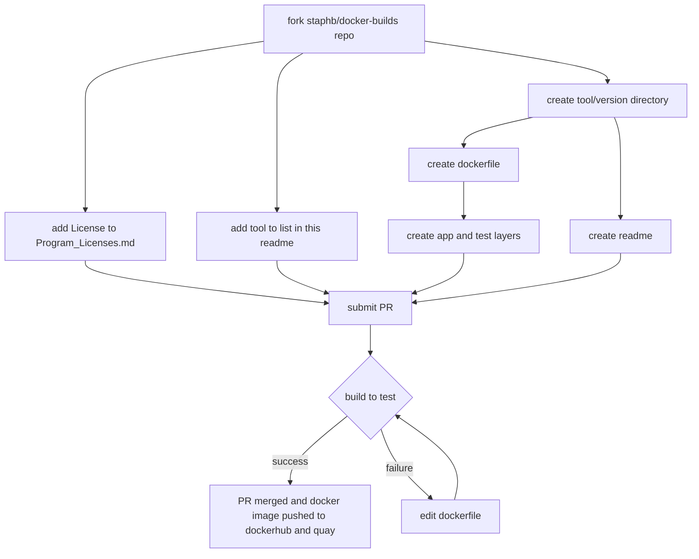

[](https://gitpod.io/#https://github.com/StaPH-B/docker-builds)

# [docker-builds](#)
This repository contains the Dockerfiles and other assorted files necessary for building Docker images for a variety of programs used by members of the StaPH-B (State Public Health Lab Bioinformatics) consortium. The purpose of this repository is to provide a centralized location for Docker images that is easily accessible for users, with clear documentation on how the containers were built and how to use them.

There are several community projects that create and share containers for bioinformatic tools. This repository contains the Dockerfiles and other assorted files necessary for building Docker images for a variety of tools used by members of the StaPH-B (State Public Health Lab Bioinformatics) consortium. The purpose of this repository is to provide a centralized location for Docker images that is easily accessible for users, with clear documentation on how the containers were built and how to use them.

This is a community resource, built and maintined by users from varied backgrounds and expertise levels. As such, we have provided some [templates for contributing to this repository](./dockerfile-template). If **you** would like to add a Docker image or improve upon the existing images, please fork the repository, make your changes/additions, and submit a pull request. If you are having an issue with an existing image, please submit an issue. We welcome any and all feedback!

[See more details on how to contribute here](https://staph-b.github.io/docker-builds/contribute/)

## Docker image repositories & hosting

We host all of our docker images on two different repositories:

  1. [Dockerhub - https://hub.docker.com/r/staphb/](https://hub.docker.com/r/staphb/)
  2. [Quay.io - https://quay.io/organization/staphb/](https://quay.io/organization/staphb/)

The development process of creating a new image is summarized as follows:



## User Guide

The [StaPH-B Docker User Guide](https://staphb.org/docker-builds/) was created to outline methods and best practices for using and developing docker containers. There are chapters for:

- [Contributing](https://staphb.org/docker-builds/contribute/)
- [Downloading Docker images](https://staphb.org/docker-builds/get_containers/)
- [Running Docker containers](https://staphb.org/docker-builds/run_containers/)
- [Developing Docker images](https://staphb.org/docker-builds/make_containers/)
- [Useful links](https://staphb.org/docker-builds/useful_links/)

### Summarized usage guide for docker

```bash
# Build a docker image to the 'test' layer
docker build --tag tool:test --target test <directory to Dockerfile>
docker build --tag samtools:test --target test samtools/1.15

# Download a docker image from dockerhub (most tools have a 'latest' version tag)
docker pull staphb/tool:version
docker pull staphb/shigatyper:2.0.2

# Run the container (don't forget to mount your volumes!)
docker run --rm -u $(id -u):$(id -g) -v <local directory>:/data tool:version <command>
docker run --rm -u $(id -u):$(id -g) -v $(pwd)/amrfinder_test_files:/data amrfinder:3.10 amrfinder --nucleotide 2021CK-01854_contigs.fa --threads 20 --name 2021CK-01854 --output /data/2021CK-01854.txt --organism Klebsiella
```

Further documentation can be found at [docs.docker.com](https://docs.docker.com/engine/reference/run/)

### Templates

Several template files are provided. These are intended to be copied and edited by contributors.

1. [dockerfile-template/Dockerfile](./dockerfile-template/Dockerfile) is the basic template useful for most images
2. [dockerfile-template/Dockerfile_mamba](./dockerfile-template/Dockerfile_mamba) is a basic template for using the micromamba base image
3. [dockerfile-template/README.md](./dockerfile-template/README.md) is a basic readme file template to assist others in using the image

### What about Singularity?

For many people, Docker is not an option, but Singularity is. Most Docker containers are compatible with Singularity and can easily be converted to Singularity format. Please see the [User Guide](https://staphb.org/docker-builds/) for instructions on how to download docker images from dockerhub and how to run them using Singularity. We've worked hard to ensure that our containers are compatibile with Singularity, but if you find one that isn't, please leave an issue and let us know!

### Summarized usage guide for singularity

```bash
# Pulling a container from dockerhub (creates a file)
singularity pull --name <name of singularity file> docker://staphb/bbtools:38.96
singularity pull --name staphb-bbtools-38.96.simg docker://staphb/bbtools:38.96

# Running the container (don't forget to mount your volumes!)
singularity exec --bind <local directory>:/data <name of singularity file> <command>
singularity exec --bind $(pwd)/fastq:/data staphb-bbtools-38.96.simg bbduk.sh in1=sample1_R1.fastq.gz in2=sample1_R2.fastq.gz out1=bbduk/sample1_rmphix_R1.fastq.gz out2=bbduk/sample1_rmphix_R2.fastq.gz outm=bbduk/sample1.matched_phix.fq ref=/opt/bbmap/resources/phix174_ill.ref.fa.gz stats=bbduk/sample1.phix.stats.txt threads=4
```

Further documentation can be found at [docs.sylabs.io](https://docs.sylabs.io/guides/3.1/user-guide/cli.html)

## Training

- Training materials (slides & exercises) from the North East Bioinformatics Regional Resource 2023 workshop **Docker for Public Health Bioinformatics** can be located here, within [`training/NE-BRR-docker-for-PH-bioinformatics-May2023/`](training/NE-BRR-docker-for-PH-bioinformatics-May2023/)
- Video training from APHL 2024 workshop **Intermediate Docker Bioinformatics Workshop** can be located in [APHL's e-learning resources](https://learn.aphl.org/learn/course/external/view/elearning/355/intermediate-docker-bioinformatics-workshop)

## Logs

In November 2020, Docker began to implement pull rate limits for images hosted on dockerhub. This limits the number of `docker pull`'s per time period (e.g. anonymous users allowed 100 pulls per six hours). We applied and were approved for Docker's "Open Source Program," which should have removed the pull rate limits for all `staphb` docker images! 🎉 🥳 If you encounter an error such as `ERROR: toomanyrequests: Too Many Requests.` or `You have reached your pull rate limit. You may increase the limit by authenticating and upgrading: https://www.docker.com/increase-rate-limits.` , please let us know by [submitting an issue.](https://github.com/StaPH-B/docker-builds/issues)

**A huge thank you goes to the folks at Docker for supporting our efforts to distribute & share critical tools for public health bioinformatics. This has been especially important during the COVID-19 global pandemic, as many of these tools are used to conduct genomic surveillance on the SARS-CoV-2 virus as well as other important pathogens of public health concern.**

To learn more about the docker pull rate limits and the open source software program, please see these blog posts ([1](https://www.docker.com/blog/docker-hub-image-retention-policy-delayed-and-subscription-updates/), [2](https://www.docker.com/blog/scaling-docker-to-serve-millions-more-developers-network-egress/), and [3](https://www.docker.com/blog/expanded-support-for-open-source-software-projects/)) and Docker documentation ([1](https://docs.docker.com/docker-hub/download-rate-limit/)).

*NOTE: In the table below, we do not provide individual links to the various tools on quay.io, please visit the above quay.io link to find all of our docker images.*

## [Available Docker images](https://hub.docker.com/r/staphb/)

| Software | Version | Link |
| :--------: | ------- | -------- |
| [ABRicate](https://hub.docker.com/r/staphb/abricate/) <br/> [](https://hub.docker.com/r/staphb/abricate) | <ul><li>0.8.7</li><li>0.8.13</li><li>0.8.13s (+serotypefinder db)</li><li>0.9.8</li><li>1.0.0</li><li>[1.0.1 (+ A. baumannii plasmid typing db)](abricate/1.0.1-Abaum-plasmid)</li><li>[1.0.1 (+ InsaFlu db)](abricate/1.0.1-insaflu-220727)</li><li>[1.0.1 (+ *Vibrio cholerae* db)](abricate/1.0.1-vibrio-cholera/)</li></ul> | https://github.com/tseemann/abricate |
| [ACI](https://hub.docker.com/r/staphb/aci/) <br/> [](https://hub.docker.com/r/staphb/aci) | <ul><li>[1.4.20240116](./aci/1.4.20240116/)</li></ul> | https://github.com/erinyoung/ACI |
| [ANIclustermap](https://hub.docker.com/r/staphb/aniclustermap/) <br/> [](https://hub.docker.com/r/staphb/aniclustermap) | <ul><li>[1.3.0](aniclusteramp/1.3.0/)</li><li>[1.4.0](aniclusteramp/1.4.0/)</li></ul> | https://github.com/moshi4/ANIclustermap |
| [any2fasta](https://hub.docker.com/r/staphb/any2fasta/) <br/> [](https://hub.docker.com/r/staphb/any2fasta) | <ul><li>0.4.2</li></ul> | https://github.com/tseemann/any2fasta |
| [ARIBA](https://hub.docker.com/r/staphb/ariba/) <br/> [](https://hub.docker.com/r/staphb/ariba) | <ul><li>[2.14.4](./ariba/2.14.4/)</li><li>[2.14.6](./ariba/2.14.6/)</li><li>[2.14.7](./ariba/2.14.7/)</li></ul> | https://github.com/sanger-pathogens/ariba |
| [artic](https://hub.docker.com/r/staphb/artic) <br/> [](https://hub.docker.com/r/staphb/artic) | <ul><li>[1.2.4-1.11.1 (artic-medaka)](artic/1.2.4-1.11.1/)</li><li>[1.2.4-1.12.0 (artic-medaka)](artic/1.2.4-1.12.0/)</li></ul> | https://github.com/artic-network/fieldbioinformatics |
| [artic-ncov2019](https://hub.docker.com/r/staphb/artic-ncov2019) <br/> [](https://hub.docker.com/r/staphb/artic-ncov2019) | <ul><li>1.3.0</ul> | https://github.com/artic-network/fieldbioinformatics |
| [artic-ncov2019-epi2me](https://hub.docker.com/r/staphb/artic-ncov2019-epi2me) <br/> [](https://hub.docker.com/r/staphb/artic-ncov2019-epi2me) | <ul><li>0.3.10</ul> | https://github.com/epi2me-labs/wf-artic |
| [artic-ncov2019-medaka](https://hub.docker.com/r/staphb/artic-ncov2019-medaka) <br/> [](https://hub.docker.com/r/staphb/artic-ncov2019-medaka) | <ul><li>1.1.0</ul> | https://github.com/artic-network/artic-ncov2019 |
| [artic-ncov2019-nanopolish](https://hub.docker.com/r/staphb/artic-ncov2019-nanopolish) <br/> [](https://hub.docker.com/r/staphb/artic-ncov2019-nanopolish) | <ul><li>1.1.0</ul> | https://github.com/artic-network/artic-ncov2019 |
| [assembly_snptyper](https://hub.docker.com/r/staphb/assembly_snptyperh) <br/> [](https://hub.docker.com/r/staphb/assembly_snptyper) | <ul><li>[0.1.1](./assembly_snptyper/0.1.1/)</li></ul> | https://github.com/boasvdp/assembly_snptyper |
| [Augur](https://hub.docker.com/r/staphb/augur) <br/> [](https://hub.docker.com/r/staphb/augur) | <ul><li>[6.3.0](./augur/6.3.0/)</li><li>[7.0.2](./augur/7.0.2/)</li><li>[8.0.0](./augur/8.0.0/)</li><li>[9.0.0](./augur/9.0.0/)</li><li>[16.0.3](./augur/16.0.3/)</li><li>[24.2.2](./augur/24.2.2/)</li><li>[24.2.3](./augur/24.2.3/)</li><li>[24.3.0](./augur/24.3.0/)</li><li>[24.4.0](./augur/24.4.0/)</li><li>[26.0.0](./augur/26.0.0/)</li></ul> | https://github.com/nextstrain/augur |
| [Auspice](https://hub.docker.com/r/staphb/auspice) <br/> [](https://hub.docker.com/r/staphb/auspice) | <ul><li>2.12.0</li></ul> | https://github.com/nextstrain/auspice |
| [bakta](https://hub.docker.com/r/staphb/bakta) <br/> [](https://hub.docker.com/r/staphb/bakta) | <ul><li>[1.9.2](./bakta/1.9.2/)</li><li>[1.9.2-light](./bakta/1.9.2-5.1-light/)</li><li>[1.9.3](./bakta/1.9.3/)</li><li>[1.9.3-light](./bakta/1.9.3-5.1-light/)</li><li>[1.9.4](./bakta/1.9.4/)</li><li>[1.9.4-5.1-light](./bakta/1.9.4-5.1-light/)</ul> | https://github.com/oschwengers/bakta |
| [bandage](https://hub.docker.com/r/staphb/bandage) <br/> [](https://hub.docker.com/r/staphb/bandage) | <ul><li>[0.8.1](./bandage/0.8.1/)</li></ul> | https://rrwick.github.io/Bandage/ |
| [BBTools](https://hub.docker.com/r/staphb/bbtools/) <br/> [](https://hub.docker.com/r/staphb/bbtools) | <ul><li>[38.76](./bbtools/38.76/)</li><li>[38.86](./bbtools/38.86/)</li><li>[38.95](./bbtools/38.95/)</li><li>[38.96](./bbtools/38.96/)</li><li>[38.97](./bbtools/38.97/)</li><li>[38.98](./bbtools/38.98/)</li><li>[38.99](./bbtools/38.99/)</li><li>[39.00](./bbtools/39.00/)</li><li>[39.01](./bbtools/39.01/)</li><li>[39.06](./bbtools/39.06/)</li><li>[39.10](./bbtools/39.10/)</li><li>[39.13](./bbtools/39.13/)</li></ul> | https://jgi.doe.gov/data-and-tools/bbtools/ |
| [bcftools](https://hub.docker.com/r/staphb/bcftools/) <br/> [](https://hub.docker.com/r/staphb/bcftools) | <ul><li>[1.10.2](./bcftools/1.10.2/)</li><li>[1.11](./bcftools/1.11/)</li><li>[1.12](./bcftools/1.12/)</li><li>[1.13](./bcftools/1.13/)</li><li>[1.14](./bcftools/1.14/)</li><li>[1.15](./bcftools/1.15/)</li><li>[1.16](./bcftools/1.16/)</li><li>[1.17](./bcftools/1.17/)</li><li>[1.18](bcftools/1.18/)</li><li>[1.19](./bcftools/1.19/)</li><li>[1.20](./bcftools/1.20/)</li><li>[1.20.c](./bcftools/1.20.c/)</li><li>[1.21](./bcftools/1.21/)</li></ul> | https://github.com/samtools/bcftools |
| [bedtools](https://hub.docker.com/r/staphb/bedtools/) <br/> [](https://hub.docker.com/r/staphb/bedtools) | <ul><li>2.29.2</li><li>2.30.0</li><li>[2.31.0](bedtools/2.31.0/)</li><li>[2.31.1](bedtools/2.31.1/)</li></ul> | https://bedtools.readthedocs.io/en/latest/ <br/>https://github.com/arq5x/bedtools2 |
| [berrywood-report-env](https://hub.docker.com/r/staphb/berrywood-report-env/) <br/> [](https://hub.docker.com/r/staphb/berrywood-report-env) | <ul><li>1.0</li></ul> | none |
| [blast+](https://hub.docker.com/r/staphb/blast/) <br/> [](https://hub.docker.com/r/staphb/blast) | <ul><li>[2.13.0](blast/2.13.0/)</li><li>[2.14.0](blast/2.14.0/)</li><li>[2.14.1](blast/2.14.1/)</li><li>[2.15.0](blast/2.15.0/)</li><li>[2.16.0](./blast/2.16.0/)</li></ul> | https://www.ncbi.nlm.nih.gov/books/NBK279690/ |
| [bowtie2](https://hub.docker.com/r/staphb/bowtie2/) <br/> [](https://hub.docker.com/r/staphb/bowtie2) | <ul><li>[2.4.4](./bowtie2/2.4.4/)</li><li>[2.4.5](./bowtie2/2.4.5/)</li><li>[2.5.1](./bowtie2/2.5.1/)</li><li>[2.5.3](./bowtie2/2.5.3/)</li><li>[2.5.4](./bowtie2/2.5.4/)</li></ul> | http://bowtie-bio.sourceforge.net/bowtie2/manual.shtml <br/>https://github.com/BenLangmead/bowtie2 |
| [Bracken](https://hub.docker.com/r/staphb/bracken/) <br/> [](https://hub.docker.com/r/staphb/bracken) | <ul><li>[2.9](./bracken/2.9)</li></ul> | https://ccb.jhu.edu/software/bracken/index.shtml?t=manual <br/>https://github.com/jenniferlu717/Bracken |
| [BUSCO](https://hub.docker.com/r/staphb/busco/) <br/> [](https://hub.docker.com/r/staphb/busco) | <ul><li>[5.4.7](./busco/5.4.7/)</li><li>[5.6.1](./busco/5.6.1/)</li><li>[5.6.1-prok-bacteria_odb10_2024-01-08](./busco/5.6.1-prok-bacteria_odb10_2024-01-08/)</li><li>[5.7.1](./busco/5.7.1/)</li><li>[5.7.1-prok-bacteria_odb10_2024-01-08](./busco/5.7.1-prok-bacteria_odb10_2024-01-08/)</li><li>[5.8.0](./busco/5.8.0/)</li><li>[5.8.0-prok-bacteria_odb10_2024-01-08](./busco/5.8.0-prok-bacteria_odb10_2024-01-08/)</li></ul> | https://busco.ezlab.org/busco_userguide.html <br/>https://gitlab.com/ezlab/busco |
| [BWA](https://hub.docker.com/r/staphb/bwa) <br/> [](https://hub.docker.com/r/staphb/bwa) | <ul><li>0.7.17</li><li>[0.7.18](./bwa/0.7.18/)</li></ul> | https://github.com/lh3/bwa |
| [Canu](https://hub.docker.com/r/staphb/canu) <br/> [](https://hub.docker.com/r/staphb/canu)| <ul><li>2.0</li><li>2.1.1</li><li>2.2</li></ul> | https://canu.readthedocs.io/en/latest/ <BR/> https://github.com/marbl/canu |
| [Canu-Racon](https://hub.docker.com/r/staphb/canu-racon/) <br/> [](https://hub.docker.com/r/staphb/canu-racon) | <ul><li>1.7.1 (Canu), 1.3.1 (Racon), 2.13 (minimap2)</li><li>1.9 (Canu), 1.4.3 (Racon), 2.17 (minimap2)</li><li>1.9i (Canu), 1.4.3 (Racon), 2.17 (minimap2), (+racon_preprocess.py)</li><li>2.0 (Canu), 1.4.3 (Racon), 2.17 (minimap2)</li></ul> | https://canu.readthedocs.io/en/latest/ <br/> https://github.com/lbcb-sci/racon <br/> https://github.com/isovic/racon (ARCHIVED) <br/> https://lh3.github.io/minimap2/ |
| [CAT](https://github.com/dutilh/CAT) <br/> [](https://hub.docker.com/r/staphb/cat) | <ul><li>[5.3](./cat/5.3)</li></ul> | https://github.com/dutilh/CAT |
| [centroid](https://hub.docker.com/r/staphb/centroid/) <br/> [](https://hub.docker.com/r/staphb/centroid) | <ul><li>1.0.0</li></ul> | https://github.com/stjacqrm/centroid |
| [CDC-SPN](https://hub.docker.com/r/staphb/cdc-spn/) <br/> [](https://hub.docker.com/r/staphb/cdc-spn) | <ul><li>0.1 (no version)</li></ul> | https://github.com/BenJamesMetcalf/Spn_Scripts_Reference |
| [cfsan-snp-pipeline](https://hub.docker.com/r/staphb/cfsan-snp-pipeline) <br/> [](https://hub.docker.com/r/staphb/cfsan-snp-pipeline) | <ul><li>2.0.2</li> <li>2.2.1</li> </ul> | https://github.com/CFSAN-Biostatistics/snp-pipeline |
| [CheckM](https://hub.docker.com/r/staphb/checkm) <br/> [](https://hub.docker.com/r/staphb/checkm) | <ul><li>[1.2.2](./checkm/1.2.2/)</li><li>[1.2.3](./checkm/1.2.3/)</li></ul> | https://github.com/Ecogenomics/CheckM |
| [CheckM2](https://hub.docker.com/r/staphb/checkm2) <br/> [](https://hub.docker.com/r/staphb/checkm2) | <ul><li>[1.0.2](./checkm2/1.0.2)</li></ul> | https://github.com/chklovski/CheckM2 |
| [CheckV](https://hub.docker.com/r/staphb/checkv) <br/> [](https://hub.docker.com/r/staphb/checkv) | <ul><li>[1.0.3](./checkv/1.0.3/)</li></ul> | https://bitbucket.org/berkeleylab/checkv/ |
| [Circlator](https://hub.docker.com/r/staphb/circlator) <br/> [](https://hub.docker.com/r/staphb/circlator) | <ul><li>1.5.6</li><li>1.5.5</li></ul> | https://github.com/sanger-pathogens/circlator |
| [Circos](https://hub.docker.com/r/staphb/circos) <br/> [](https://hub.docker.com/r/staphb/circos) | <ul><li>[0.69-9](./circos/0.69.9/)</li></ul> | https://circos.ca/ |
| [CirculoCov](https://hub.docker.com/r/staphb/circulocov) <br/> [](https://hub.docker.com/r/staphb/circulocov) | <ul><li>[0.1.20240104](./circulocov/0.1.20240104/)</li></ul> | https://github.com/erinyoung/CirculoCov |
| [Clair3](https://hub.docker.com/r/staphb/clair3) <br/> [](https://hub.docker.com/r/staphb/clair3) | <ul><li>[1.0.9](./clair3/1.0.9/)</li><li>[1.0.10](./clair3/1.0.10/)</li></ul> | https://github.com/HKU-BAL/Clair3 |
| [Clustalo](https://hub.docker.com/r/staphb/clustalo) <br/> [](https://hub.docker.com/r/staphb/clustalo) | <ul><li>1.2.4</li></ul> | http://www.clustal.org/omega/ |
| [colorid](https://hub.docker.com/r/staphb/colorid) <br/> [](https://hub.docker.com/r/staphb/colorid) | <ul><li>0.1.4.3</li></ul> | https://github.com/hcdenbakker/colorid |
| [Core-SNP-filter](https://hub.docker.com/r/staphb/core-snp-filter) <br/> [](https://hub.docker.com/r/staphb/core-snp-filter) | <ul><li>[0.2.0](./core-snp-filter/0.2.0/)</li></ul> | https://github.com/rrwick/Core-SNP-filter |
| [cutshaw-report-env](https://hub.docker.com/r/staphb/cutshaw-report-env) <br/> [](https://hub.docker.com/r/staphb/cutshaw-report-env) | <ul><li>1.0.0</li></ul> | https://github.com/VADGS/CutShaw |
| [datasets-sars-cov-2](https://github.com/CDCgov/datasets-sars-cov-2) <br/> [](https://hub.docker.com/r/staphb/datasets-sars-cov-2) | <ul><li>0.6.2</li><li>0.6.3</li><li>0.7.2</li></ul> | https://github.com/CDCgov/datasets-sars-cov-2 |
| [dnaapler](https://hub.docker.com/r/staphb/dnaapler) <br/> [](https://hub.docker.com/r/staphb/dnaapler) | <ul><li>[0.1.0](dnaapler/0.1.0/)</li></ul> <ul><li>[0.4.0](dnaapler/0.4.0/)</li><li>[0.5.0](dnaapler/0.5.0/)</li><li>[0.5.1](dnaapler/0.5.1/)</li><li>[0.7.0](dnaapler/0.7.0/)</li><li>[0.8.0](dnaapler/0.8.0/)</li><li>[1.0.1](dnaapler/1.0.1/)</li></ul> | https://github.com/gbouras13/dnaapler |
| [diamond](https://github.com/bbuchfink/diamond) <br/> [](https://hub.docker.com/r/staphb/diamond) | <ul><li>[2.1.9](./diamond/2.1.9)</li><li>[2.1.10](./diamond/2.1.10)</li></ul> | https://github.com/bbuchfink/diamond|
| [dorado](https://hub.docker.com/r/staphb/dorado) <br/> [](https://hub.docker.com/r/staphb/dorado) | <ul><li>[0.8.0](dorado/0.8.0/)</li><li>[0.8.3](dorado/0.8.3/)</li></ul> | [https://github.com/nanoporetech/dorado](https://github.com/nanoporetech/dorado) |
| [dragonflye](https://hub.docker.com/r/staphb/dragonflye) <br/> [](https://hub.docker.com/r/staphb/dragonflye) | <ul><li>[1.0.14](./dragonflye/1.0.14/)</li><li>[1.1.1](./dragonflye/1.1.1/)</li><li>[1.1.2](./dragonflye/1.1.2/)</li><li>[1.2.0](./dragonflye/1.2.0/)</li><li>[1.2.1](./dragonflye/1.2.1/)</li></ul> | https://github.com/rpetit3/dragonflye |
| [Dr. PRG ](https://hub.docker.com/r/staphb/drprg) <br/> [](https://hub.docker.com/r/staphb/drprg) | <ul><li>[0.1.1](drprg/0.1.1/)</li></ul> | https://mbh.sh/drprg/ |
| [DSK](https://hub.docker.com/r/staphb/dsk) <br/> [](https://hub.docker.com/r/staphb/dsk) | <ul><li>[0.0.100](./dsk/0.0.100/)</li><li>[2.3.3](./dsk/2.3.3/)</li></ul> | https://gatb.inria.fr/software/dsk/ |
| [el_gato](https://hub.docker.com/r/staphb/elgato) <br/> [](https://hub.docker.com/r/staphb/elgato) | <ul><li>[1.15.2](./elgato/1.15.2)</li><li>[1.18.2](./elgato/1.18.2)</li><li>[1.19.0](./elgato/1.19.0)</li><li>[1.20.0](./elgato/1.20.0)</li><li>[1.20.1](./elgato/1.20.1)</li></ul> | https://github.com/appliedbinf/el_gato |
| [emboss](https://hub.docker.com/r/staphb/emboss) <br/> [](https://hub.docker.com/r/staphb/emboss) | <ul><li>6.6.0 (no version)</li></ul> | http://emboss.sourceforge.net |
| [emmtyper](https://hub.docker.com/r/staphb/emmtyper) <br/> [](https://hub.docker.com/r/staphb/emmtyper) | <ul><li>[0.2.0](./emmtyper/0.2.0/)</li><li>[0.2.0-2412](./emmtyper/0.2.0-2412/)</li></ul> | https://github.com/MDU-PHL/emmtyper |
| [emm-typing-tool](https://hub.docker.com/r/staphb/emm-typing-tool) <br/> [](https://hub.docker.com/r/staphb/emm-typing-tool) | <ul><li>0.0.1 (no version)</li></ul> | https://github.com/phe-bioinformatics/emm-typing-tool |
| [EToKi](https://hub.docker.com/r/staphb/etoki) <br/> [](https://hub.docker.com/r/staphb/etoki) | <ul><li>1.2.1</li></ul> | https://github.com/zheminzhou/EToKi |
| [FastANI](https://hub.docker.com/r/staphb/fastani) <br/> [](https://hub.docker.com/r/staphb/fastani) | <ul><li>1.1</li><li>1.32</li><li>1.33</li><li>1.33 + RGDv2</li><li>[1.34](fastani/1.34)</li><li>[1.34 + RGDv2](fastani/1.34-RGDV2/)</li></ul> | https://github.com/ParBLiSS/FastANI |
| [fasten](https://hub.docker.com/r/staphb/fasten) <br/> [](https://hub.docker.com/r/staphb/fasten) | <ul><li>[0.7.2](./fasten/0.7.2)</li><li>[0.8.1](./fasten/0.8.1/)</li></ul> | https://github.com/lskatz/fasten |
| [Fastp](https://hub.docker.com/r/staphb/fastp) <br/> [](https://hub.docker.com/r/staphb/fastp) | <ul><li>0.23.2</li><li>[0.23.4](fastp/0.23.4/)</li><li>[0.24.0](./fastp/0.24.0/)</li></ul> | http://opengene.org/fastp/ <br/> https://github.com/OpenGene/fastp |
| [FastTree](https://hub.docker.com/r/staphb/fasttree) <br/> [](https://hub.docker.com/r/staphb/fasttree) | <ul><li>2.1.11</li></ul> | http://www.microbesonline.org/fasttree/ |
| [FastQC](https://hub.docker.com/r/staphb/fastqc) <br/> [](https://hub.docker.com/r/staphb/fastqc) | <ul><li>0.11.8</li><li>0.11.9</li><li>0.12.1</li></ul> | https://www.bioinformatics.babraham.ac.uk/projects/fastqc/ <br/> https://github.com/s-andrews/FastQC |
| [fastq-scan](https://hub.docker.com/r/staphb/fastq-scan) <br/> [](https://hub.docker.com/r/staphb/fastq-scan) | <ul><li>0.4.3</li><li>0.4.4</li><li>1.0.0</li><li>1.0.1</li></ul> | https://github.com/rpetit3/fastq-scan |
| [Freebayes](https://hub.docker.com/r/staphb/freebayes) <br/> [](https://hub.docker.com/r/staphb/freebayes) | <ul><li>1.3.6</li><li>1.3.7</li><li>1.3.7</li><li>1.3.7</li></ul> | https://github.com/freebayes/freebayes |
| [Filtlong](https://hub.docker.com/r/staphb/filtlong) <br/> [](https://hub.docker.com/r/staphb/filtlong) | <ul><li>0.2.0</li><li>0.2.1</li></ul> | https://github.com/rrwick/filtlong |
| [FLASH](https://hub.docker.com/r/staphb/flash) <br/> [](https://hub.docker.com/r/staphb/flash) | <ul><li>1.2.11</li></ul> | http://ccb.jhu.edu/software/FLASH |
| [Flye](https://hub.docker.com/r/staphb/flye) <br/> [](https://hub.docker.com/r/staphb/flye) | <ul><li>[2.5](flye/2.5/)</li><li>[2.7](flye/2.7/)</li><li>[2.8](flye/2.8/)</li><li>[2.9](flye/2.9/)</li><li>[2.9.1](flye/2.9.1/)</li><li>[2.9.2](flye/2.9.2/)</li><li>[2.9.3](flye/2.9.3/)</li><li>[2.9.4](flye/2.9.4/)</li><li>[2.9.5](./flye/2.9.5/)</li></ul> | https://github.com/fenderglass/Flye |
| [Freyja](https://hub.docker.com/r/staphb/freyja) <br/> [](https://hub.docker.com/r/staphb/freyja) | <ul><li>[1.2](./freyja/1.2/)</li><li>[1.2.1](./freyja/1.2.1/)</li><li>[1.3.1](./freyja/1.3.1/)</li><li>[1.3.2](./freyja/1.3.2/)</li><li>[1.3.4](./freyja/1.3.4/)</li><li>[1.3.7](./freyja/1.3.7/)</li><li>[1.3.8](./freyja/1.3.8/)</li><li>[1.3.9](./freyja/1.3.9/)</li><li>[1.3.10](./freyja/1.3.10/)</li><li>[1.3.11](./freyja/1.3.11/)</li><li>[1.3.12](./freyja/1.3.12/)</li><li>[1.4.2](./freyja/1.4.2/)</li><li>[1.4.3](freyja/1.4.3/)</li><li>[1.4.4](freyja/1.4.4/)</li><li>[1.4.5](freyja/1.4.5/)</li><li>[1.4.7](freyja/1.4.7/)</li><li>[1.4.8](freyja/1.4.8/)</li><li>[1.4.9](freyja/1.4.9/)</li><li>[1.5.0](freyja/1.5.0/)</li><li>[1.5.1](freyja/1.5.1/)</li><li>[1.5.2](freyja/1.5.2/)</li></ul> | https://github.com/andersen-lab/Freyja |
| [GAMBIT](https://hub.docker.com/r/staphb/gambit) <br/> [](https://hub.docker.com/r/staphb/gambit) | <ul><li>0.3.0</li><li>0.4.0</li><li>0.5.0</li><li>1.0.0</li></ul> | https://github.com/jlumpe/gambit |
| [GAMMA](https://hub.docker.com/r/staphb/gamma) <br/> [](https://hub.docker.com/r/staphb/gamma) | <ul><li>1.4</li><li>2.1</li><li>2.2</li></ul> | https://github.com/rastanton/GAMMA/ |
| [GenoFLU](https://hub.docker.com/r/staphb/genoflu) <br/> []() | <ul><li>[1.03](genoflu/1.03/)</li></ul> | https://github.com/USDA-VS/GenoFLU |
| [geNomad](https://hub.docker.com/r/staphb/genomad) <br/> [](https://hub.docker.com/r/staphb/genomad) | <ul><li>[1.7.4](./genomad/1.7.4/)</li><li>[1.8.0](./genomad/1.8.0/)</li><li>[1.8.1](./genomad/1.8.1/)</li></ul> | https://github.com/apcamargo/genomad |
| [GenoVi](https://hub.docker.com/r/staphb/genovi) <br/> [](https://hub.docker.com/r/staphb/genovi) | <ul><li>[0.2.16](./genovi/0.2.16/)</li></ul> | https://github.com/robotoD/GenoVi |
| [gfastats](https://hub.docker.com/r/staphb/gfastats) <br/> [](https://hub.docker.com/r/staphb/gfastats) | <ul><li>[1.3.6](./gfastats/1.3.6/)</li><li>[1.3.7](./gfastats/1.3.7/)</li></ul> | https://github.com/vgl-hub/gfastats |
| [grandeur_ref](https://hub.docker.com/r/staphb/grandeur_ref) <br/> [](https://hub.docker.com/r/staphb/grandeur_ref) | <ul><li>[4.5](./grandeur_ref/4.5/)</li></ul> | Part of https://github.com/UPHL-BioNGS/Grandeur |
| [Gubbins](https://hub.docker.com/r/staphb/gubbins) <br/> [](https://hub.docker.com/r/staphb/gubbins) | <ul><li>[3.3.3](./gubbins/3.3.3/)</li><li>[3.3.4](./gubbins/3.3.4/)</li><li>[3.3.5](./gubbins/3.3.5/)</li></ul> | https://github.com/nickjcroucher/gubbins |
| [heatcluster](https://hub.docker.com/r/staphb/heatcluster) <br/> [](https://hub.docker.com/r/staphb/heatcluster) | <ul><li>[1.0.2c](./heatcluster/1.0.2c/)</li></ul> | https://github.com/DrB-S/heatcluster/tree/main |
| [hmmer](https://hub.docker.com/r/staphb/hmmer) <br/> [](https://hub.docker.com/r/staphb/hmmer) | <ul><li>[3.3](hmmer/3.3/)</li><li>[3.3.2](hmmer/3.3.2/)</li><li>[3.4](./hmmer/3.4/)</li></ul> | http://hmmer.org/ |
| [homopolish](https://hub.docker.com/r/staphb/homopolish) <br/> [](https://hub.docker.com/r/staphb/homopolish) | <ul><li>0.4.1</li></ul> | https://github.com/ythuang0522/homopolish/ |
| [hostile](https://github.com/bede/hostile) <br/> [](https://hub.docker.com/r/staphb/hostile | <ul><li>[1.1.0](./hostile/1.1.0)</li></ul> | https://github.com/bede/hostile |
| [htslib](https://hub.docker.com/r/staphb/htslib) <br/> [](https://hub.docker.com/r/staphb/htslib) | <ul><li>[1.14](./htslib/1.14)</li><li>[1.15](./htslib/1.15)</li><li>[1.16](./htslib/1.16)</li><li>[1.17](./htslib/1.17)</li><li>[1.18](./htslib/1.18/)</li><li>[1.19](./htslib/1.19/)</li><li>[1.20](./htslib/1.20/)</li><li>[1.20.c](./htslib/1.20.c/)</li><li>[1.21](./htslib/1.21/)</li></ul> | https://www.htslib.org/ |
| [igv-reports](https://hub.docker.com/r/staphb/igv-reports) <br/> [](https://hub.docker.com/r/staphb/igv-reports) | <ul><li>[1.12.0](./igv-reports/1.12.0/)</li></ul> | https://github.com/igvteam/igv-reports |
| [Integron Finder](https://hub.docker.com/r/staphb/integron_finder/) <br/> [](https://hub.docker.com/r/staphb/integron_finder) | <ul><li>[2.0.5](./integron_finder/2.0.5/)</li></ul> | https://github.com/gem-pasteur/Integron_Finder |
| [iqtree](https://hub.docker.com/r/staphb/iqtree/) <br/> [](https://hub.docker.com/r/staphb/iqtree) | <ul><li>1.6.7</li></ul> | http://www.iqtree.org/ |
| [iqtree2](https://hub.docker.com/r/staphb/iqtree2/) <br/> [](https://hub.docker.com/r/staphb/iqtree2) | <ul><li>2.1.2</li><li>2.2.2.2</li><li>[2.2.2.6](iqtree2/2.2.2.6/)</li><li>[2.2.2.7](iqtree2/2.2.2.7/)</li><li>[2.3.1](iqtree2/2.3.1/)</li><li>[2.3.4](iqtree2/2.3.4/)</li><li>[2.3.6](iqtree2/2.3.6/)</li></ul> | http://www.iqtree.org/ |
| [IPA](https://hub.docker.com/r/staphb/pbipa) <br/> [](https://hub.docker.com/r/staphb/pbipa) | <ul><li>[1.8.0](./pbipa/1.8.0/)</li></ul> | https://github.com/PacificBiosciences/pbipa |
| [IRMA](https://hub.docker.com/r/staphb/irma/) <br/> [](https://hub.docker.com/r/staphb/irma) | <ul><li>1.0.2</li><li>1.0.3</li><li>1.1.2</li><li>1.1.3</li><li>[1.1.4](./irma/1.1.4/)</li></ul> | https://wonder.cdc.gov/amd/flu/irma/|
| [isPcr](https://users.soe.ucsc.edu/~kent/) <br/> [](https://hub.docker.com/r/staphb/ispcr) | <ul><li>[33](ispcr/33/)</li></ul> | https://users.soe.ucsc.edu/~kent/ |
| [iVar](https://hub.docker.com/r/staphb/ivar/) <br/> [](https://hub.docker.com/r/staphb/ivar) | <ul><li>[1.1](./ivar/1.1/)</li><li>[1.1 (+SARS-CoV2 reference)](./ivar/1.1-SC2/)</li><li>[1.2.1](./ivar/1.2.1/)</li><li>[1.2.1 (+SC2 ref)](./ivar/1.2.1-SC2/)</li><li>[1.2.2 (+SC2 ref and artic bedfiles)](./ivar/1.2.2_artic20200528/)</li><li>[1.3](./ivar/1.3/)</li><li>[1.3.1](./ivar/1.3.1/)</li><li>[1.3.2](./ivar/1.3.2/)</li><li>[1.4.1](./ivar/1.4.1/)</li><li>[1.4.2](./ivar/1.4.2/)</li><li>[1.4.3](./ivar/1.4.3/)</li></ul> | https://github.com/andersen-lab/ivar |
| [Jasmine](https://hub.docker.com/r/staphb/pbjasmine/) <br/> [](https://hub.docker.com/r/staphb/pbjasmine) | <ul><li>[2.0.0](./pbjasmine/2.0.0/)</li></ul> | https://github.com/PacificBiosciences/jasmine |
| [Kaptive](https://hub.docker.com/r/staphb/kaptive/) <br/> [](https://hub.docker.com/r/staphb/kaptive) | <ul><li>[2.0.0](./kaptive/2.0.0/)</li><li>[2.0.3](./kaptive/2.0.3/)</li><li>[2.0.5](./kaptive/2.0.5/)</li><li>[2.0.8](./kaptive/2.0.8/)</li><li>[3.0.0b6](./kaptive/3.0.0b6/)</li></ul> | https://github.com/klebgenomics/Kaptive |
| [Kleborate](https://hub.docker.com/r/staphb/kleborate/) <br/> [](https://hub.docker.com/r/staphb/kleborate) | <ul><li>[2.0.4](./kleborate/2.0.4/)</li><li>[2.1.0](./kleborate/2.1.0/)</li><li>[2.2.0](./kleborate/2.3.2/)</li><li>[2.3.2](./kleborate/2.3.2)</li><li>[2.3.2-2023-05](kleborate/2.3.2-2023-05/)</li><li>[2.4.1](kleborate/2.4.1/)</li><li>[3.1.2](kleborate/3.1.2/)</li></ul> | https://github.com/katholt/Kleborate/ <br/> https://github.com/katholt/Kaptive/ |
| [kma](https://hub.docker.com/r/staphb/kma/) <br/> [](https://hub.docker.com/r/staphb/kma) | <ul><li>1.2.21</li><li>1.4.10 (no database)</li><li>[1.4.14](./kma/1.4.14/) (no database)</li></ul> | https://bitbucket.org/genomicepidemiology/kma/ |
| [Kraken](https://hub.docker.com/r/staphb/kraken/) <br/> [](https://hub.docker.com/r/staphb/kraken) | <ul><li>1.0</li><li>1.1.1</li><li>1.1.1 (no database)</li></ul> | https://github.com/DerrickWood/kraken |
| [Kraken2](https://hub.docker.com/r/staphb/kraken2/) <br/> [](https://hub.docker.com/r/staphb/kraken2) | <ul><li>2.0.8-beta (no database)</li><li>2.0.8-beta (MiniKraken2_v1_8GB db)</li><li>2.0.8-beta_hv (human + virus db)</li><li>2.0.9-beta (no db)</li><li>2.0.9-beta (Minikraken v2 RefSeq: bacteria, archaea, viral, and human 8GB db)</li><li>2.1.0 (no db)</li><li>2.1.1 (no db)</li><li>2.1.2 (no db)</li><li>[2.1.3](kraken2/2.1.3/) (no db)</li></ul> | https://github.com/DerrickWood/kraken2 | 
| [KrakenTools](https://github.com/jenniferlu717/KrakenTools) <br/> [](https://hub.docker.com/r/staphb/krakentools) | <ul><li>[d4a2fbe](./krakentools/d4a2fbe)</li></ul> | https://github.com/jenniferlu717/KrakenTools |
| [KrakenUniq](https://hub.docker.com/r/staphb/krakenuniq/) <br/> [](https://hub.docker.com/r/staphb/krakenuniq) | <ul><li>[1.0.4](./krakenuniq/1.0.4) (no database)</li></ul> | https://github.com/fbreitwieser/krakenuniq |
| [kSNP3](https://hub.docker.com/r/staphb/ksnp3/) <br/> [](https://hub.docker.com/r/staphb/ksnp3)| <ul><li>3.1</li></ul> | https://sourceforge.net/projects/ksnp/ |
| [kSNP4](https://hub.docker.com/r/staphb/ksnp4/) <br/> [](https://hub.docker.com/r/staphb/ksnp4)| <ul><li>4.0</li><li>[4.1](./ksnp4/4.1/)</li></ul> | https://sourceforge.net/projects/ksnp/ |
| [label](https://hub.docker.com/r/staphb/label/) <br/> [](https://hub.docker.com/r/staphb/label)| <ul><li>[0.6.4](./label/0.6.4/)</li></ul> | https://wonder.cdc.gov/amd/flu/label |
| [legsta](https://hub.docker.com/r/staphb/legsta/) <br/> [](https://hub.docker.com/r/staphb/legsta)| <ul><li>0.3.7</li><li>0.5.1</li></ul> | https://github.com/tseemann/legsta |
| [liftoff](https://hub.docker.com/r/staphb/liftoff/) <br/> [](https://hub.docker.com/r/staphb/liftoff)| <ul><li>1.6.3</li></ul> | https://github.com/agshumate/Liftoff |
| [lima](https://hub.docker.com/r/staphb/lima/) <br/> [](https://hub.docker.com/r/staphb/lima)| <ul><li>[2.9.0](./lima/2.9.0/)</li><li>[2.9.0+Rscripts](./lima/2.9.0+Rscripts/)</li></ul> | https://github.com/PacificBiosciences/barcoding |
| [longshot](https://hub.docker.com/r/staphb/longshot/) <br/> [](https://hub.docker.com/r/staphb/longshot)| <ul><li>[0.4.5](longshot/0.4.5)</li><li>[1.0.0](longshot/1.0.0/)</li></ul> | https://github.com/pjedge/longshot |
| [lrge](https://hub.docker.com/r/staphb/lrge/) <br/> [](https://hub.docker.com/r/staphb/lrge)| <ul><li>[0.1.3](./lrge/0.1.3/)</li></ul> | https://github.com/mbhall88/lrge |
| [Lyve-SET (includes CG-Pipeline scripts and raxml)](https://hub.docker.com/r/staphb/lyveset/) <br/> [](https://hub.docker.com/r/staphb/lyveset) | <ul><li>1.1.4f</li><li>2.0.1</li></ul> | https://github.com/lskatz/lyve-SET https://github.com/lskatz/CG-Pipeline |
| [MAFFT](https://hub.docker.com/r/staphb/mafft/) <br/> [](https://hub.docker.com/r/staphb/mafft)  | <ul><li>[7.450](./mafft/7.450/)</li><li>[7.475](./mafft/7.475/)</li><li>[7.505](./mafft/7.505/)</li><li>[7.520](./mafft/7.520/)</li><li>[7.526](./mafft/7.526/)</li></ul> | https://mafft.cbrc.jp/alignment/software/ |
| [Mash](https://hub.docker.com/r/staphb/mash/) <br/> [](https://hub.docker.com/r/staphb/mash)  | <ul><li>2.1</li><li>2.2</li><li>2.3</li></ul> | https://github.com/marbl/Mash |
| [mashtree](https://hub.docker.com/r/staphb/mashtree) <br/> [](https://hub.docker.com/r/staphb/mashtree) | <ul><li>[0.52.0](./mashtree/0.52.0/)</li><li>[0.57.0](./mashtree/0.57.0/)</li><li>[1.0.4](./mashtree/1.0.4/)</li><li>[1.2.0](./mashtree/1.2.0/)</li><li>[1.4.6](./mashtree/1.4.6/)</li></ul> | https://github.com/lskatz/mashtree |
| [MaSuRCA](https://hub.docker.com/r/staphb/masurca) <br/> [](https://hub.docker.com/r/staphb/masurca) | <ul><li>4.0.8</li><li>4.0.9</li><li>4.1.0</li></ul> | https://github.com/alekseyzimin/masurca |
| [medaka](https://hub.docker.com/r/staphb/medaka) <br/> [](https://hub.docker.com/r/staphb/medaka) | <ul><li>[0.8.1](./medaka/0.8.1/)</li><li>[1.0.1](./medaka/1.0.1/)</li><li>[1.2.0](./medaka/1.2.0/)</li><li>[2.0.0](./medaka/2.0.0/)</li><li>[2.0.1](./medaka/2.0.1/)</li></ul> | https://github.com/nanoporetech/medaka |
| [meningotype](https://hub.docker.com/r/staphb/meningotype) <br/> [](https://hub.docker.com/r/staphb/meningotype) | <ul><li>[0.8.5](./meningotype/0.8.5/)</li></ul> | https://github.com/MDU-PHL/meningotype |
| [metaphlan](https://hub.docker.com/r/staphb/metaphlan) <br/> [](https://hub.docker.com/r/staphb/metaphlan) | <ul><li>[3.0.3-no-db (no database)](./metaphlan/3.0.3-no-db/)</li><li> [3.0.3 (~3GB db)](./metaphlan/3.0.3/)</li><li>[4.1.0](./metaphlan/4.1.0/) (no database)</li><li>[4.1.1](./metaphlan/4.1.1/) (no database)</li></ul> | https://github.com/biobakery/MetaPhlAn |
| [MIDAS](https://hub.docker.com/r/staphb/midas) <br/> [](https://hub.docker.com/r/staphb/midas) | <ul><li>1.3.2 (no database)</li> | https://github.com/snayfach/MIDAS |
| [minimap2](https://hub.docker.com/r/staphb/minimap2) <br/> [](https://hub.docker.com/r/staphb/minimap2) | <ul><li>2.17</li><li>2.18</li><li>2.21</li><li>2.22</li><li>2.23</li><li>2.24</li><li>2.25</li><li>[2.26](./minimap2/2.26)</li><li>[2.27](./minimap2/2.27/)</li><li>[2.28](./minimap2/2.28/)</li></ul> | https://github.com/lh3/minimap2 |
| [minipolish](https://hub.docker.com/r/staphb/minipolish) <br/> [](https://hub.docker.com/r/staphb/minipolish) | <ul><li>0.1.3</li></ul> | https://github.com/rrwick/Minipolish |
| [mlst](https://hub.docker.com/r/staphb/mlst) <br/> [](https://hub.docker.com/r/staphb/mlst) | <ul><li>2.16.2</li><li>2.17.6</li><li>2.19.0</li><li>2.22.0</li><li>2.22.1</li><li>2.23.0</li><li>[2.23.0-2023-07 (databases updated July 2023)](mlst/2.23.0-2023-07/)</li><li>[2.23.0-2023-08 (databases updated Aug 2023)](mlst/2.23.0-2023-08/)</li><li>[2.23.0-2024-01 (databases updated Jan 2024)](mlst/2.23.0-2024-01/)</li><li>[2.23.0-2024-03 (databases updated March 2024)](mlst/2.23.0-2024-03/)</li></ul> | https://github.com/tseemann/mlst |
| [Mugsy](https://hub.docker.com/r/staphb/mugsy) <br/> [](https://hub.docker.com/r/staphb/mugsy) | <ul><li>1r2.3</li></ul> | http://mugsy.sourceforge.net/ |
| [MultiQC](https://hub.docker.com/r/staphb/multiqc) <br/> [](https://hub.docker.com/r/staphb/multiqc) | <ul><li>[1.7](./multiqc/1.7/)</li><li>[1.8](./multiqc/1.8/)</li><li>[1.18](./multiqc/1.18/)</li><li>[1.19](./multiqc/1.19/)</li><li>[1.22.2](./multiqc/1.22.2/)</li><li>[1.22.3](./multiqc/1.22.3/)</li><li>[1.25](./multiqc/1.25/)</li></ul> | https://github.com/MultiQC/MultiQC |
| [Mummer](https://hub.docker.com/r/staphb/mummer) <br/> [](https://hub.docker.com/r/staphb/mummer) | <ul><li>4.0.0</li><li>4.0.0 + RGDv2</li><li>4.0.0 + RGDv2 + gnuplot</li></ul> | https://github.com/mummer4/mummer |
| [Mykrobe + Genotyphi + sonneityping](https://hub.docker.com/r/staphb/mykrobe) <br/> [](https://hub.docker.com/r/staphb/mykrobe) | <ul><li>0.11.0 (Mykrobe) & 1.9.1 (Genotyphi) </li><li>0.12.1 (Mykrobe) & 1.9.1 (Genotyphi) & v20210201 (sonneityping) </li><li>0.12.1 (Mykrobe) & 2.0 (Genotyphi) & v20210201 (sonneityping) </li><li>[0.12.2 (Mykrobe) & 2.0 (Genotyphi) & v20210201 (sonneityping)](mykrobe/0.12.2/)</li><li>[0.13.0](./mykrobe/0.13.0)</li></ul> | https://github.com/Mykrobe-tools/mykrobe <br/> https://github.com/typhoidgenomics/genotyphi <br/> https://github.com/katholt/sonneityping |
| [NanoPlot](https://hub.docker.com/r/staphb/nanoplot) <br/> [](https://hub.docker.com/r/staphb/nanoplot) | <ul><li>[1.27.0](./nanoplot/1.27.0/)</li><li>[1.29.0](./nanoplot/1.29.0/)</li><li>[1.30.1](./nanoplot/1.30.1/)</li><li>[1.32.0](./nanoplot/1.32.0/)</li><li>[1.33.0](./nanoplot/1.33.0/)</li><li>[1.40.0](./nanoplot/1.40.0/)</li><li>[1.41.6](./nanoplot/1.41.6/)</li><li>[1.42.0](./nanoplot/1.42.0/)</li></ul> | https://github.com/wdecoster/NanoPlot |
| [ngmaster](https://hub.docker.com/r/staphb/ngmaster) <br/> [](https://hub.docker.com/r/staphb/ngmaster) | <ul><li>0.5.8</li><li>1.0.0</li></ul> | https://github.com/MDU-PHL/ngmaster |
| [NCBI Datasets](https://hub.docker.com/r/staphb/ncbi-datasets) <br/> [](https://hub.docker.com/r/staphb/ncbi-datasets) | <details><summary> Click to see all datasets versions </summary> **datasets versions** <ul><li>[13.31.0](./ncbi-datasets/13.31.0/)</li><li>[13.35.0](./ncbi-datasets/13.35.0/)</li><li>[13.43.2](./ncbi-datasets/13.43.2/)</li><li>[14.0.0](./ncbi-datasets/14.0.0/)</li><li>[14.3.0](./ncbi-datasets/14.3.0/)</li><li>[14.7.0](./ncbi-datasets/14.7.0/)</li><li>[14.13.2](./ncbi-datasets/14.13.2/)</li><li>[14.20.0](./ncbi-datasets/14.20.0/)</li><li>[14.27.0](ncbi-datasets/14.27.0/)</li><li>[15.1.0](ncbi-datasets/15.1.0/)</li><li>[15.2.0](ncbi-datasets/15.2.0/)</li><li>[15.11.0](ncbi-datasets/15.11.0/)</li><li>[15.27.1](ncbi-datasets/15.27.1/)</li><li>[15.31.0](ncbi-datasets/15.31.1/)</li><li>[16.2.0](ncbi-datasets/16.2.0/)</li><li>[16.8.1](./ncbi-datasets/16.8.1/)</li><li>[16.10.3](./ncbi-datasets/16.10.3/)</li><li>[16.15.0](./ncbi-datasets/16.15.0/)</li><li>[16.22.1](./ncbi-datasets/16.22.1/)</li><li>[16.30.0](./ncbi-datasets/16.30.0/)</li><li>[16.35.0](ncbi-datasets/16.35.0/)</li></ul> | [https://github.com/ncbi/datasets](https://github.com/ncbi/datasets) <br/>[https://www.ncbi.nlm.nih.gov/datasets/docs/v1/](https://www.ncbi.nlm.nih.gov/datasets/docs/v1/) |
| [NCBI AMRFinderPlus](https://hub.docker.com/r/staphb/ncbi-amrfinderplus) <br/> [](https://hub.docker.com/r/staphb/ncbi-amrfinderplus) | **AMRFinderPlus & database verion** <details><summary> Click to see AMRFinderplus v3.11.4 and older versions! </summary> <ul><li>3.1.1b</li><li>3.8.4</li><li>3.8.28</li><li>3.9.3</li><li>3.9.8</li><li>3.10.1</li><li>3.10.5</li><li>3.10.16</li><li>3.10.20</li><li>3.10.24</li><li>3.10.30</li><li>3.10.36</li><li>3.10.42</li><li>3.11.2 & 2022-12-19.1</li><li>[3.11.2 & 2023-02-23.1](ncbi-amrfinderplus/3.11.2-2023-02-23.1/)</li><li>[3.11.4 & 2023-02-23.1](ncbi-amrfinderplus/3.11.4-2023-02-23.1/)</li></ul> </details> <ul><li>[3.11.8 & 2023-02-23.1](ncbi-amrfinderplus/3.11.8-2023-02-23.1/)</li><li>[3.11.11 & 2023-04-17.1](ncbi-amrfinderplus/3.11.11-2023-04-17.1)</li><li>[3.11.14 & 2023-04-17.1](ncbi-amrfinderplus/3.11.14-2023-04-17.1/)</li><li>[3.11.17 & 2023-07-13.2](ncbi-amrfinderplus/3.11.17-2023-07-13.2/)</li><li>[3.11.18 & 2023-08-08.2](ncbi-amrfinderplus/3.11.18-2023-08-08.2/)</li><li>[3.11.20 & 2023-09-26.1](ncbi-amrfinderplus/3.11.20-2023-09-26.1/)</li><li>[3.11.26 & 2023-11-15.1](ncbi-amrfinderplus/3.11.26-2023-11-15.1/)</li><li>[3.12.8 & 2024-01-31.1](ncbi-amrfinderplus/3.12.8-2024-01-31.1/)</li><li>[3.12.8 & 2024-05-02.2](./ncbi-amrfinderplus/3.12.8-2024-05-02.2/)</li><li>[3.12.8 & 2024-07-22.1](./ncbi-amrfinderplus/3.12.8-2024-07-22.1/)</li><li>[4.0.3 & 2024-10-22.1 (includes stxtyper)](./ncbi-amrfinderplus/4.0.3-2024-10-22.1/)</li></ul> | [https://github.com/ncbi/amr](https://github.com/ncbi/amr) |
| [NCBI table2asn](https://hub.docker.com/r/staphb/ncbi-table2asn) <br/> [](https://hub.docker.com/r/staphb/ncbi-table2asn) | <ul><li>[1.26.678](./ncbi-table2asn/1.26.678/)</li><li>[1.28.943](./ncbi-table2asn/1.28.943/)</li><li>[1.28.1021](./ncbi-table2asn/1021/)</li></ul> | [https://www.ncbi.nlm.nih.gov/genbank/table2asn/](https://www.ncbi.nlm.nih.gov/genbank/table2asn/) <br/>[https://ftp.ncbi.nlm.nih.gov/asn1-converters/versions/2022-06-14/by_program/table2asn/](https://ftp.ncbi.nlm.nih.gov/asn1-converters/versions/2022-06-14/by_program/table2asn/) |
| [ONTime](https://hub.docker.com/r/staphb/ontime) <br/> [](https://hub.docker.com/r/staphb/ontime) | <ul><li>[0.2.3](ontime/0.2.3/)</li><li>[0.3.1](ontime/0.3.1/)</li></ul> | https://github.com/mbhall88/ontime |
| [OrthoFinder](https://hub.docker.com/r/staphb/orthofinder) <br/> [](https://hub.docker.com/r/staphb/orthofinder) | <ul><li>2.17</li></ul> | https://github.com/davidemms/OrthoFinder |
| [Panaroo](https://hub.docker.com/r/staphb/panaroo)  <br/> [](https://hub.docker.com/r/staphb/panaroo) | <ul><li>[1.2.10](panaroo/1.2.10/)</li><li>[1.3.4](panaroo/1.3.4/)</li><li>[1.5.0](./panaroo/1.5.0/)</li></ul>| https://github.com/gtonkinhill/panaroo |
| [pandas](https://hub.docker.com/r/staphb/pandas)  <br/> [](https://hub.docker.com/r/staphb/pandas) | <ul><li>[2.2.3](pandas/2.2.3/)</li></ul>| https://github.com/pandas-dev/pandas |
| [pango_aliasor](https://hub.docker.com/r/staphb/pango_aliasor)  <br/> [](https://hub.docker.com/r/staphb/pango_aliasor) | <ul><li>[0.3.0](./pango_aliasor/0.3.0/)</li></ul>| https://github.com/corneliusroemer/pango_aliasor |
| [Pangolin](https://hub.docker.com/r/staphb/pangolin) <br/> [](https://hub.docker.com/r/staphb/pangolin) | <details><summary> Click to see Pangolin v4.2 and older versions! </summary> **Pangolin version & pangoLEARN data release date** <ul><li>1.1.14</li><li>2.0.4 & 2020-07-20</li><li>2.0.5 & 2020-07-20</li><li>2.1.1 & 2020-12-17</li><li>2.1.3 & 2020-12-17</li><li>2.1.6 & 2021-01-06</li><li>2.1.7 & 2021-01-11</li><li>2.1.7 & 2021-01-20</li><li>2.1.8 & 2021-01-22</li><li>2.1.10 & 2021-02-01</li><li>2.1.11 & 2021-02-01</li><li>2.1.11 & 2021-02-05</li><li>2.2.1 & 2021-02-06</li><li>2.2.2 & 2021-02-06</li><li>2.2.2 & 2021-02-11</li><li>2.2.2 & 2021-02-12</li><li>2.3.0 & 2021-02-12</li><li>2.3.0 & 2021-02-18</li><li>2.3.0 & 2021-02-21</li><li>2.3.2 & 2021-02-21</li><li>2.3.3 & 2021-03-16</li><li>2.3.4 & 2021-03-16</li><li>2.3.5 & 2021-03-16</li><li>2.3.6 & 2021-03-16</li><li>2.3.6 & 2021-03-29</li><li>2.3.8 & 2021-04-01</li><li>2.3.8 & 2021-04-14</li><li>2.3.8 & 2021-04-21</li><li>2.3.8 & 2021-04-23</li><li>2.4 & 2021-04-28</li><li>2.4.1 & 2021-04-28</li><li>2.4.2 & 2021-04-28</li><li>2.4.2 & 2021-05-10</li><li>2.4.2 & 2021-05-11</li><li>2.4.2 & 2021-05-19</li><li>3.0.5 & 2021-06-05</li><li>3.1.3 & 2021-06-15</li><li>3.1.5 & 2021-06-15</li><li>3.1.5 & 2021-07-07-2</li><li>3.1.7 & 2021-07-09</li><li>3.1.8 & 2021-07-28</li><li>3.1.10 & 2021-07-28</li><li>3.1.11 & 2021-08-09</li><li>3.1.11 & 2021-08-24</li><li>3.1.11 & 2021-09-17</li><li>3.1.14 & 2021-09-28</li><li>3.1.14 & 2021-10-13</li><li>3.1.16 & 2021-10-18</li><li>3.1.16 & 2021-11-04</li><li>3.1.16 & 2021-11-09</li><li>3.1.16 & 2021-11-18</li><li>3.1.16 & 2021-11-25</li><li>3.1.17 & 2021-11-25</li><li>3.1.17 & 2021-12-06</li><li>3.1.17 & 2022-01-05</li><li>3.1.18 & 2022-01-20</li><li>3.1.19 & 2022-01-20</li><li>3.1.20 & 2022-02-02</li><li>3.1.20 & 2022-02-28</li></ul> **Pangolin version & pangolin-data version** <ul><li>4.0 & 1.2.133</li><li>4.0.1 & 1.2.133</li><li>4.0.2 & 1.2.133</li><li>4.0.3 & 1.2.133</li><li>4.0.4 & 1.2.133</li><li>4.0.5 & 1.3</li><li>4.0.6 & 1.6</li><li>4.0.6 & 1.8</li><li>4.0.6 & 1.9</li><li>4.1.1 & 1.11</li><li>4.1.2 & 1.12</li><li>4.1.2 & 1.13</li><li>4.1.2 & 1.14</li><li>4.1.3 & 1.15.1</li><li>4.1.3 & 1.16</li><li>4.1.3 & 1.17</li><li>4.2 & 1.18</li><li>4.2 & 1.18.1</li><li>4.2 & 1.18.1.1</li><li>4.2 & 1.19</li></ul> </details> **Pangolin version & pangolin-data version** <ul><li>[4.3 & 1.20](pangolin/4.3-pdata-1.20/)</li><li>[4.3 & 1.21](pangolin/4.3-pdata-1.21/)</li><li>[4.3.1 & 1.22](pangolin/4.3.1-pdata-1.22/)</li><li>[4.3.1 & 1.23](pangolin/4.3.1-pdata-1.23/)</li><li>[4.3.1 & 1.23.1](pangolin/4.3.1-pdata-1.23.1/)</li><li>[4.3.1 & 1.23.1 with XDG_CACHE_HOME=/tmp](pangolin/4.3.1-pdata-1.23.1-1/)</li><li>[4.3.1 & 1.24](pangolin/4.3.1-pdata-1.24/)</li><li>[4.3.1 & 1.25.1](pangolin/4.3.1-pdata-1.25.1/)</li><li>[4.3.1 & 1.26](pangolin/4.3.1-pdata-1.26/)</li><li>[4.3.1 & 1.27](pangolin/4.3.1-pdata-1.27/)</li><li>[4.3.1 & 1.28](pangolin/4.3.1-pdata-1.28/)</li><li>[4.3.1 & 1.28.1](pangolin/4.3.1-pdata-1.28.1/)</li><li>[4.3.1 & 1.29](pangolin/4.3.1-pdata-1.29/)</li><li>[4.3.1 & 1.30](pangolin/4.3.1-pdata-1.30/)</li><li>[4.3.1 & 1.31](pangolin/4.3.1-pdata-1.31/)</li></ul> |  https://github.com/cov-lineages/pangolin<br/>https://github.com/cov-lineages/pangoLEARN<br/>https://github.com/cov-lineages/pango-designation<br/>https://github.com/cov-lineages/scorpio<br/>https://github.com/cov-lineages/constellations<br/>https://github.com/cov-lineages/lineages (archived)<br/>https://github.com/hCoV-2019/pangolin (archived) |
| [panqc](https://hub.docker.com/r/staphb/panqc) <br/> [](https://hub.docker.com/r/staphb/panqc) | <ul><li>[0.4.0](./panqc/0.4.0/)</li></ul> | https://github.com/maxgmarin/panqc/releases/tag/0.4.0 |
| [parallel-perl](https://hub.docker.com/r/staphb/parallel-perl) <br/> [](https://hub.docker.com/r/staphb/parallel-perl) | <ul><li>20200722</li></ul> | https://www.gnu.org/software/parallel |
| [parsnp](https://hub.docker.com/r/staphb/parsnp) <br/> [](https://hub.docker.com/r/staphb/parsnp) | <ul><li>[1.5.6](./parsnp/1.5.6/)</li><li>[2.0.4](./parsnp/2.0.4/)</li><li>[2.0.5](./parsnp/2.0.5/)</li></ul> | https://github.com/marbl/parsnp |
| [pasty](https://hub.docker.com/r/staphb/pasty) <br/> [](https://hub.docker.com/r/staphb/pasty) | <ul><li>1.0.2</li><li>[1.0.3](pasty/1.0.3/)</li><li>[2.2.1](./pasty/2.2.1/)</li></ul> | https://github.com/rpetit3/pasty |
| [pbmm2](https://hub.docker.com/r/staphb/pbmm2) <br/> [](https://hub.docker.com/r/staphb/pbmm2) | <ul><li>[1.13.1](./pbmm2/1.13.1/)</li></ul> | https://github.com/PacificBiosciences/pbmm2 |
| [Pavian](https://hub.docker.com/r/staphb/pavian) <br/> [](https://hub.docker.com/r/staphb/pavian) | <ul><li>[1.2.1](pavian/1.2.1/)</li></ul> | https://github.com/fbreitwieser/pavian |
| [pbptyper](https://hub.docker.com/r/staphb/pbptyper) <br/> [](https://hub.docker.com/r/staphb/pbptyper) | <ul><li>[1.0.0](./pbptyper/1.0.0/)</li><li>[1.0.1](./pbptyper/1.0.0/)</li><li>[1.0.4](./pbptyper/1.0.4/)</li><li>[2.0.0](./pbptyper/2.0.0/)</li></ul> | https://github.com/rpetit3/pbptyper |
| [pbtk](https://hub.docker.com/r/staphb/pbtk) <br/> [](https://hub.docker.com/r/staphb/pbtk) | <ul><li>[3.1.1](./pbtk/3.1.1/)</li></ul> | https://github.com/PacificBiosciences/pbtk |
| [Phyml](https://hub.docker.com/r/staphb/phyml) <br/> [](https://hub.docker.com/r/staphb/phyml) | <ul><li>3.3.20220408</li></ul> | https://github.com/stephaneguindon/phyml |
| [phyTreeViz](https://hub.docker.com/r/staphb/phytreeviz) <br/> [](https://hub.docker.com/r/staphb/phytreeviz) | <ul><li>[0.1.0](./phytreeviz/0.1.0/)</li><li>[0.2.0](./phytreeviz/0.2.0/)</li></ul> | https://github.com/moshi4/phyTreeViz/ |
| [Piggy](https://hub.docker.com/r/staphb/piggy) <br/> [](https://hub.docker.com/r/staphb/piggy) | <ul><li>1.5</li></ul> | https://github.com/harry-thorpe/piggy |
| [Pilon](https://hub.docker.com/r/staphb/pilon) <br/> [](https://hub.docker.com/r/staphb/pilon) | <ul><li>1.23.0</li><li>1.24</li></ul> | https://github.com/broadinstitute/pilon |
| [Piranha](https://hub.docker.com/r/staphb/piranha) <br/> [](https://hub.docker.com/r/staphb/piranha) | <ul><li>1.0.4</li></ul> | https://github.com/polio-nanopore/piranha |
| [PlasmidFinder](https://hub.docker.com/r/staphb/plasmidfinder) <br/> [](https://hub.docker.com/r/staphb/plasmidfinder) | <ul><li>[2.1.6](./plasmidfinder/2.1.6/)</li><li>[2.1.6_2024-03-07](./plasmidfinder/2.1.6_2024-03-07/)</li></ul> | https://bitbucket.org/genomicepidemiology/plasmidfinder/src/master/ |
| [PlasmidSeeker](https://hub.docker.com/r/staphb/plasmidseeker) <br/> [](https://hub.docker.com/r/staphb/plasmidseeker) | <ul><li>1.0</li><li>1.3</li></ul> | https://github.com/bioinfo-ut/PlasmidSeeker |
| [pmga](https://hub.docker.com/r/staphb/pmga/) <br/> [](https://hub.docker.com/r/staphb/pmga) | <ul><li>3.0.2</li></ul> | https://github.com/rpetit3/pmga |
| [PolkaPox](https://hub.docker.com/r/staphb/polkapox/) <br/> [](https://hub.docker.com/r/staphb/polkapox) | <ul><li>[1.0.0-beta](./polkapox/1.0.0-beta/)</li></ul> | https://github.com/CDCgov/polkapox |
| [polypolish](https://hub.docker.com/r/staphb/polypolish/) <br/> [](https://hub.docker.com/r/staphb/polypolish) | <ul><li>[0.5.0](./polypolish/0.5.0/)</li><li>[0.6.0](./polypolish/0.6.0/)</li><li>[0.6.0-bwa](./polypolish/0.6.0-bwa/)</li></ul> | https://github.com/rrwick/Polypolish |
| [PopPUNK](https://hub.docker.com/r/staphb/poppunk/) <br/> [](https://hub.docker.com/r/staphb/poppunk) | <ul><li>[2.4.0](./poppunk/2.4.0/)</li><li>[2.5.0](./poppunk/2.5.0/)</li><li>[2.6.0](./poppunk/2.6.0/)</li><li>[2.6.2](./poppunk/2.6.2/)</li><li>[2.6.3](./poppunk/2.6.3/)</li><li>[2.6.5](./poppunk/2.6.5/)</li></ul> | https://github.com/bacpop/PopPUNK |
| [Porechop](https://hub.docker.com/r/staphb/porechop/) <br/> [](https://hub.docker.com/r/staphb/porechop) | <ul><li>0.2.4</li></ul> | https://github.com/rrwick/Porechop |
| [PPanGGOLiN](https://hub.docker.com/r/staphb/ppanggolin/) <br/> [](https://hub.docker.com/r/staphb/ppanggolin) | <ul><li>[1.2.105](./ppanggolin/1.2.105/)</li><li>[2.0.3](./ppanggolin/2.0.3/)</li><li>[2.0.5](./ppanggolin/2.0.5/)</li><li>[2.1.2](./ppanggolin/2.1.2/)</li></ul> | https://github.com/labgem/PPanGGOLiN |
| [Prokka](https://hub.docker.com/r/staphb/prokka/) <br/> [](https://hub.docker.com/r/staphb/prokka) | <ul><li>1.13.4</li><li>1.14.0</li><li>1.14.5</li><li>1.14.6</li></ul> | https://github.com/tseemann/prokka |
| [pyCirclize](https://hub.docker.com/r/staphb/pycirclize/) <br/> [](https://hub.docker.com/r/staphb/pycirclize) | <ul><li>[1.0.0](pycirclize/1.0.0/)</li><li>[1.2.0](./pycirclize/1.2.0/)</li><li>[1.5.0](./pycirclize/1.5.0/)</li><li>[1.6.0](./pycirclize/1.6.0/)</li><li>[1.71](./pycirclize/1.7.1/)</li></ul> | https://github.com/moshi4/pyCirclize |
| [pyGenomeViz](https://hub.docker.com/r/staphb/pygenomeviz/) <br/> [](https://hub.docker.com/r/staphb/pygenomeviz) | <ul><li>0.2.2</li><li>0.3.2</li><li>[0.4.2](pygenomeviz/0.4.2/)</li><li>[0.4.3](pygenomeviz/0.4.3/)</li><li>[0.4.4](pygenomeviz/0.4.4/)</li><li>[1.1.0](pygenomeviz/1.1.0/)</li></ul> | https://github.com/moshi4/pyGenomeViz |
| [pyMLST](https://hub.docker.com/r/staphb/pymlst/) <br/> [](https://hub.docker.com/r/staphb/pymlst) | <ul><li>[2.1.5](./pymlst/2.1.5/)</li><li>[2.1.6](./pymlst/2.1.6/)</li></ul> | https://github.com/bvalot/pyMLST |
| [pypolca](https://hub.docker.com/r/staphb/pypolca/) <br/> [](https://hub.docker.com/r/staphb/pypolca) | <ul><li>[0.3.1](./pypolca/0.3.1/)</li></ul> | https://github.com/gbouras13/pypolca |
| [QUAST](https://hub.docker.com/r/staphb/quast/) <br/> [](https://hub.docker.com/r/staphb/quast) | <ul><li>5.0.0</li><li>5.0.2</li><li>[5.2.0](./quast/5.2.0)</li><li>[5.2.0-slim](./quast/5.2.0-slim)</li><li>[5.3.0](./quast/5.3.0)</li><li>[5.3.0-slim](./quast/5.3.0-slim)</li></ul> | https://github.com/ablab/quast |
| [QuickSNP](https://hub.docker.com/r/staphb/quicksnp/) <br/> [](https://hub.docker.com/r/staphb/quicksnp) | <ul><li>1.0.1</li></ul> | https://github.com/k-florek/QuickSNP |
| [racon](https://hub.docker.com/r/staphb/racon) <br/> [](https://hub.docker.com/r/staphb/racon)| <ul><li>[1.4.3](./racon/1.4.3/)</li><li>[1.4.20](./racon/1.4.20/)</li><li>[1.5.0](./racon/1.5.0/)</li><li>[1.5.0-minimap2](./racon/1.5.0-minimap2/)</li></ul> | <li> https://github.com/lbcb-sci/racon </li><li> https://github.com/isovic/racon (ARCHIVED)</li> |
| [rasusa](https://hub.docker.com/r/staphb/rasusa/) <br/> [](https://hub.docker.com/r/staphb/rasusa) | <ul><li>[0.1.0](./rasusa/0.1.0/)</li><li>[0.2.0](./rasusa/0.2.0/)</li><li>[0.3.0](./rasusa/0.3.0/)</li><li>[0.6.0](./rasusa/0.6.0/)</li><li>[0.7.0](./rasusa/0.7.0/)</li><li>[0.8.0](./rasusa/0.8.0/)</li><li>[2.0.0](./rasusa/2.0.0/)</li><li>[2.1.0](./rasusa/2.1.0/)</li></ul> | https://github.com/mbhall88/rasusa |
| [raven](https://hub.docker.com/r/staphb/raven/) <br/> [](https://hub.docker.com/r/staphb/raven) | <ul><li>1.5.1</li><li>1.8.1</li><li>[1.8.3](./raven/1.8.3)</li></ul> | https://github.com/lbcb-sci/raven |
| [RAxML](https://hub.docker.com/r/staphb/raxml/) <br/> [](https://hub.docker.com/r/staphb/raxml) | <ul><li>8.2.12</li><li>[8.2.13](./raxml/8.2.13/)</li></ul> | https://github.com/stamatak/standard-RAxML |
| [RAxML-NG](https://hub.docker.com/r/staphb/raxml-ng/) <br/> [](https://hub.docker.com/r/staphb/raxml-ng) | <ul><li>[1.2.2](./raxml-ng/1.2.2/)</li></ul> | https://github.com/amkozlov/raxml-ng |
| [rdp](https://hub.docker.com/r/staphb/rdp) <br/> [](https://hub.docker.com/r/staphb/rdp) | <ul><li>[2.14](./rdp/0.4.0/)</li></ul> | https://sourceforge.net/projects/rdp-classifier/files/rdp-classifier/rdp_classifier_2.14.zip/download |
| [ResFinder](https://hub.docker.com/r/staphb/resfinder/) <br/> [](https://hub.docker.com/r/staphb/resfinder) | <ul><li>[4.1.1](./resfinder/4.1.11/)</li><li>[4.5.0](./resfinder/4.5.0/)</li></ul> | https://bitbucket.org/genomicepidemiology/resfinder/src/master/ |
| [Roary](https://hub.docker.com/r/staphb/roary/) <br/> [](https://hub.docker.com/r/staphb/roary) | <ul><li>3.12.0</li><li>3.13.0</li></ul> | https://github.com/sanger-pathogens/Roary |
| [SalmID](https://hub.docker.com/r/staphb/salmid) <br/> [](https://hub.docker.com/r/staphb/salmid) | <ul><li>0.1.23</li></ul> | https://github.com/hcdenbakker/SalmID |
| [samclip](https://hub.docker.com/r/staphb/samclip) <br/> [](https://hub.docker.com/r/staphb/samclip) | <ul><li>[0.4.0](./samclip/0.4.0/)</li></ul>| https://github.com/tseemann/samclip |
| [Samtools](https://hub.docker.com/r/staphb/samtools) <br/> [](https://hub.docker.com/r/staphb/samtools) | <ul><li>[1.9](./samtools/1.9/)</li><li>[1.10](./samtools/1.10/)</li><li>[1.11](./samtools/1.11/)</li><li>[1.12](./samtools/1.12/)</li><li>[1.13](./samtools/1.13/)</li><li>[1.14](./samtools/1.14/)</li><li>[1.15](./samtools/1.15/)</li><li>[1.16](./samtools/1.16/)</li><li>[1.16.1](./samtools/1.16.1/)</li><li>[1.17](./samtools/1.17/)</li><li>[1.17-2023-06](./samtools/1.17-2023-06/)</li><li>[1.18](./samtools/1.18/)</li><li>[1.19](./samtools/1.19/)</li><li>[1.20](./samtools/1.20/)</li><li>[1.20.c](./samtools/1.20.c/)</li></ul> | https://github.com/samtools/samtools |
| [SeqFu](https://hub.docker.com/r/staphb/SeqFu) <br/> [](https://hub.docker.com/r/staphb/seqfu) | <ul><li>[1.20.3](./seqfu/1.20.3/)</li></ul> |  https://github.com/telatin/seqfu2 |
| [SeqKit](https://hub.docker.com/r/staphb/SeqKit) <br/> [](https://hub.docker.com/r/staphb/seqkit) | <ul><li>[2.3.1](./seqkit/2.3.1/)</li><li>[2.6.1](./seqkit/2.6.1/)</li><li>[2.7.0](./seqkit/2.7.0/)</li><li>[2.8.0](./seqkit/2.8.0/)</li><li>[2.8.1](./seqkit/2.8.1/)</li><li>[2.8.2](./seqkit/2.8.2/)</li></ul> | https://github.com/shenwei356/seqkit |
| [SeqSero](https://hub.docker.com/r/staphb/seqsero/) <br/> [](https://hub.docker.com/r/staphb/seqsero) | <ul><li>1.0.1</li></ul> | https://github.com/denglab/SeqSero |
| [SeqSero2](https://hub.docker.com/r/staphb/seqsero2/) <br/> [](https://hub.docker.com/r/staphb/seqsero2) | <ul><li>[0.1.0](./seqsero2/0.1.0/)</li><li>[1.0.0](./seqsero2/1.0.0/)</li><li>[1.0.2](./seqsero2/1.0.2/)</li><li>[1.1.0](./seqsero2/1.1.0/)</li><li>[1.1.1](./seqsero2/1.1.1/)</li><li>[1.2.1](./seqsero2/1.2.1/)</li><li>[1.3.1](./seqsero2/1.3.1/)</li></ul> | https://github.com/denglab/SeqSero2/ |
| [seqtk](https://hub.docker.com/r/staphb/seqtk) <br/> [](https://hub.docker.com/r/staphb/seqtk) | <ul><li>[1.3](seqtk/1.3/)</li><li>[1.4](seqtk/1.4/)</li></ul> | https://github.com/lh3/seqtk |
| [seqyclean](https://hub.docker.com/r/staphb/seqyclean) <br/> [](https://hub.docker.com/r/staphb/seqyclean) | <ul><li>1.10.09</li></ul> | https://github.com/ibest/seqyclean |
| [Seroba](https://hub.docker.com/r/staphb/seroba) <br/> [](https://hub.docker.com/r/staphb/seroba) | <ul><li>1.0.0</li><li>1.0.2</li></ul> | https://github.com/sanger-pathogens/seroba |
| [SerotypeFinder](https://hub.docker.com/r/staphb/serotypefinder/) <br/> [](https://hub.docker.com/r/staphb/serotypefinder) | <ul><li>[1.1 (perl version)](./serotypefinder/1.1/)</li><li>[2.0.1 (python version)](./serotypefinder/2.0.1/)</li><li>[2.0.2](./serotypefinder/2.0.2/)</ul> | https://bitbucket.org/genomicepidemiology/serotypefinder/ |
| [ShigaPass](https://hub.docker.com/r/staphb/shigapass/) <br/> [](https://hub.docker.com/r/staphb/shigapass) | <ul><li>[1.5.0](shigapass/1.5.0/)</li></ul> | https://github.com/imanyass/ShigaPass |
| [shigatyper](https://hub.docker.com/r/staphb/shigatyper/) <br/> [](https://hub.docker.com/r/staphb/shigatyper) | <ul><li>2.0.1</li><li>2.0.2</li><li>2.0.3</li><li>[2.0.4](shigatyper/2.0.4/)</li><li>[2.0.5](shigatyper/2.0.5/)</li></ul> | https://github.com/CFSAN-Biostatistics/shigatyper |
| [ShigEiFinder](https://hub.docker.com/r/staphb/shigeifinder/) <br/> [](https://hub.docker.com/r/staphb/shigeifinder) | <ul><li>[1.3.2](shigeifinder/1.3.2/)</li><li>[1.3.3](shigeifinder/1.3.3/)</li><li>[1.3.5](shigeifinder/1.3.5/)</li></ul> | https://github.com/LanLab/ShigEiFinder |
| [Shovill](https://hub.docker.com/r/staphb/shovill/) <br/> [](https://hub.docker.com/r/staphb/shovill) | <ul><li>1.0.4</li><li>1.1.0</li></ul> | https://github.com/tseemann/shovill |
| [Shovill-se](https://hub.docker.com/r/staphb/shovill-se/) <br/> [](https://hub.docker.com/r/staphb/shovill-se) | <ul><li>1.1.0</li></ul> | https://github.com/rpetit3/shovill/tree/v1.1.0se |
| [SISTR](https://hub.docker.com/r/staphb/sistr/) <br/> [](https://hub.docker.com/r/staphb/sistr) | <ul><li>1.0.2</li><li>1.1.1</li><li>[1.1.2](./sistr/1.1.2/)</li></ul> | https://github.com/phac-nml/sistr_cmd |
| [SKA](https://hub.docker.com/r/staphb/ska/) <br/> [](https://hub.docker.com/r/staphb/ska) | <ul><li>1.0</li></ul> | https://github.com/simonrharris/SKA |
| [SKA2](https://hub.docker.com/r/staphb/ska2/) <br/> [](https://hub.docker.com/r/staphb/ska2) | <ul><li>[0.3.6](./ska2/0.3.6/)</li><li>[0.3.7](./ska2/0.3.7/)</li><li>[0.3.10](./ska2/0.3.10/)</li></ul> | https://github.com/bacpop/ska.rust |
| [skani](https://github.com/bluenote-1577/skani) <br/> [](https://hub.docker.com/r/staphb/skani) | <ul><li>[0.2.0](./skani/0.2.0)</li><li>[0.2.1](./skani/0.2.1)</li><li>[0.2.2](./skani/0.2.2)</li></ul> | https://github.com/bluenote-1577/skani |
| [SKESA](https://hub.docker.com/r/staphb/skesa) <br/> [](https://hub.docker.com/r/staphb/skesa) | <ul><li>[2.3.0](./skesa/2.3.0/)</li><li>[2.4.0 (`gfa_connector` & `kmercounter` included)](./skesa/2.4.0/)</li><li>[skesa.2.4.0_saute.1.3.0_2 (also known as 2.5.1)](./skesa/skesa.2.4.0_saute.1.3.0_2/)</li></ul> | https://github.com/ncbi/SKESA |
| [Smalt](https://hub.docker.com/r/staphb/smalt) <br/> [](https://hub.docker.com/r/staphb/smalt) | <ul><li>0.7.6</li></ul> | https://www.sanger.ac.uk/tool/smalt-0/ |
| [snpeff](https://hub.docker.com/r/staphb/snpeff) <br/> [](https://hub.docker.com/r/staphb/snpeff) | <ul><li>5.1</li><li>[5.2a](snpeff/5.2a/)</li></ul> | https://pcingola.github.io/SnpEff |
| [Snippy](https://hub.docker.com/r/staphb/snippy) <br/> [](https://hub.docker.com/r/staphb/snippy) | <ul><li>4.4.5</li><li>4.5.1</li><li>4.6.0</li></ul> | https://github.com/tseemann/snippy |
| [snp-dists](https://hub.docker.com/r/staphb/snp-dists) <br/> [](https://hub.docker.com/r/staphb/snp-dists) | <ul><li>0.6.2</li><li>0.8.2</li></ul> | https://github.com/tseemann/snp-dists |
| [SNP-sites](https://hub.docker.com/r/staphb/snp-sites) <br/> [](https://hub.docker.com/r/staphb/snp-sites) | <ul><li>2.3.3</li><li>2.5.1</li></ul> | https://github.com/sanger-pathogens/snp-sites |
| [SNVPhyl-tools](https://hub.docker.com/r/staphb/snvphyl-tools) <br/> [](https://hub.docker.com/r/staphb/snvphyl-tools) | <ul><li>1.8.2</li></ul> | https://github.com/phac-nml/snvphyl-tools |
| [SPAdes](https://hub.docker.com/r/staphb/spades/) <br/> [](https://hub.docker.com/r/staphb/spades) | <ul><li>[3.8.2](./spades/3.8.2/)</li><li>[3.12.0](./spades/3.12.0/)</li><li>[3.13.0](./spades/3.13.0/)</li><li>[3.14.0](./spades/3.14.0/)</li><li>[3.14.1](./spades/3.14.1/)</li><li>[3.15.0](./spades/3.15.0/)</li><li>[3.15.1](./spades/3.15.1/)</li><li>[3.15.2](./spades/3.15.2/)</li><li>[3.15.3](./spades/3.15.3/)</li><li>[3.15.4](./spades/3.15.4/)</li><li>[3.15.5](./spades/3.15.5/)</li><li>[4.0.0](./spades/4.0.0/)</li></ul> | https://github.com/ablab/spades </br> http://cab.spbu.ru/software/spades/ |
| [SRA-toolkit](https://hub.docker.com/r/staphb/sratoolkit/) <br/> [](https://hub.docker.com/r/staphb/sratoolkit) | <ul><li>2.9.2</li><li>[3.0.7](./sratoolkit/3.0.7/)</li></ul> | https://github.com/ncbi/sra-tools |
| [SRST2](https://hub.docker.com/r/staphb/srst2/) <br/> [](https://hub.docker.com/r/staphb/srst2) | <ul><li>0.2.0</li><li>[0.2.0 + custom Vibrio cholerae database](srst2/0.2.0-vibrio-230224/README.md)</li></ul> | https://github.com/katholt/srst2 |
| [Staramr](https://hub.docker.com/r/staphb/staramr/) <br/> [](https://hub.docker.com/r/staphb/staramr) | <ul><li>[0.5.1](./staramr/0.5.1/)</li><li>[0.7.1](./staramr/0.7.1/)</li><li>[0.8.0](./staramr/0.8.0/)</li><li>[0.10.0](./staramr/0.10.0/)</li></ul> | https://github.com/phac-nml/staramr |
| [stxtyper](https://hub.docker.com/r/staphb/stxtyper) <br/> [](https://hub.docker.com/r/staphb/stxtyper) | <ul><li>[1.0.24](stxtyper/1.0.24/)</li><li>[1.0.27](stxtyper/1.0.27/)</li></ul> | https://github.com/ncbi/stxtyper |
| [sylph](https://hub.docker.com/r/staphb/sylph) <br/> [](https://hub.docker.com/r/staphb/sylph) | <ul><li>[0.4.1](./sylph/0.4.1)</li><li>[0.5.1](./sylph/0.5.1)</li><li>[0.6.0](./sylph/0.6.0)</li><li>[0.6.1](./sylph/0.6.1)</li></ul> | https://github.com/bluenote-1577/sylph |
| [TBProfiler](https://hub.docker.com/r/staphb/tbprofiler/) <br/> [](https://hub.docker.com/r/staphb/tbprofiler) | <ul><li>[4.3.0](./tbprofiler/4.3.0/)</li><li>[4.4.0](./tbprofiler/4.4.0/)</li><li>[4.4.2](./tbprofiler/4.4.2/)</li><li>[5.0.1](tbprofiler/5.0.1/)</li><li>[6.2.0](tbprofiler/6.2.0/)</li><li>[6.2.1](tbprofiler/6.2.1/)</li><li>[6.3.0](tbprofiler/6.3.0/)</li><li>[6.4.0](tbprofiler/6.4.0/)</li><li>[6.4.1](tbprofiler/6.4.1/)</li></ul> | https://github.com/jodyphelan/TBProfiler |
| [TipToft](https://hub.docker.com/r/staphb/tiptoft/) <br/> [](https://hub.docker.com/r/staphb/tiptoft) | <ul><li>1.0.0</li><li>1.0.2</li></ul> | https://github.com/andrewjpage/tiptoft |
| [Tostadas](https://hub.docker.com/r/staphb/tostadas/) <br/> [](https://hub.docker.com/r/staphb/tostadas) | <ul><li>[0.2.0-beta](./tostadas/0.2.0-beta/)</li><li>[3.1.0](./tostadas/3.1.0/)</li><li>[4.0.0](./tostadas/4.0.0/)</li></ul> | https://github.com/CDCgov/tostadas |
| [toulligQC](https://hub.docker.com/r/staphb/toulligqc/) <br/> [](https://hub.docker.com/r/staphb/toulligqc) | <ul><li>[2.7.1](./toulligqc/2.7.1/)</li></ul> | https://github.com/GenomiqueENS/toulligQC |
| [Treemmer](https://hub.docker.com/r/staphb/treemmer/) <br/> [](https://hub.docker.com/r/staphb/treemmer) | <ul><li>0.3</li></ul> | https://git.scicore.unibas.ch/TBRU/Treemmer (archived, moved to GitHub) </br> https://github.com/fmenardo/Treemmer |
| [Trimmomatic](https://hub.docker.com/r/staphb/trimmomatic/) <br/> [](https://hub.docker.com/r/staphb/trimmomatic) | <ul><li>0.38</li><li>0.39</li></ul> | http://www.usadellab.org/cms/?page=trimmomatic </br>https://github.com/usadellab/Trimmomatic |
| [Trycycler](https://hub.docker.com/r/staphb/trycycler/) <br/> [](https://hub.docker.com/r/staphb/trycycler) | <ul><li>[0.3.1](./trycycler/0.3.1/)</li><li>[0.3.2](./trycycler/0.3.2/)</li><li>[0.3.3](./trycycler/0.3.3/)</li><li>[0.5.0](./trycycler/0.5.0/)</li><li>[0.5.3](./trycycler/0.5.3/)</li><li>[0.5.4](./trycycler/0.5.4/)</li><li>[0.5.5](./trycycler/0.5.5/)</li></ul> | https://github.com/rrwick/Trycycler |
| [Unicycler](https://hub.docker.com/r/staphb/unicycler/) <br/> [](https://hub.docker.com/r/staphb/unicycler) | <ul><li>0.4.7</li><li>0.4.8</li><li>0.4.9</li><li>0.5.0</li></ul> | https://github.com/rrwick/Unicycler |
| [VADR](https://hub.docker.com/r/staphb/vadr/) <br/> [](https://hub.docker.com/r/staphb/vadr) | <ul><li>1.1</li><li>1.1.2</li><li>1.1.3</li><li>1.2</li><li>1.2.1</li><li>1.3 & SARS-CoV-2 models 1.3-1</li><li>1.3 & SARS-CoV-2 models 1.3-2</li><li>1.4 & SARS-CoV-2 models 1.3-2</li><li>1.4.1 & SARS-CoV-2 models 1.3-2</li><li>[1.4.2 & SARS-CoV-2 models 1.3-2, MPXV models 1.4.2-1](vadr/1.4.2/)</li><li>[1.5 & SARS-CoV-2 models 1.3-2, MPXV models 1.4.2-1](vadr/1.5/)</li><li>[1.5.1 & SARS-CoV-2 models 1.3-2, MPXV models 1.4.2-1, RSV models 1.5-2](vadr/1.5.1/)</li><li>[1.6.3 & SARS-CoV-2 models 1.3-2, MPXV models 1.4.2-1, RSV models 1.5-2, Influenza v1.6.3-1](vadr/1.6.3/)</li><li>[1.6.3 & SARS-CoV-2 models 1.3-2, MPXV models 1.4.2-1, RSV models 1.5-2, Influenza v1.6.3-1, HAV v1.0.0](vadr/1.6.3-hav/)</li><li>[1.6.3 & SARS-CoV-2 models 1.3-2, MPXV models 1.4.2-1, RSV models 1.5-2, Influenza v1.6.3-2, HAV v1.0.0](vadr/1.6.3-hav-flu2/)</li></ul> | https://github.com/nawrockie/vadr (archived, now redirects to ncbi/vadr) </br>https://github.com/ncbi/vadr |
| [Verkko](https://hub.docker.com/r/staphb/verkko/) <br/> [](https://hub.docker.com/r/staphb/verkko) | <ul><li>[2.0](./verkko/2.0/)</li><li>[2.1](./verkko/2.1/)</li><li>[2.2](./verkko/2.2/)</li></ul> | https://github.com/marbl/verkko |
| [VIBRANT](https://hub.docker.com/r/staphb/vibrant/) <br/> [](https://hub.docker.com/r/staphb/vibrant) | <ul><li>1.2.1</li></ul> | https://github.com/AnantharamanLab/VIBRANT |
| [VIGOR4](https://hub.docker.com/r/staphb/vigor4/) <br/> [](https://hub.docker.com/r/staphb/vigor4) | <ul><li>[4.1.20190131](./vigor4/4.1.20190131/)</li><li>[4.1.20200702](./vigor4/4.1.20200702/)</li></ul> | https://github.com/JCVenterInstitute/VIGOR4 |
| [Viridian](https://hub.docker.com/r/staphb/viridian/) <br/> [](https://hub.docker.com/r/staphb/viridian) | <ul><li>[1.2.2](./viridian/1.2.2/)</li><li>[1.3.0](./viridian/1.3.0/)</li></ul> | https://github.com/iqbal-lab-org/viridian |
| [VirSorter2](https://hub.docker.com/r/staphb/virsorter2/) <br/> [](https://hub.docker.com/r/staphb/virsorter2/) | <ul><li>2.1</li></ul> | https://github.com/jiarong/VirSorter2 |
| [VirulenceFinder](https://hub.docker.com/r/staphb/virulencefinder/) <br/> [](https://hub.docker.com/r/staphb/virulencefinder/) | <ul><li>[2.0.4](virulencefinder/2.0.4/)</li><li>[3.0.0](virulencefinder/3.0.0/)</li></ul> | https://bitbucket.org/genomicepidemiology/virulencefinder/src/master/ <br/> https://bitbucket.org/genomicepidemiology/virulencefinder_db/src/master/ |
| [wtdbg2](https://hub.docker.com/r/staphb/wtdbg2/) <br/> [](https://hub.docker.com/r/staphb/wtdbg2) | <ul><li>2.5</li></ul> | https://github.com/ruanjue/wtdbg2 |

You can also view the list of images on Docker hub here: https://hub.docker.com/r/staphb/

## License
  * [GNU GPLv3 license](/LICENSE) was added 2020-01-16
  * We keep a list of the licenses for the main software within the docker images here: [Program_Licenses.md](/Program_Licenses.md)
  * Links to licenses for each program should also be listed as a metadata `LABEL` within each dockerfile

## Authors/Maintainers
Each Dockerfile lists the author(s)/maintainer(s) as a metadata `LABEL`, but the authors/maintainers of the docker images are:
  * [@kapsakcj](https://github.com/kapsakcj)
  * [@k-florek](https://github.com/k-florek)
  * [@garfinjm](https://github.com/garfinjm)
  * [@kevinlibuit](https://github.com/kevinlibuit)
  * [@erinyoung](https://github.com/erinyoung)
  * [@lskatz](https://github.com/lskatz)
  * [@stjacqrm](https://github.com/stjacqrm)
  * [@AbigailShockey](https://github.com/AbigailShockey)
  * [@andersgs](https://github.com/andersgs)
  * [@logan-fink](https://github.com/logan-fink)
  * [@tgallagh](https://github.com/tgallagh)
  * [@koakeson](https://github.com/koakeson)
  * [@joacjo](https://github.com/joacjo)
  * [@rpetit3](https://github.com/rpetit3/)
  * [@jvhagey](https://github.com/jvhagey)
  * [@Antonia-Chalka](https://github.com/Antonia-Chalka)
  * [@MillironX](https://github.com/MillironX)
  * [@frankambrosio3](https://github.com/frankambrosio3)
  * [@HNHalstead](https://github.com/HNHalstead)
  * [@fanninpm](https://github.com/fanninpm)
  * [@SarahNadeau](https://github.com/SarahNadeau)
  * [@DOH-HNH0303](https://github.com/DOH-HNH0303)
  * [@jwarnn](https://github.com/jwarnn)
  * [@stitam](https://github.com/stitam)
  * [@tiverson](https://github.com/tives82)
  * [@sbthandras](https://github.com/sbthandras)
  * [@idolawoye](https://github.com/idolawoye)
  * [@michellescribner](https://github.com/michellescribner)
  * [@cjjossart](https://github.com/cjjossart)
  * [@jlumpe](https://github.com/jlumpe)
  * [@kissake](https://github.com/kissake)
  * [@sage-wright](https://github.com/sage-wright)
  * [@ankushkgupta](https://github.com/ankushkgupta)
  * [@kyleoconnell](https://github.com/kyleoconnell)
  * [@CTindall-1](https://github.com/CTindall-1)
  * [@hkunerth](https://github.com/hkunerth)
  * [@eetueklund](https://github.com/eetueklund)
  * [@wchen190](https://github.com/wchen190)
  * [@shelby-bennett](https://github.com/shelby-bennett)
  * [@cjalcorta](https://github.com/cjalcorta)
  * [@mndoucette](https://github.com/mndoucette)
  * [@jcw349](https://github.com/jcw349)
  * [@poojasgupta](https://github.com/poojasgupta)
  * [@hollygene](https://github.com/hollygene)
  * [@HarryHung](https://github.com/HarryHung)
  * [@sam-baird](https://github.com/sam-baird)
  * [@eproctor118](https://github.com/eproctor118)
  * [@cimendes](https://github.com/cimendes)
  * [@golden75](https://github.com/golden75)
  * [@Kincekara](https://github.com/Kincekara)
  * [@Haikelnb](https://github.com/Haikelnb)
  * [@kprus](https://github.com/kprus)
  * [@arianna-smith](https://github.com/arianna-smith)
  * [@laura-bankers](https://github.com/laura-bankers)
  * [@evagunawan](https://github.com/evagunawan)
  * [@nawrockie](https://github.com/nawrockie)
  * [@stephenturner](https://github.com/stephenturner)
  * [@soejun](https://github.com/soejun)
  * [@taylorpaisie](https://github.com/taylorpaisie)
  * [@fraser-combe](https://github.com/fraser-combe)


